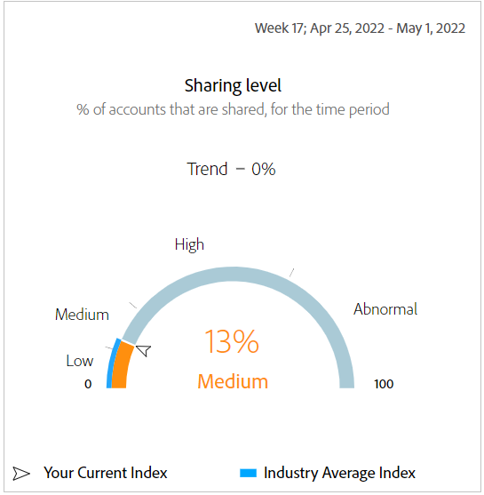

# 대시보드 {#dashboard}

대시보드는 계정 공유의 범위 및 영향에 대한 높은 수준의 개요를 제공하도록 설계된 그래프 및 보고서 컬렉션에 데이터를 요약하고 집계합니다. 계정 IQ의 주요 보고서와 지표가 포함된 단일 페이지를 제공합니다.

*그림: 대시보드*

## 평균 공유 점수 - 현재 세그먼트에 대해 집계됨 {#aggregated-sharing}

[집계된 공유 점수] 패널에서는 계정 및 스트리밍 볼륨 측면에서 공유의 양과 영향을 요약하는 상위 라인 판독이 제공됩니다.

이 값은 구독자에 의한 자격 증명 공유의 크기를 이해하는 데 도움이 되므로 그에 따라 조치를 취해야 할 필요성을 측정합니다.

*그림: 평균 공유 점수 패널 - 현재 세그먼트에 대해 집계됨*

다음 세 지표는 평균 공유 점수의 구성 요소입니다.

### 공유 수준 {#sharing-level}

공유 수준 측정은 선택한 기간 동안 공유되는 모든 가입자 계정(정의된 세그먼트에서)의 백분율을 보여줍니다.

선택한 기간 동안 선택된 프로그래머 채널 중 하나에서 스트리밍된 선택된 MVPD 집합의 모든 계정에 대해 계산된 공유 확률의 평균을 기반으로 계산된 값입니다.

*그림: 공유 수준*

트렌드 지표는 이전 시간대의 지표 값에 대한 백분율 변경을 보여줍니다.

### 공유 계정의 사용 {#usage-from-shared-accounts}

이 측정은 정의된 세그먼트 및 기간에 대한 공유 계정에서 모든 가입자 계정의 사용 비율을 나타냅니다. 측정은 사용 범위(공유 계정에서)를 0에서 100% 사이의 비율로 표시합니다. Low, Medium, High 및 Abnormal라는 이러한 범위는 업계 평균을 기반으로 합니다.

이전 시간대와 비교하여 공유 계정의 사용량 증가 또는 감소를 나타내는 트렌드 표시기도 볼 수 있습니다.

*그림: 공유 계정의 사용*

### 전체 공유 점수 {#overall-sharing-score}

전체 공유 점수는 &quot;공유 수준&quot; 및 &quot;공유 계정의 z 사용량&quot;을 포함한 공유 점수의 합입니다.

업계 비교 시 공유의 상대적 영향을 반영하기 위한 값을 제공합니다. 이것은 한 번호로 상황을 요약하는 신용 점수와 유사합니다. 그러나 이 경우, 이 경우, 숫자가 높을수록 잠재적인 해가 더 커집니다.

*그림: 전체 공유 점수*

<!--### MVPDs in segment {#mvpd-in-segment}

It is a table of risk indices and accounts totals for the top MVPDs ranked by overall usage or account sharing.

-->

### MVPD에 대한 업계 전체 공유 점수 {#top-mvpds}

이 표는 세그먼트에서 MVPD에 대한 서로 다른 집계된 공유 점수 비교 보기를 제공합니다.

>[!NOTE]
>
>이 표는 세그먼트에서 해당 MVPD로 표시되는 데이터가 아니라 비교 목적으로 전체 업계 데이터를 사용합니다.

*그림: 전체 점수로 세그먼트화된 상위 MVPD*

### 채널 및 MVPD별 점수 공유 {#sharin-score-by-channels-and-mvpds}

이 표에서는 현재 세그먼트에서 MVPD에 대해 선택한 채널의 점수를 공유하는 비교 보기를 제공합니다.

*그림: 채널 및 MVPD별 점수 공유*

### 확률을 공유하는 계정 {#accounts-sharing-probability}

이 차트는 확률 퀴나일을 매우 낮은(0-20%)부터 매우 높은(80=100%)까지 공유하는 범위로 분할합니다.

>[!NOTE]
>
>막대 그래프는 로그 배율을 사용합니다.

*그림: 서로 다른 공유 확률 범위에 있는 가입자 계정 수 및 백분율*

### 확률 수준을 공유하는 계정 및 사용 수 {#number-of-accounts-usage-sharing-probability}

이 패널에서는 각 퀴놀이의 공유 계정 관련 사용을 사용하여 확률 퀴나일을 매우 낮은(0-20%)부터 매우 높은(80-100%)까지 공유하는 범위로 분할된 계정의 테이블 형식 보기를 제공합니다.

*그림: 다양한 확률 범위에 속하는 계정, 추세 및 사용 수*

