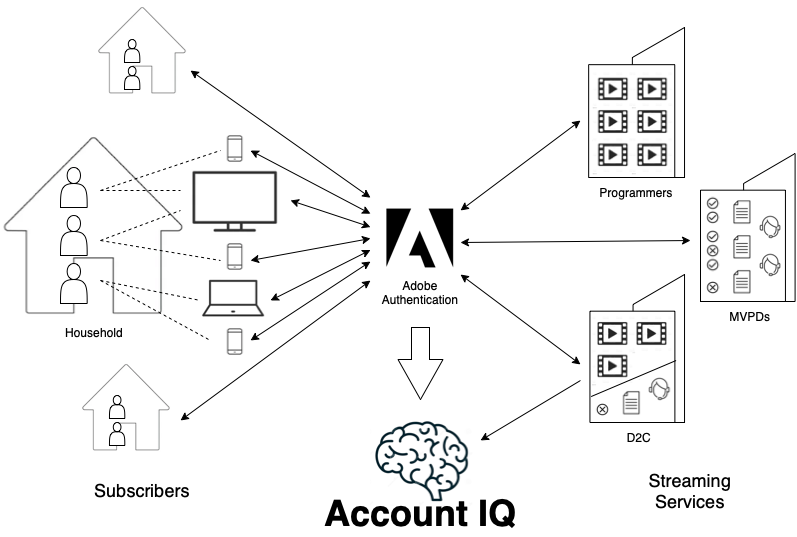

# 계정 IQ 개요 {#account-iq-overview}

스트리밍 서비스 가입자에 의한 자격 증명 공유는 업계의 주요 문제이며, 갈수록 커지고 있습니다. 자격 증명 공유에 대한 이해, 식별 및 작업은 복잡한 프로세스입니다. 가입자 사용 행동을 이해하고 해당 활동에 대한 전체적인 보기를 개발하는 데 관련된 복잡성이 있습니다. 예를 들어, 동일 세대 및 외부 구성원 간의 공유를 구별합니다. 이러한 문제로 인해 스트리밍 서비스 제공업체는 자격 증명 공유에 대해 행동을 자제할 수 있습니다.

일반적으로, 비디오 스트리밍 서비스 공급업체는 자신의 비즈니스에 공유하는 위험을 이해하고 비용을 이해하지만 공유 사이트를 차단하거나 오퍼를 제공하는 등의 제한된 조치를 가지고 있습니다. 그러나 서비스 담당자가 정확하게 공유를 파악하고 올바른 시청 행동을 보상하고 동시에 비즈니스 성장을 타깃팅하는 전략을 채택할 수 있도록 하는 정보 및 타깃팅된 접근 방식이 권장됩니다. 

*그림: 계정 IQ 정보 흐름*

Adobe Primetime 계정 IQ를 사용하면 비디오 스트리밍 서비스에서 가입자 사용 패턴을 이해하고 자격 증명 공유를 식별할 수 있습니다. 스트리밍 서비스는 Adobe의 독점적 다계층 기계 학습 모델을 사용하여 각 가입자가 남긴 데이터의 긴 추적 정보를 깊이 분석하여 사용 행동을 이해하고 보다 확실한 자격 증명 공유를 식별할 수 있습니다. 또한 동시 실행 스트림 제한 또는 오퍼 사용자 지정 등 다른 시스템과의 통합을 통해 작업을 수행할 수 있으며 올바른 보기 동작을 유도하거나 구독자 및 매출을 늘리는지 여부에 관계없이 이러한 작업이 미치는 영향을 확인할 수 있습니다.

계정 IQ는 자격 증명 공유를 측정, 관리 및 수익을 창출할 수 있는 도구와 기능을 제공합니다. Reports, Analytics 및 대시보드를 사용하면 패턴을 식별하기 위해 데이터를 탐색할 수 있습니다. 직접 작업은 캠페인 관리, 통화 제한 또는 가입자 등록과 같은 Adobe 및 타사 시스템과의 내보내기 및 통합을 통해 지원됩니다. 또한 전용 추적 도구는 이러한 작업의 성공을 측정하여 업데이트하거나 확장할 수 있습니다.

계정 IQ 애플리케이션 도구 및 기능은 다음 섹션에 설명되어 있습니다.

* [대시보드](/help/AccountIQ/dashboard.md)
* [일반 사용량 보고서](/help/AccountIQ/general-usage-reports.md)
* [공유 계정 보고서](/help/AccountIQ/shared-acc-reports.md)
* [사용 패턴](/help/AccountIQ/usage-patterns.md)
* [작업](/help/AccountIQ/operations.md)

이러한 각 섹션에서 그래프와 보고서에 대해 자세히 살펴보겠습니다.

>[!MORELIKETHIS]
>
>* [계정 IQ를 시작하는 방법](/help/AccountIQ/get-started.md)
>* [대시보드](/help/AccountIQ/dashboard.md)
>* [일반 사용량 보고서](/help/AccountIQ/general-usage-reports.md)
>* [공유 계정 보고서](/help/AccountIQ/shared-acc-reports.md)
>* [사용 패턴](/help/AccountIQ/usage-patterns.md)
>* [제품 용어 설명](/help/AccountIQ/product-concepts.md)
>* [계정 IQ 백서](https://www.adobe.com/content/dam/dx/us/en/products/primetime/resources/primetime-account-iq-whitepaper.pdf)

<!-- Credential sharing is rampant and prevalent among subscribers in the video streaming industry. To add to it, understanding, identifying, and acting on password sharing is a complex process. There is complexity involved in understanding the subscriber usage behavior and developing a holistic view of viewer activity—for example, distinguishing sharing among members within the same household and outside. Due to this challenge, streaming service providers have inhibitions in acting against password sharing.

Generally, video streaming service providers consider password sharing as fatal for business and act strongly against it, by blocking the sharers. However, it is advised to follow a holistic approach that enables them to understand sharing accurately and adopt strategies to reward good viewing behavior and target business growth simultaneously.

*Figure: Account IQ information flow*

Adobe Primetime Account IQ enables video streaming services understand the subscriber usage patterns and identify password sharing by analyzing usage behavior. Moreover, it validates the impact of applying actions to encourage legitimate viewing behavior while maximizing business ROI, eventually growing subscribers and revenue.

By deeply analyzing the long, winding trail of data left behind by each subscriber using Adobe's proprietary multi-layer machine learning model, customers can understand usage behavior and identify password sharing with a greater degree of certainty, use the insights to validate the impact of applying actions to encourage legitimate viewing behavior while maximizing business growth, eventually act on password sharing using validated tactics to improve viewer experience, growing subscribers and revenue (for e.g. converting sharers to paid subscribers, managing ad loads based on sharing behavior, rewarding good behavior with better viewer experience).

Account IQ is helps you understand usage patterns and identify password sharing by leveraging the Primetime Authentication  solution that processes a huge volume of TV Everywhere transactions. A proprietary multi-layer machine learning model trained by this real-world TVE data accurately characterizes usage patterns and helps video streaming services understand usage patterns and identify password sharing at an individual account level. Based on Adobe's customer experience management solutions, Account IQ enables video streaming services to effectively use their audience data to create actionable sharing profiles as well powers integrations with other Adobe Digital Experience and 3rd party solutions—for example, Adobe Primetime Concurrency Monitoring or Adobe Analytics—to enable understanding usage patterns, identify and act upon password sharing.

<!-- The widespread availability of video content and streaming services bring with it problem of account sharing; eventually leading to the loss of revenue by content providers. Account IQ helps TV Everywhere and VOD (video on demand) providers understand the risks to their revenue and business operations, and determine the most effective actions to take to mitigate the impacts of credential fraud. It helps these media companies (MVPDs, Programmers, and VOD providers) manage and uncover the instances of password sharing with a high level of confidence, enabling them deliver better business outcomes and provide better viewing experiences for subscribers.

To help media companies better understand the password sharing within their businesses, Primetime Account IQ determines **Password Sharing Risk Index** that rates every subscriber on their likelihood of sharing account credentials for subscription passwords, from very low to very high. Based on these calculations and the resulting indices, analytics are performed and visuals are generated for better understanding and interpretation of the account sharing behavior. Account IQ is a hosted web application, which you can access using your browser.

Account IQ assigns sharing scores to different subscriber accounts, so that the content providers (media companies, programmers, MVPDs, and VOD providers) can take informed decisions about subscriber accounts and check the illicit sharing.

Passwords are the main methods for viewers to authenticate, and there is a misconception that credential sharing is allowed. This idea makes illicit password sharing a common practice; necessitating the need for media companies to educate their viewers about permissible sharing and prevent illicit sharing.-->
