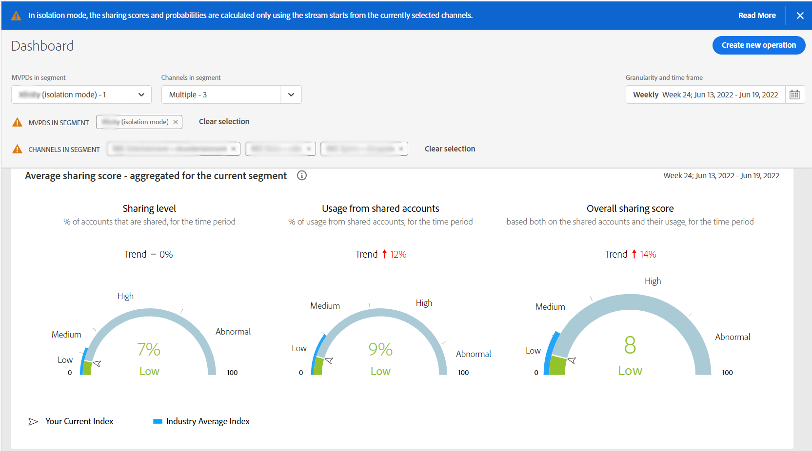

# 격리 모드에서 공유 보고서 보기 {#report-isolation-mode}

격리 모드에서 MVPD(예: Exfinity)는 장치 간에 일관되게 가입자를 식별하지만, 구독자가 상호 작용하는 프로그래머에 따라 구독자를 다르게 식별합니다. 표준 모드에서 MVPD는 프로그래머와 관계없이 장치 간에 일관되게 구독자를 식별합니다.

예를 들어, 다음 이미지에서 격리 모드 MVPD의 가입자 B(예: Exfinity)가 동일한 장치를 사용하여 두 명의 다른 프로그래머가 제공하는 컨텐츠에 액세스하면 MVPD는 서로 다른 식별자를 두 개의 서로 다른 액세스 시도와 연결합니다. 따라서 프로그래머(그림의 L과 M)와 계정 IQ에는 컨텐츠에 액세스하는 두 개의 다른 구독자가 있는 것으로 보입니다. 그러나 표준 MVPD의 경우, 구독자 B가 두 명의 다른 프로그래머가 제공하는 컨텐츠에 액세스하면 MVPD가 두 액세스 시도 모두에 대해 단일 액세스 식별자를 연결합니다. 격리 모드의 MVPD(예: Exfinity)는 가입자가 서로 다른 프로그래머에서 동일한 장치를 사용하는 경우에도 일관되게 가입자를 식별하지 않습니다.

*그림: 격리 모드 MVPD는 두 개 대신 네 개의 다른 구독자를 식별합니다*

데이터 왜곡을 관리하기 위해(서로 다른 프로그래머에 액세스하는 방식이 서로 다른 구독자를 식별하기 때문에) 격리 모드는 프로그래머에 대해 보고된 활동을 해당 프로그래머의 응용 프로그램에서만 해당 활동에만 제한합니다. 예를 들어 위의 이미지에서 격리 모드의 경우 프로그래머 L은 ID X와 Z를 무시하고 ID W와 Y의 활동만 기반으로 데이터를 봅니다.

>[!IMPORTANT]
>
> 프로그래머 L은 L을 제외한 모든 프로그래머와 함께 하는 것으로 가입자에게서 A와 B에 대한 정보를 공유하지 못하게 되는 것이 단점이 있다.

격리 모드에서는 공유 점수 및 모든 관련 지표를 얻기 위해 수행되는 모든 계산은 선택한 프로그래머 및 채널에 속하는 응용 프로그램에서 스트리밍되는 장치의 활동만 사용하여 수행됩니다.
공유 점수 및 확률을 현재 선택한 채널에서 시작하는 스트림을 사용해야만 계산됩니다.

격리 모드에서 지표를 보려면 다음을 수행하십시오.

1. 선택 **격리 모드** 에서 **세그먼트의 MVPD** 드롭다운 옵션을 선택하고 **선택 항목 적용**.

   

   *그림: 격리 모드에서 MVPD 선택*

1. 에서 원하는 채널을 선택합니다 **세그먼트의 채널** 드롭다운 옵션을 선택하고 **선택 항목 적용**. 또한 [시간대](/help/AccountIQ/product-concepts.md#granularity-def).

   >[!IMPORTANT]
   >
   >계정 공유는 모든 프로그래머의 응용 프로그램에서 스트리밍을 위해 측정할 때 더 관련성이 높으므로 격리 모드에 있을 때 공유 점수가 낮아지고 지표에 일부 변형이 표시됩니다.

   

   *그림: 격리 모드에서 확률 계기 공유*

   위의 지표는 모든 계정의 6%만 공유되고 있음을 보여줍니다. 컨텐츠의 8%만이 소비되고 있습니다. 따라서 채널은 격리 모드에서 해당 점수를 다른 MVPD와 비교할 수 있습니다. 따라서 분리모드를 이용하여 얻은 정보는 다른 데이터와 다르게 해석되어야 한다.
