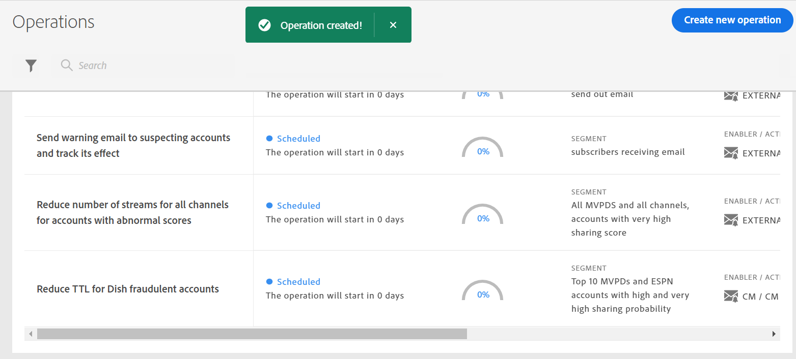

# 사용자 세그먼트에 대한 작업 만들기 {#operation-to-track-segment}

계정 IQ의 각 보고서 페이지에는 **새 작업 만들기** 구독자 계정에 대해 다양한(대량) 작업을 자동화(및 단순화하는 워크플로우 작성을 돕는 옵션 규칙을 정의하여 샘플을 지정하고 작업을 정의하고 이러한 작업의 효과를 기록하여 분석할 수 있습니다. 작업을 생성할 페이지에서 작업을 수행할 사용자 그룹의 샘플을 정의하고, 작업을 미래 날짜에 실행하도록 예약할 수 있습니다.

작업을 생성하려면

1. 다음 의 단계를 사용하여 보고서 또는 대시보드 페이지에서 분석할 세그먼트(집단)를 정의합니다 [세그먼트 및 일정 정의](/help/AccountIQ/howto-select-segment-timeframe.md).

1. 선택 **새 작업 만들기** 옵션 을 사용하십시오. 다음 **새 작업 만들기** 페이지가 표시됩니다.

   
   *그림: 새 작업을 만드는 페이지*

1. 설정 **새 작업 만들기** 페이지의 양식 필드에 다음 정보를 입력합니다.

   * [작업 이름](#operation-details) 작업 세부 정보
   * 세그먼트에서 작업을 실행할 세그먼트 [Target 세그먼트](#segment) 을 사용하여 세그먼트를 세분화하고 [추가 세그멘테이션](#additional-segmentation)
   * [세그먼트 유형](#segment-type) 아래에 [Target 세그먼트](#segment)
   * [작업](#action)
   * [활성화 예약](#schedule)

1. [작업 저장](#save-operation).

## 작업 세부 사항 {#operation-details}

+++프로그래머 - 작업 세부 사항

에서 새 작업 이름을 지정합니다. **작업 이름** 작업 세부 정보 아래의 필드. 예: &quot;*MVPD X 구독자에 대한 다중 요소 인증 효과 테스트 또는 동시 시청 중 스트림 수 제한 또는 20개 이상의 장치에서 채널 &#39;N&#39;을 보는 MVPD D 구독자 제한*&quot;.

+++

+++MVPD - 작업 세부 정보

에서 새 작업 이름을 지정합니다. **작업 이름** 작업 세부 정보 아래의 필드. 예: &quot;*채널 N&#39;s viewer에 대한 다단계 인증의 효과를 테스트하거나, &quot;동시 시청 시 스트림 수 제한&quot; 또는 &quot;20개 이상의 장치에서 채널 &#39;N&#39;을 보는 구독자 제한*&quot;.

+++

## Target 세그먼트 {#segment}

+++프로그래머-Target 세그먼트

다음 **세그먼트** 여기서는 이 작업에서 작업할 사용자를 정의합니다. 또는 작업에 대한 샘플 그룹 입니다. 기본 세그먼트는 **세그먼트** 다음을 사용하여 선택함 [세그먼트 및 시간대 패널](/help/AccountIQ/howto-select-segment-timeframe.md) 위의 1단계의 기본 보고서 또는 대시보드 페이지에서 을 참조하십시오.

<!--* The first segment entry in the **Segment** section, by default, shows the **segment** you selected in the step 1.

* The **segment evaluation period** is the time period of analysis you selected in step 1 from **Granularity and Timeframe** option.

*Figure: Segment and timeframe selection on the main page*-->

이 세그먼트는 만들어지는 작업의 영향을 받을 구독자를 정의합니다. 예를 들어 선택한 세그먼트가 *MVPD의 가입자 계정 중 N스포츠 채널을 보는 C라는 모든 계정*.

+++

+++MVPD-Target 세그먼트

다음 **세그먼트** 여기서는 이 작업에서 작업할 사용자를 정의합니다. 또는 작업에 대한 샘플 그룹 입니다. 기본 세그먼트는 **세그먼트** 다음을 사용하여 선택함 [세그먼트 및 시간대 패널](/help/AccountIQ/howto-select-segment-timeframe.md) 위의 1단계의 기본 보고서 또는 대시보드 페이지에서 을 참조하십시오.

<!--* The first segment entry in the **Segment** section, by default, shows the **segment** you selected in the step 1.

* The **segment evaluation period** is the time period of analysis you selected in step 1 from **Granularity and Timeframe** option.

*Figure: Segment and timeframe selection on the main page*-->

이 세그먼트는 만들어지는 작업의 영향을 받을 구독자(특정 채널을 보는 사람)를 정의합니다. 예를 들어 (기본) 세그먼트는 *&#39;N Sports&#39; 채널을 보는 모든 가입자 계정*.
+++

### 추가 세그멘테이션 {#additional-segmentation}

또한 지표를 더 추가하여 타겟 세그먼트를 세분화할 수 있습니다. 예를 들어 다른 지표로 90%보다 큰 공유 확률 을 추가할 수 있습니다. 그래서, 이제 문제문은 다음과 같이 쓰여져 있습니다. *&quot;공유 가능성이 90%보다 큰 &#39;N Sports&#39; 채널을 보고 있는 &#39;C&#39;라는 이름의 MVPD의 가입자 계정에 대한 작업을 만드십시오.&quot;*.

*그림: 추가 세그멘테이션*

또한 장치 수에 대한 다른 지표를 추가하여 작업을 구체화하면 업데이트된 문제 문은 읽습니다. *&quot;공유 점수가 90점 이상인 채널 &#39;N Sports&#39;를 보고 있고 평가 기간 동안 컨텐츠를 보기 위해 5개 이상의 장치를 사용하고 있는 &#39;C&#39;라는 이름의 MVPD의 가입자 계정에 대한 작업을 만드십시오.&quot;*.

*그림: 전체 공유 점수 및 장치 수 지표를 사용하는 예제가 세분되었습니다*

이렇게 하면 사용자 그룹이 더 세분화됩니다. 따라서, 지표와 조건을 더 추가하면 세그먼트를 정의하여 운영할 계정을 정의할 수 있습니다.

### 세그먼트 유형 {#segment-type}

세그먼트 유형은 작업의 평가 기간 동안 세그먼트가 처리되는 방식입니다.

*그림: 세그먼트 유형을 사용하여 운영할 세그먼트 수를 세분화합니다*

<!--The segment type option allows you to further refine your segment based on the evaluation period (or time).

**Fixed number of accounts** 

When you select **Fixed number of accounts** segment type, then you need to specify an evaluation period as well.

By doing so, you are fixing the sample size for evaluation in terms of numbers. You are making Account IQ identify a specific set of users (that meet the criteria of defined evaluation period and segment metrics) to operate on. The analysis and graphs will be generated for this specific set of users only (identified initially) throughout the operation.

**Variable number of accounts**

When you select **Variable number of accounts** segment type, you do not limit the number of accounts in segment. The accounts which fall under the defined segment metrics are the part of the segment, and the number of accounts will change continuously during the course of operation.-->

>[!IMPORTANT]
>
>만 사용할 수 있습니다 **고정 계정 수** 선택 사항입니다. 선택할 수 있는 옵션 **변수 계정 수** 향후 릴리스에서 제공될 예정입니다.

<!--

you tell Account IQ in the beginning of the operation which number of accounts to operate on.

Account IQ system only has a segment definition, and during the operation it looks into all the accounts that fit that segments.

the number of accounts in segment is not limited, the accounts that fall under defined segment metrics will be part of the segment, and the no of accounts will change continuously, as there are no specific limitations - like an evaluation period in the past.When the segment is defined (which in this example is, subscriber accounts of MVPD 'C' who are viewing the channel 'N Sports' that have a sharing score above 80 and are using 10 different IPs) and we also identified a time period to evaluate a segment. This identifies X number of accounts as sample (for example 5000). How many devices they are using?
It identifies x-number of accounts (5000)...a very specific set of users that meet this criteria.
for every period that we schedule (within that operation) during that operation) we will look at those 5K users that are originally identified and we will present graph about them. How are the sharing scores coming up?u We identified a period. Are their sharing scores going up? Are there fewer of them who are meeting this definition?
Fixed versus variable is the way the treated in fixed or variable way.

1. we identified a fixed set of accounts.
2. we evaluate those specific accounts on criteria throughout the operation.

General idea independent of graph is that we will evaluate a set of accounts identified initially, for no of periods during operation and generate graphs against that.
Those are the 5000 users for which I will create graphs for for every period of the operation.

**Variable number of accounts**
We do not identify any initial set of accounts, we just have a segment definition.
Each period during the operation, we go and look into all the accounts that fit that segments.
If it is not a fixed segment, I won't initially evaluate it. I won't have an initial set of 5000. Instead at every period during the evaluation I will evaluate the segment then, and then I will produce graph about the next 3000 users.
the......will vary from period to period.

if not fixed segment, then I won't initially evaluate or have initial set of 5000, instead at every period during an operation and the.-->

## 작업 {#action}

다음 **작업** 정의된 세그먼트에서 수행할 작업을 정의합니다.

다음 두 가지 유형의 작업을 수행할 수 있습니다.

* 계정 IQ와 통합된 시스템을 사용하는 작업; 예 [동시성 모니터링](https://tve.helpdocsonline.com/concurrency-monitoring-introduction)<!--, or Adobe Target-->.

* 계정 IQ 시스템과 통합되지 않고 계정 IQ 외부에 있는 워크플로우를 만들고 처리하는 작업입니다. 예를 들어 채널 프로그래머 &#39;N&#39;이 MVPD &#39;C&#39;의 모든 구독자에게 벌크 이메일을 보내는 작업입니다.

>[!NOTE]
>
>작업을 작성하면 작업을 지정하고 범위를 정의할 수 있을 뿐만 아니라 이러한 작업의 효과를 기록할 수도 있습니다.

## 예약{#schedule}

시작 및 종료 날짜를 설정하여 작업에 대한 활성화를 예약할 수 있습니다.

>[!NOTE]
>
>시작 날짜 및 종료 날짜의 세부기간은 을 사용하여 세그먼트를 정의할 때 평가에 대해 선택한 세부기간과 동일합니다 **세그먼트 및 시간대 패널**, 1단계에서.
>
>
>따라서 세부기간을 주 로 선택한 경우 시작 및 종료 날짜는 주 기준(예: 14주)입니다. 세부기간을 월로 선택하는 경우 시작 및 종료 날짜는 월 단위로 표시됩니다.

>[!IMPORTANT]
>
>시작 날짜는 평가 기간 이후이고 현재 날짜보다 이후여야 합니다. 마찬가지로 종료 날짜도 시작 날짜 및 현재 날짜보다 이후여야 합니다.

### 작업 저장 {#save-operation}

작업을 저장하면 이 작업에서 정의한 세그먼트가 나중에 저장된다는 메시지 화면이 표시됩니다. 하지만 이 세그먼트의 이름을 지정해야 합니다.

*그림: 저장 작업 및 세그먼트 이름 지정*

>[!NOTE]
>
>수행하려는 세그먼트와 함께 수행하는 작업을 기반으로 작업에 이름을 지정하는 것이 가장 좋습니다.

<!--In future you can select this saved segment when defining a segment for your analysis on the main reports page. Moreover, the saved segment is also listed when you create an operation the next time.

*Figure: Saved segments in segment selector on Create new operations page* 

>[!IMPORTANT]
>
>When creating an operation, if you select a segment that was previously created then you cannot add new metrics to it and refine it.
>
>Adding new metrics creates a new segment, but you cannot modify an existing segment.-->

작업을 만들면 시작 날짜부터 지정한 종료 날짜까지 실행됩니다.

저장된 작업의 세부 사항은 기본 [작업](/help/AccountIQ/operations.md) 페이지.

*그림: 새로 만든 작업이 기본 작업 페이지에 나열됩니다*
