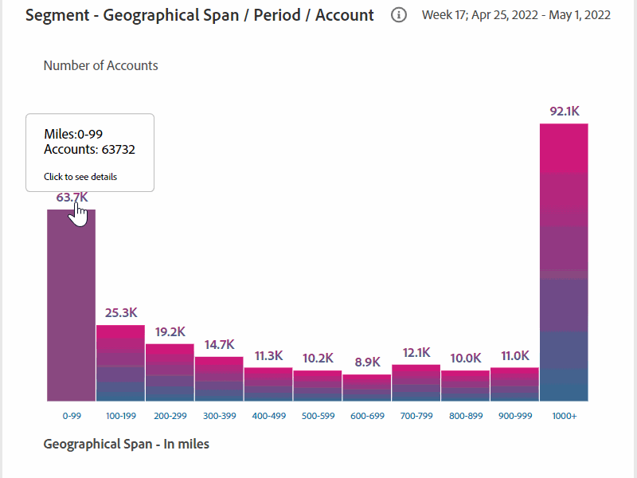

# 공유 계정 보고서 {#shared-accounts-reports}

공유 계정 보고서는 장치 수 및 장치 유형과 같은 지표를 선택한 공유 확률 범위로 분류합니다(예: **중간 확률 초과** 및 **낮은 확률** 현재 세그먼트를 표시합니다.

그런 다음 이러한 범위는 사용자 정의 임계값 역할을 할 수 있으며 그래프는 선택한 임계값을 기반으로 업데이트됩니다.

계정 IQ는 정의된 세그먼트의 모든 가입자 계정을 공유 확률을 기준으로 다음 5개의 카테고리가 있는 계정으로 분류합니다.

* 매우 높음(80%-100%)
* 높음(60%-80%)
* 중재(40%-60%)
* 낮음(20%-40%)
* 매우 낮음(0%-20%)

## 계정 공유 가능성 {#accounts-sharing-probability}

여기서는 도넛 차트를 분류하고 다양한 확률 카테고리의 가입자 계정의 백분율(및 절대 숫자)을 표시합니다.

빨간색 줄은 사용자가 선택한 임계값 범위를 [현재 세그먼트의 임계값을 초과하는 계정](#threshold-selector) 패널.

막대 차트는 다양한 공유 확률 카테고리(x축에 그림)에 대한 y축에 있는 계정 수를 표시합니다.

빨간색 선은 임계값 범위를 나타내며 막대 차트에서 조정할 수 있습니다. 막대 차트에서 조정된 임계값은 도넛 차트의 임계값 범위를 반영합니다.

<!---->

### 현재 세그먼트의 임계값을 초과하는 계정{#threshold-selector}

이 패널을 사용하면 다음 범위에서 가입자 계정의 임계값으로 선택할 수 있습니다(해당 구독 가능성 기준).

* 계정 **매우 낮음** 공유 **확률**

* 계정 **낮은** 공유 **확률**

* 계정 **중재** 공유 **확률**

* 계정 **높은** 공유 **확률**

임계값을 선택하면 선택한 세그먼트의 모든 가입자 계정 중 계정의 백분율(및 숫자)이 표시됩니다.

## 세그먼트 - 총 재생 요청 수 {#play-request-out-total}

도넛 차트는 세그먼트에서 구독자가 수행한 재생 요청의 비율(및 수)을 보여줍니다. 및 을 사용하면 정의된 세그먼트가 아닌 구독자가 수행한 재생 요청을 비교할 수 있습니다.

도넛 차트에 커서를 이동하면 다양한 확률 범위의 가입자 백분율과 숫자도 표시됩니다.

<!---->

## 세그먼트 평균 계정당 장치 수{#avg-devices-account}

막대 차트는 현재 세그먼트에서 구독자와 현재 세그먼트가 아닌 구독자가 사용하는 각 장치 유형의 평균 장치 수를 보여줍니다.

## 세그먼트 - 계정당 기간별 우편 번호 {#zip-codes-period-account}

이 그래프는 시간대의 다른 위치에서 콘텐츠를 소비하는 구독자의 수를 알려줍니다.

확대하면 그래프에서 범위를 표시하는 막대의 세부 사항을 좁히고 볼 수 있습니다.

<!---->

## 세그먼트 - 지역 범위/기간/계정 {#geo-span-period-account}

이 막대 그래프는 마일 단위의 다양한 지리적 범위에 대한 가입자 계정의 수를 그래프로 표시합니다. 이 범위는 기간 동안 가입자가 스트리밍한 위치 사이의 최대 거리를 기준으로 합니다.

<!--Total number of users ...

How many accounts are within 99 miles of each other.....and how many are apart. 

Based on points on the map.-->

지리적 거리의 범위를 나타내는 막대를 선택하면 범위가 확장되어 더 자세한 정보가 표시됩니다.

<!---->
