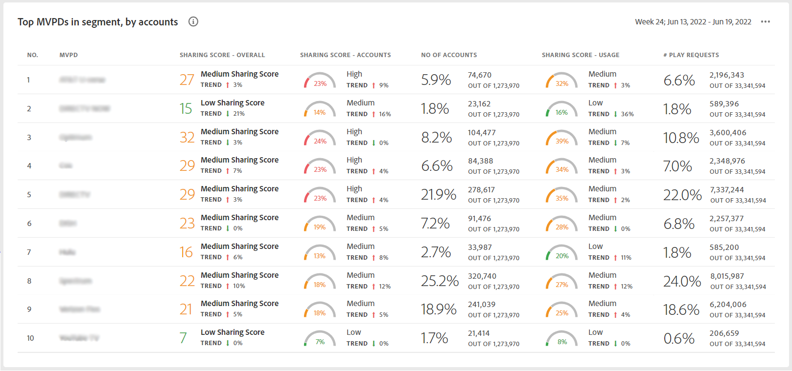

# 상위 10명의 프로그래머에 대한 계정 공유 보고서 보기 {#view-top-10-programmer-reports}

계정 IQ에는 상위 10개 프로그래머(정의된 [세그먼트](/help/AccountIQ/product-concepts.md#segmet-def)).

* 계정을 공유하는 가입자의 가장 높은 비율

* 공유 계정의 최대 사용 권한

* 암호 공유의 크기가 가장 높은(전체 공유 점수) 가입자

>[!NOTE]
>
>한 세그먼트에서 상위 프로그래머 목록을 가져오는 계산의 기반은 특정 MVPD의 프로그래머뿐만 아니라 전체 비디오 스트리밍 산업의 데이터입니다.

<!--
>[!NOTE]
>
>Only the MVPDs that have a minimum of 50,000 active subscriber accounts are considered to obtain these reports.
-->

로그인한 MVPD 사용자의 경우 다음 세 가지 기본 선택(상위 10개의 MVPD에 대한 보고서를 보려면)을 사용할 수 있습니다.

* [점수를 공유하여 상위 10개 프로그래머](#top-10prog-sharingscore)

* [사용별 상위 10개 프로그래머](#top-10prog-usage)

* [계정별 상위 10개 프로그래머](#top-10prog-accounts)

## 점수를 공유하여 상위 10개 프로그래머 {#top-10prog-sharingscore}

선택 항목을 사용하는 경우 **점수를 공유한 상위 10개 프로그래머** 세그먼트를 정의하려면, 계정 IQ 시스템은 업계 전반에서 10개의 MVPD를 식별하고(해당 지표와 함께) 10개의 MVPD를 내림차순으로 나열합니다 [전체 공유 점수](/help/AccountIQ/product-concepts.md#overall-sharing-score)

채널에 대한 점수를 공유하여 상위 10개 MVPD에 대한 목록 및 보고서를 보려면 다음을 수행하십시오.

1. 를 사용하십시오 [세그먼트 및 시간대 패널](/help/AccountIQ/segments-timeframe.md)의 단계에 따라 세그먼트를 정의하려면 [세그먼트를 정의하고 기간을 선택하는 방법](/help/AccountIQ/howto-select-segment-timeframe.md) 을 참조하십시오. 이 평가를 수행하려면 **점수를 공유한 상위 10개 프로그래머** 옵션 을 선택합니다.

1. 다음 중 하나에서 보고서 페이지를 선택합니다 [일반 사용](/help/AccountIQ/general-usage-reports.md), [공유 계정](/help/AccountIQ/shared-acc-reports.md), [사용 패턴](/help/AccountIQ/usage-patterns.md), 또는 [대시보드](/help/AccountIQ/dashboard.md) (대시보드는 다른 보고서 페이지에서 선택한 그래프를 간략하게 표시합니다.)

이러한 각 페이지에는 활동이 반영됩니다.

## 사용별 상위 10개 프로그래머 {#top-10prog-usage}

선택 항목을 사용하는 경우 **사용별 상위 10개 프로그래머** 세그먼트를 정의하려면, 계정 IQ 시스템은 업계 전반에서 10개의 MVPD를 식별하고(해당 지표와 함께) 10개의 MVPD를 내림차순으로 나열합니다 [공유 계정의 사용](/help/AccountIQ/product-concepts.md)

채널에 대한 점수를 공유하여 상위 10개 MVPD에 대한 목록 및 보고서를 보려면 다음을 수행하십시오.

1. 를 사용하십시오 [세그먼트 및 시간대 패널](/help/AccountIQ/segments-timeframe.md)의 단계에 따라 세그먼트를 정의하려면 [세그먼트를 정의하고 기간을 선택하는 방법](/help/AccountIQ/howto-select-segment-timeframe.md) 을 참조하십시오. 이 평가를 수행하려면 **사용별 상위 10개 프로그래머** 옵션 을 선택합니다.

1. 다음 중 하나에서 보고서 페이지를 선택합니다 [일반 사용](/help/AccountIQ/general-usage-reports.md), [공유 계정](/help/AccountIQ/shared-acc-reports.md), [사용 패턴](/help/AccountIQ/usage-patterns.md), 또는 [대시보드](/help/AccountIQ/dashboard.md) (대시보드는 다른 보고서 페이지에서 선택한 그래프를 간략하게 표시합니다.)

이러한 각 페이지에는 활동이 반영됩니다.

## 계정별 상위 10개 프로그래머 {#top-10prog-accounts}

선택 항목을 사용하는 경우 **계정별 상위 10개 프로그램** 세그먼트를 정의하려면 계정 IQ 시스템은 업계 전반에서 10개의 MVPD를 식별하고(해당 지표와 함께) 해당 세그먼트의 내림차순으로 10개의 MVPD 목록을 식별합니다 [공유 수준](/help/AccountIQ/product-concepts.md)

채널에 대해 공유되는 계정 수별로 상위 10개 MVPD에 대한 목록 및 보고서를 보려면 다음을 수행하십시오.

1. 를 사용하십시오 [세그먼트 및 시간대 패널](/help/AccountIQ/segments-timeframe.md)의 단계에 따라 세그먼트를 정의하려면 [세그먼트를 정의하고 기간을 선택하는 방법](/help/AccountIQ/howto-select-segment-timeframe.md) 을 참조하십시오. 이 평가를 수행하려면 **계정별 상위 10명의 프로그래머** 옵션 을 선택합니다.

1. 다음 중 하나에서 보고서 페이지를 선택합니다 [일반 사용](/help/AccountIQ/general-usage-reports.md), [공유 계정](/help/AccountIQ/shared-acc-reports.md), [사용 패턴](/help/AccountIQ/usage-patterns.md), 또는 [대시보드](/help/AccountIQ/dashboard.md) (대시보드는 다른 보고서 페이지에서 선택한 그래프를 간략하게 표시합니다.)

이러한 각 페이지에는 활동이 반영됩니다.

