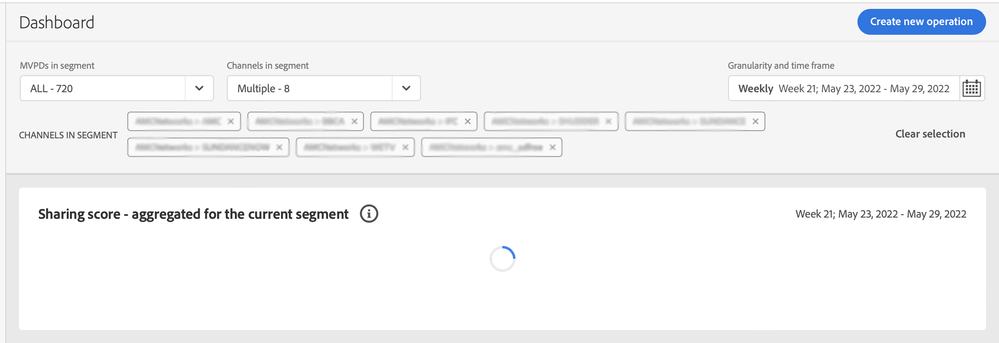

# 계정 IQ 문제 해결 {#troubleshoot}

데이터 및 차트를 로드하는 데 너무 오래 걸리거나 보고서를 내보내지 않는 문제 또는 지표 및 그래프와 관련된 다른 문제에 직면했습니까? 계속 읽으면서 빠른 도움을 받으세요.

* 페이지 또는 개별 패널을 로드하는 데 너무 오래 걸리는 경우 페이지를 새로 고침해 보십시오. 현재 버전의 경우 MVPD 및 프로그래머의 선택에 따라 페이지를 로드하는 데 최대 1분이 걸릴 수 있습니다.

  

* 새로 고친 후에도 데이터 또는 그래프를 볼 수 없는 경우 계정 IQ에서 로그아웃한 다음 다시 로그인합니다.

* 위의 문제 해결 방법 중 어느 것도 도움이 되지 않거나 데이터 또는 통계 내보내기 불능과 관련된 다른 질문이 있는 경우 tve-support@adobe.com으로 이메일을 보내거나 핫라인 번호 +1-205-693-9813으로 전화하여 Adobe 지원 센터에 문의하십시오.
