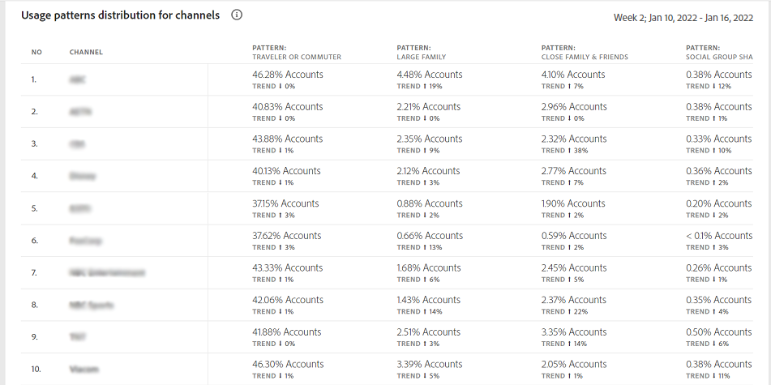

# 사용 패턴 {#usage-patterns}

계정 IQ는 가입자 계정의 사용자를 여행자나 통근, 대가족, 커뮤니티 공유 등 사회적 행동의 관점에서 다양한 범주로 분류한다. 다음 **사용 패턴** 페이지에는 이러한 사용자 유형화에 대한 몇 가지 다양한 분석 및 보고서가 표시됩니다. 예를 들어, **사용 패턴 분포 - 세그먼트와 합계의 사용자** 보고서는 현재 세그먼트와 전체 산업의 사용 동작을 비교합니다.

앱의 다른 페이지와 마찬가지로 분석 및 보고서는 여기에 정의된 대로 현재 세그먼트를 기반으로 합니다. [세그먼트 패널](/help/AccountIQ/segments-timeframe.md).

## 사용 패턴 분포 {#usage-pattern-dis}

의 막대 그래프 **사용 패턴 분포 - 세그먼트와 합계의 사용자** 는 각 소셜 동작 또는 사용 패턴에 대한 구독자 수와 백분율을 보여 줍니다. 현재 세그먼트의 각 사용 패턴을 전체 산업과 비교할 뿐만 아니라 모든 채널을 포함하는 세그먼트와 비교합니다.

## 세그먼트의 사용 패턴 분포(#usage-pattern-dis-segment)

다음 **세그먼트의 사용 패턴 분포** 패널 은 각 사용자 패턴에 대한 다음 정보를 표로 표시합니다.

* 개별 계정이 속한 공유 확률 범위
* 해당 패턴의 계정 수 및 백분율
* 재생 요청 측면에서 해당 카테고리의 구독자가 사용하는 전체 및 비율입니다.

예를 들어 위의 이미지에서

* 정의된 세그먼트의 일반 사용자(한 위치에서만 장치 수가 제한된 1~몇 명)는 0~5%의 계정 공유 확률을 갖습니다.

* 그리고 전체 가입자 계좌(5,981,648개) 중 36.8%(2,201,935개)가 상시 이용자이다.

* 그리고 전체 재생 요청(153,076,350건) 중 15.7%(24,073,311건)가 일반 이용자에 의해 이루어지고 있다.

## 세그먼트 파트너별 사용 패턴 분포 {#usage-pattern-dis-mvpd}

+++프로그래머 - 총 세그먼트 및 세그먼트 파트너에 대한 사용 패턴 배포

다음 **사용 패턴 분포** 표는 현재 세그먼트의 MVPD들에 대한 사용 패턴 분포의 비교를 제공한다.

+++

+++MVPD- 총 세그먼트 및 세그먼트 파트너에 대한 사용 패턴 분포

다음 **사용 패턴 분포** 표는 현재 세그먼트의 프로그래머 채널에 대한 사용 패턴 분포의 비교를 제공합니다.

+++
