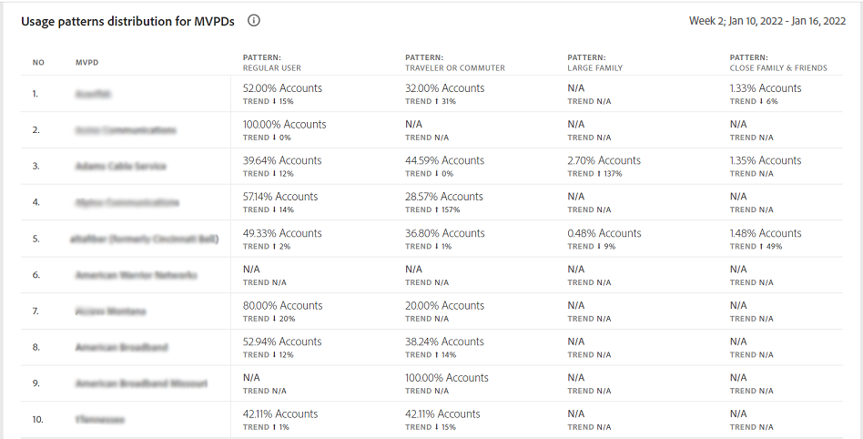

# 사용 패턴 {#usage-patterns}

계정 IQ는 가입자 계정의 사용자를 여행자 또는 통근, 큰 가족, 커뮤니티 공유와 같은 사회적 행동에 따라 다양한 카테고리로 분류합니다. 다음 **사용 패턴** 페이지에 이러한 사용자 유형화에 대한 여러 가지 다른 분석 및 보고서가 표시됩니다. 예, **사용 패턴 배포 - 세그먼트와 업계 사용자** 보고서는 현재 세그먼트의 사용 행동을 전체 산업과 비교합니다.

앱의 다른 페이지와 마찬가지로 여기에 있는 analytics 및 보고서는 [세그먼트 패널](/help/AccountIQ/segments-timeframe.md).

## 사용 패턴 배포 {#usage-pattern-dis}

의 막대 그래프 **사용 패턴 배포 - 세그먼트와 업계의 사용자** 각 소셜 동작 또는 사용 패턴에 대한 구독자 수 및 비율을 나타냅니다. 현재 세그먼트의 각 사용 패턴을 전체 산업과 비교하는 것 외에도 모든 채널을 포함하는 세그먼트와 비교합니다.

## 세그먼트에서 사용 패턴 배포(#usage-pattern-dis-segment)

다음 **세그먼트에서 사용 패턴 배포** 패널에서는 각 사용자 패턴에 대해 다음 정보를 보여 줍니다.

* 개별 계정이 속하는 확률 범위 공유
* 해당 패턴의 계정 수 및 백분율
* 재생 요청 측면에서 해당 카테고리의 구독자에 의한 전체 사용 비율 및 비율

예를 들어 위의 이미지에서

* 정의된 세그먼트에서 일반 사용자(한 위치에서만 장치 수가 제한된 사람 1~몇 명)의 경우 계정 공유 가능성은 0~5% 사이입니다.

* 또 전체 가입자 계정(598만1648명)의 36.8%(220만1935명)는 일반적이다.

* 그리고 전체 재생 요청(153,076,350)의 15.7%(24,073,311)는 일반 사용자가 수행합니다.

## MVPD에 대한 사용 패턴 배포 {#usage-pattern-dis-mvpd}

다음 **MVPD에 대한 사용 패턴 배포** 표는 현재 세그먼트의 MVPD에 대한 사용 패턴 분포를 비교합니다.

