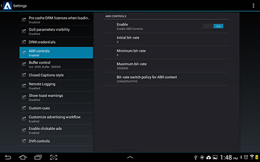

# 다양한 비트 전송률 {#multiple-bit-rates}

TV SDK는 다양한 비트 전송률을 갖는 여러 프로파일이 포함된 비디오를 재생할 수 있으며, 두 프로필 간에 전환하여 사용 가능한 대역폭에 따라 두 개 이상의 품질 수준을 제공할 수 있습니다.

MBR(Multiple Bit Rate) 스트림에 대해 초기 비트, 최소 및 최대 비트 전송률 및 적응형 비트 전송률(ABR) 스위치 정책을 설정할 수 있습니다. TVSDK는 지정된 구성 내에서 최상의 재생 환경을 제공하는 비트 전송률로 자동 전환됩니다.

참조 구현은 IPlaybackConfig에서 다음 ABR 매개 변수를 [구성합니다](https://help.adobe.com/en_US/primetime/api/reference_implementation/android/javadoc/com/adobe/primetime/reference/config/IPlaybackConfig.html).

| 매개 변수 | 설명 |
|--- |--- |
| 초기 비트 전송률: getABRInitialBitRate | 첫 번째 세그먼트에 대한 원하는 재생 비트 전송률(초당 비트 수)입니다. 재생이 시작되면 첫 번째 세그먼트에 가장 가까운 프로필(초기 비트 전송률보다 크거나 같음)이 사용됩니다.  최소 비트 전송률이 정의되고 초기 비트 전송률이 최소값보다 낮은 경우 TVSDK는 최소 비트 전송률보다 낮은 비트 전송률을 갖는 프로파일을 선택합니다. 마찬가지로 초기 비율이 최대 속도 이상일 경우 TVSDK는 최대 속도 미만 중 가장 높은 비율을 선택합니다. 초기 비트 전송률이 0이거나 정의되지 않은 경우 초기 비트 전송률은 ABR 정책에 의해 결정됩니다.  초당 바이트 프로필을 나타내는 정수 값을 반환합니다. |
| 최소 비트 전송률: getABRMinBitRate | ABR이 전환할 수 있는 가장 낮은 비트 전송률입니다. ABR 전환은 이보다 비트 전송률이 낮은 프로파일을 무시합니다. 초당 비트 프로필을 나타내는 정수 값을 반환합니다. |
| 최대 비트 전송률: getABRMaxBitRate | ABR이 전환할 수 있는 가장 높은 허용 비트 전송률입니다. ABR 전환은 이보다 비트 전송률이 높은 프로파일을 무시합니다. 초당 비트 프로필을 나타내는 정수 값을 반환합니다. |
| ABR 전환 정책: getABRPolicy | 가능한 경우 재생이 가장 높은 비트 전송률 프로파일로 점진적으로 전환됩니다. ABR 전환을 위한 정책을 설정할 수 있습니다. 이 정책은 TVSDK가 프로파일 간에 전환되는 속도를 결정합니다. 기본값은 중재입니다. <ul><li>*보수적*:대역폭이 현재 비트 전송률보다 50% 높을 때 다음 비트 전송률이 더 높은 프로필로 전환합니다. </li><li>*중재*:대역폭이 현재 비트 전송률보다 20% 높을 때 다음 더 높은 비트 전송률 프로파일로 전환합니다.</li><li>*공격적*:대역폭이 현재 비트 전송률보다 높을 때 즉시 최고 비트 전송률 프로파일로 전환합니다</li></ul> 초기 비트 전송률이 0이거나 지정되지 않았으며 정책이 지정된 경우 재생은 Reventor의 가장 낮은 비트 전송률 프로필, 중재의 사용 가능한 프로필의 중간값 비트 비율에 가장 가까운 프로필, 공격용의 가장 높은 비트율 프로필로 시작합니다.  정책이 지정된 경우 최소 및 최대 비트 전송률의 제한 내에서 작동합니다.  ABRControlParameters 열거형에서 현재 설정을 반환합니다. <ul><li>ABR_RESTRUCTIVE</li><li>ABR_MODERATE </li><li>ABR_AGAINST</li></ul> ABRPolicy [도 참조하십시오](https://help.adobe.com/en_US/primetime/api/psdk/javadoc/com/adobe/mediacore/ABRControlParameters.ABRPolicy.html). |

>[!NOTE]
>
>* TVSDK는 제어 매개 변수를 엄격히 준수하기 보다는 지속적인 재생 환경을 선호하므로 TVSDK 장애 조치 메커니즘이 이러한 설정을 무시할 수 있습니다.
>* 비트 전송률이 변경되면 TVSDK에서 `onProfileChanged` 이벤트를 전달합니다 `PlaybackEventListener`.

## 참조 구현에서 사용자 정의 ABR 컨트롤 활성화 {#section_72A6E7263E1441DD8D7E0690285515E6}

ABR(적응형 비트 전송률)은 기본적으로 TVSDK에서 활성화됩니다. Primetime 설정 사용자 인터페이스를 사용하여 사용자 지정 ABR 컨트롤을 구성하여 참조 구현의 기본 TVSDK 동작을 재정의할 수 있습니다.

설정 사용자 인터페이스를 통해 사용자 정의 ABR을 활성화하려면:

* Primetime 설정 대화 상자를 엽니다.
* 을 **[!UICONTROL ABR controls]**&#x200B;선택합니다.

   

* 컨트롤을 [!UICONTROL Enable ON] 눌러 표시합니다 `OFF`.

isABRControlEnabled가 true(ON) `PlaybackManager` 를 반환하는 경우에만  ABR 매개 변수를 설정합니다. false(OFF)를 반환하면 `PlaybackManager` 기본 ABR 컨트롤을 사용하여 초기, 최소 및 최대 비트 전송률이 모두 0이고 ABR 정책이 `ABR_MODERATE`적용됩니다.

## 낮은 비트 전송률을 위한 구성 {#section_5451691CBBD24542AD54A474D222CD39}

일부 낮은 비트 전송률의 경우 TVSDK는 기본적으로 오디오 전용 스트림으로 전환되며 재생이 멈춥니다. 오디오 전용으로 전환하는 상황이 발생하지 않도록 플레이어를 구성할 수 있습니다.

* IPlaybackConfig [인터페이스를 구현합니다](https://help.adobe.com/en_US/primetime/api/reference_implementation/android/javadoc/com/adobe/primetime/reference/config/IPlaybackConfig.html) .

* getABRMinBitRate [가](https://help.adobe.com/en_US/primetime/api/reference_implementation/android/javadoc/com/adobe/primetime/reference/config/IPlaybackConfig.html#getABRMinBitRate()) 오디오 전용 비트 전송률보다 높은지(64000보다 높음) 확인합니다.
* isABRControlEnabled [가](https://help.adobe.com/en_US/primetime/api/reference_implementation/android/javadoc/com/adobe/primetime/reference/config/IPlaybackConfig.html#isABRControlEnabled()) 켜져 있는지 확인합니다.