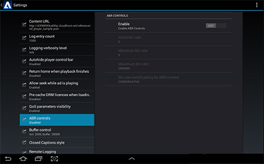

# QoS 재생 및 장치 통계 표시 {#display-qos-playback-and-device-statistics}

플레이어에서 필요한 만큼 자주 QoSProvider의 재생 및 장치 통계를 읽도록 설정할 수 있습니다.

다음 `QoSProvider` 클래스는 프레임 속도, 프로필 비트 속도, 버퍼링에 소요된 총 시간, 버퍼링 시도 횟수, 첫 번째 비디오 조각에서 첫 번째 바이트를 가져오는 데 걸린 시간, 첫 번째 프레임을 렌더링하는 데 걸린 시간, 현재 버퍼링된 길이 및 버퍼 시간을 포함하여 다양한 통계를 제공합니다.

참조 구현은 다음을 제공합니다 `QoSManager` QoS 오버레이 표시를 활성화할 수 있는 클래스입니다. 설정 사용자 인터페이스에서 QoS 가시성을 활성화할 수도 있습니다.

다음 `QoSManager` 디바이스 정보를 가져와서 미디어 플레이어에 연결하고 최신 QoS 정보로 업데이트하여 QoS 통계를 추적합니다.

**QoS 통계 보고 활성화 또는 비활성화**

1. ManagerFactory를 사용하여 QosManager를 만들거나 QoS 보고를 사용하도록 설정합니다.

   * QosManager를 만들려면:
      * 이 애플리케이션은 광고 워크플로 기능을 사용해야 합니다.

   QoSManager qosManager = 새로운 QosManagerOn();

   * ManagerFactory를 사용하여 QoS 통계 표시를 활성화하려면 다음을 수행합니다.

   qosManager = ManagerFactory.getQosManager(
   <b>true</b>, config, mediaPlayer);

   >[!NOTE]
   >
   >부울을 로 변경 `false` QoS 보고를 비활성화합니다.

2. 이벤트 리스너 추가:

   `qosManager.addEventListener(qosManagerEventListener);`

3. QoS 공급자를 만들고 플레이어 활동 컨텍스트에 연결합니다.

   `qosManager.createQOSProvider(getActivity());`

   >[!NOTE]
   >
   >플레이어 활동이 중단될 예정인 경우 을 호출해야 합니다. [qosManager.destroyQOSProvider](https://help.adobe.com/en_US/primetime/reference_implementation/android/javadoc/com/adobe/primetime/reference/manager/QosManager.html#destroyQOSProvider()) 미디어 플레이어에서 분리하여 QOS 공급자를 정리합니다.

**관련 API 설명서**

* [클래스 QosManager](https://help.adobe.com/en_US/primetime/api/reference_implementation/android/javadoc/com/adobe/primetime/reference/manager/QosManager.html)
* [클래스 QosManagerOn](https://help.adobe.com/en_US/primetime/api/reference_implementation/android/javadoc/com/adobe/primetime/reference/manager/QosManagerOn.html)
* [QosManagerEventListener](https://help.adobe.com/en_US/primetime/api/reference_implementation/android/javadoc/com/adobe/primetime/reference/manager/QosManager.QosManagerEventListener.html)
* [QosItem](https://help.adobe.com/en_US/primetime/api/reference_implementation/android/javadoc/com/adobe/primetime/reference/manager/QosManager.QosItem.html)
