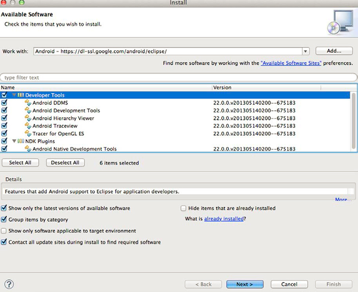

# 필수 구성 요소 소프트웨어 다운로드 및 구성 {#download-and-configure-prerequisite-software}

1. 에서 JDK 다운로드 [https://www.oracle.com/technetwork/java/javase/downloads/](https://www.oracle.com/technetwork/java/javase/downloads/).

   설치 프로세스는 간단합니다. 시스템에 JDK가 이미 설치되어 있는 경우 이 단계를 건너뛸 수 있지만 JDK, Eclipse IDE 및 OS가 호환되어야 합니다.
1. 에서 Java 개발자용 Eclipse IDE 다운로드 [https://www.eclipse.org/downloads](https://www.eclipse.org/downloads).

   패키지의 압축을 푼 후에 Eclipse를 직접 실행할 수 있습니다. 설치 관리자가 없습니다.
1. 에서 Android SDK ADT 번들 다운로드 [https://developer.android.com/sdk/index.html](https://developer.android.com/sdk/index.html).

   이 번들에는 Eclipse가 포함됩니다. 시스템에 Eclipse가 이미 설치되어 있는 경우 [!UICONTROL Use An Existing IDE] 섹션.

   압축을 풀고 기억할 위치에 설치합니다. 이후 단계에서 이를 참조해야 합니다.
1. Android SDK를 구성합니다.
   1. 터미널(Mac OS X에서)이나 명령 프롬프트(Windows에서)를 엽니다.
   1. Android SDK를 다운로드/압축을 푼 디렉토리로 이동합니다.
   1. 이름이 인 파일이 포함된 tools 폴더로 이동합니다. [!DNL android].
   1. 다음 명령을 실행합니다.

      * Mac OS X/Unix의 경우:

        ```
        chmod +x android 
        android update sdk --no-ui
        ```

      * Windows의 경우:

        ```
        android update sdk --no-ui
        ```

        이 프로세스는 시간이 소요됩니다.

1. Eclipse 구성
   1. Eclipse를 시작합니다.

      Windows에서 Eclipse가 시작되지 않고 Eclipse에서 필요한 Java 파일을 찾을 수 없다는 문제가 보고되면 다음을 시도해 보십시오.

      * 추가 `-vm C:\[path to your JDK bin]\javaw.exe` (으)로 [!DNL eclipse.ini] 파일.
   1. 선택  **[!UICONTROL Help]** > **[!UICONTROL Install New Software]** .
   1. 클릭 **[!UICONTROL Add...]**.
   1. 입력 `Android` 을 참조하십시오.
   1. 입력 `https://dl-ssl.google.com/android/eclipse/` 대상: **[!UICONTROL Work with]** 링크를 클릭합니다.
   1. 클릭 **[!UICONTROL OK]**.

      다음과 유사한 대화 상자가 표시됩니다.

      

   1. 결과 패키지(개발자 도구 및 NDK 플러그인)를 선택하고 **[!UICONTROL Next]**.

      Android 개발 도구(ADT)가 다운로드됩니다.
   1. 다운로드가 완료되면 Eclipse를 다시 시작합니다.

   이제 Android SDK가 설치되었습니다. 1. Android SDK를 찾아 리소스로 사용할 수 있도록 Eclipse를 구성합니다.
   1. Eclipse 열기.
   1. 선택  **[!UICONTROL Window]** > **[!UICONTROL Preferences]** Windows의 경우  **[!UICONTROL ADT]** > **[!UICONTROL Preferences]** Mac OS X에서
   1. 다음 항목 선택 **[!UICONTROL Android]** 탭.
   1. Android SDK의 위치를 찾습니다.
   1. 클릭 **[!UICONTROL Apply]**.

      
