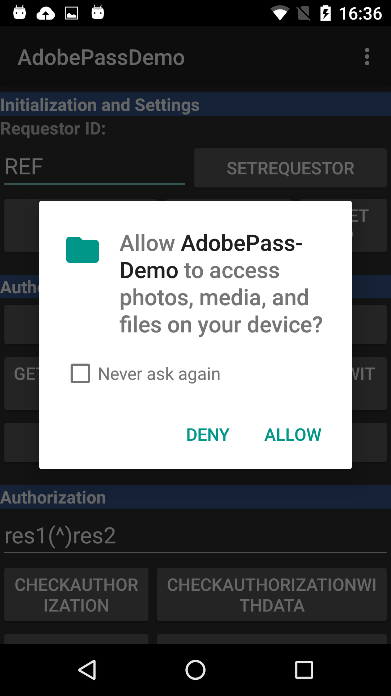

# Adobe Primetime 인증 및 Android 6 &quot;Marshmallow&quot; 새로운 권한 모델 {#adobe-primetime-authentication-and-the-android-6-marshmallow-new-permissions-model}

>[!NOTE]
>
>이 페이지의 컨텐츠는 정보용으로만 제공됩니다. 이 API를 사용하려면 Adobe의 현재 라이선스가 필요합니다. 허가되지 않은 사용은 허용되지 않습니다.

</br>

새로운 Android 6 Marshmallow 릴리스에서는 기존 Adobe Primetime 인증 SDK 버전 1.8 이상을 사용하는 앱의 동작에 영향을 줄 수 있는 권한 모델에 대한 일부 업데이트가 도입되었습니다.

새로운 기능으로서, 새로운 Android OS는 [설치 및 런타임 시 앱에 필요한 권한에 대한 세부적인 제어](https://developer.android.com/about/versions/marshmallow/android-6.0-changes.html).

>[!IMPORTANT]
>
>아래에 설명된 변경 사항은 다음과 같습니다. **android 6.0용으로 특별히 개발된 애플리케이션에만 영향을 미칩니다.** (targetSdkVersion=23). Android 6.0으로 업그레이드할 때 사용자의 디바이스에 이미 설치된 이전 애플리케이션에는 영향을 주지 않습니다.


특히 Android Studio에서 개발된 앱의 경우 [API 레벨 23](http://developer.android.com/sdk/api_diff/23/changes.html) 및 Adobe Primetime 인증 SDK를 사용하는 개발자는 사용자 지정 코드를 작성해야 합니다(아래 코드 조각 참조) [허용/거부 권한 대화 상자를 트리거하려면](https://developer.android.com/training/permissions/requesting.html).

다음은 장치 외부 스토리지에 대한 쓰기 액세스를 요청하는 데 사용되는 코드 발췌문입니다.

```java
// Here, thisActivity is the current activity
if (ContextCompat.checkSelfPermission(thisActivity,
                Manifest.permission.WRITE_EXTERNAL_STORAGE)
        != PackageManager.WRITE_EXTERNAL_STORAGE) {

    // Should we show an explanation?
    if (ActivityCompat.shouldShowRequestPermissionRationale(thisActivity,
            Manifest.permission.WRITE_EXTERNAL_STORAGE)) {

        // Show an expanation to the user *asynchronously* -- don't block
        // this thread waiting for the user's response! After the user
        // sees the explanation, try again to request the permission.

    } else {

        // No explanation needed, we can request the permission.

        ActivityCompat.requestPermissions(thisActivity,
                new String[]{Manifest.permission.WRITE_EXTERNAL_STORAGE},
                MY_PERMISSIONS_REQUEST_WRITE_EXTERNAL_STORAGE);

        // MY_PERMISSIONS_REQUEST_WRITE_EXTERNAL_STORAGE is an
        // app-defined int constant. The callback method gets the
        // result of the request.
    }
}
```


**사용자의 관점에서**&#x200B;를 설치하면 파일에 대한 읽기/쓰기 권한을 확인하는 창이 표시됩니다(아래 그림 2 참조). 이렇게 하면 다음 두 가지 결과 중 하나가 생성됩니다.

1. 사용자인 경우 **확인** 권한, 일반 인증 흐름은 유지되고 토큰은 글로벌 저장소에 저장됩니다. 토큰이 유효한 경우 사용자는 앱 및 여러 앱에서 Adobe Primetime 인증을 사용하여 인증된 상태를 유지합니다.
1. 사용자인 경우 **거부** 저장소에서 권한, 쓰기 작업이 실패하고 사용자가 앱을 종료할 때까지만 인증됩니다. 전경과 배경 간을 전환할 때 일부 응용 프로그램이 다시 초기화되므로 이 작업을 수행할 때 사용자가 로그아웃됩니다. 토큰은 저장되지 않으며 사용자는 앱을 사용할 때마다 인증해야 합니다.


>[!TIP]
>
>Adobe Primetime 인증 SDK 1.9에는 현재 스토리지 복원력을 도입하는 기능이 개발 중입니다. 새 SDK가 다음에 대해 타깃팅됨 **10월 마지막 주 릴리스**. 응용 프로그램은 일반 저장소를 사용할 수 없을 때마다 응용 프로그램의 샌드박스 저장소에 쓰는 것으로 대체됩니다. API 레벨 23에서 개발된 애플리케이션의 경우 사용자가 글로벌 스토리지에서 읽기/쓰기 권한을 수락하지 않는 경우를 다룹니다. 토큰은 앱마다 개별적으로 저장되므로 Adobe Primetime 인증을 사용하는 앱 간 Single Sign-On이 비활성화됩니다.




*그림: API 레벨 23으로 작성된 앱에 대한 권한 요청 대화 상자*

>[!IMPORTANT]
>
> Adobe 권고 사항 **파트너는 인증 프로세스에서 최상의 사용자 경험을 보장하기 위해 API 레벨 22(targetSdkVersion=22) 이상을 사용하여 앱을 개발할 수 있습니다.**.
