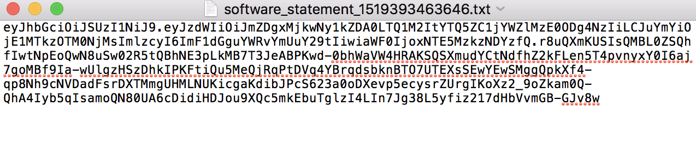

# Dynamic Client Registration Management {#dynamic-client-registration-management}

>[!NOTE]
>
>이 페이지의 컨텐츠는 정보용으로만 제공됩니다. 이 API를 사용하려면 Adobe의 현재 라이선스가 필요합니다. 무단 사용이 허용되지 않습니다.

## 개요 {#overview}

그리고 [Android Chrome 사용자 지정 탭](https://developer.chrome.com/multidevice/android/customtabs){target_blanck} 및 [Apple Safari View Controller](https://developer.apple.com/documentation/safariservices/sfsafariviewcontroller)고객 응용 프로그램의 {target_blanck}에서 Adobe Primetime 인증에서 사용자 인증 흐름을 업데이트하고 있습니다. 보다 구체적으로, 더 이상 상태를 유지 관리하는 목표를 달성하지 못하여 MVPD 가입자 인증의 사용자 에이전트 흐름을 리디렉션 간에 추적할 수 있습니다. 이 작업은 이전에 HTTP 쿠키를 사용하여 수행되었습니다. 이 제한은 모든 API를 OAuth 2.0으로 마이그레이션하기 시작하는 드라이버입니다 [RFC6749](https://tools.ietf.org/html/rfc6749){target_blanck}.

이 업데이트를 통해 Adobe 인증 클라이언트는 OAuth 2.0 클라이언트가 되고 사용자 지정 OAuth 2.0 인증 서버가 Adobe Primetime 인증 서비스의 요구 사항을 충족하도록 배포됩니다.

클라이언트 응용 프로그램이 OAuth 2.0 권한을 활용하려면 서버가 동적으로 등록하여 특정 정보(클라이언트 자격 증명)를 가져와 상호 작용할 수 있어야 합니다. 등록 프로세스의 일부로 클라이언트는 기본 제공 메타데이터 집합을 클라이언트 등록 종단점에 제공해야 합니다.

이 메타데이터는 &quot;software_id&quot;를 포함하는 소프트웨어 문으로 통신되며, 인증 서버에서 동일한 소프트웨어 문을 사용하여 응용 프로그램의 다른 인스턴스를 상호 연관시킬 수 있습니다.

A **소프트웨어 명세서** 는 클라이언트 소프트웨어에 대한 메타데이터 값을 번들로 어설션하는 JSON 웹 토큰(JWT)입니다. 클라이언트 등록 요청의 일부로 인증 서버에 표시할 때 소프트웨어 문에 디지털 서명을 하거나 JWS(JSON 웹 서명)를 사용하여 MACed를 지정해야 합니다.

소프트웨어 명세서의 정의와 공식 설명서에서 작동 방식에 대한 자세한 설명을 확인할 수 있습니다 [RFC7591](https://tools.ietf.org/html/rfc7591).

소프트웨어 문은 사용자의 장치에 있는 애플리케이션과 함께 배포되어야 합니다.

이 업데이트 전에 Adobe에는 애플리케이션에서 Adobe Primetime 인증 호출을 수행할 수 있는 두 가지 메커니즘이 있었습니다.

* 브라우저 기반 클라이언트는 를 통해 등록됩니다 [도메인 목록](/help/authentication/programmer-overview.md#reg-and-init)
* iOS 및 Android 애플리케이션과 같은 기본 애플리케이션 클라이언트는 **서명 요청자** 메커니즘

클라이언트 등록 인증 메커니즘을 사용하여 TVE 대시보드에 애플리케이션을 추가해야 합니다.

고객이 새로운 Android SDK 및 예정된 iOS SDK의 구현을 시작하려면 소프트웨어 문이 필요합니다. 소프트웨어 문은 TVE 대시보드에서 생성된 응용 프로그램을 식별합니다.

아래 섹션의 단계를 따라 TVE 대시보드에서 등록된 애플리케이션을 만듭니다.

## 등록된 응용 프로그램 만들기 {#create_app}

TVE 대시보드에서 등록된 애플리케이션을 생성할 수 있는 방법에는 두 가지가 있습니다.

* [프로그래머 수준](#prog-level) - 등록된 응용 프로그램을 만들어 임의의 또는 모든 프로그래머 채널에 연결할 수 있습니다.

* [채널 수준](#channel-level) - 이 채널에만 영구적으로 연결된 등록된 응용 프로그램을 만들 수 있습니다.

### 프로그래머 수준에서 등록된 응용 프로그램 만들기 {#prog-level}

이동 **프로그래머** > **등록된 응용 프로그램** 탭.

등록된 응용 프로그램 탭에서 **새 애플리케이션 추가**. 새 창에서 필요한 필드를 입력합니다.

아래 이미지와 같이 입력해야 하는 필드는 다음과 같습니다.

* **응용 프로그램 이름** - 응용 프로그램의 이름

* **채널에 할당됨** - 채널의 이름, t또는 이 응용 프로그램이 연결된 경로입니다. 드롭다운 마스크의 기본 설정은 다음과 같습니다 **모든 채널.** 인터페이스를 사용하면 한 채널 또는 모든 채널을 선택할 수 있습니다.

* **애플리케이션 버전** - 기본적으로 &quot;1.0.0&quot;으로 설정되어 있지만 자체 애플리케이션 버전으로 수정하는 것이 좋습니다. 가장 좋은 방법으로서, 애플리케이션 버전을 변경하기로 결정하는 경우, 애플리케이션에 대해 새로 등록된 애플리케이션을 만들어 반영하십시오.

* **애플리케이션 플랫폼** - 응용 프로그램에 연결할 플랫폼입니다. 모든 값 또는 여러 값을 선택할 수 있는 옵션이 있습니다.

* **도메인 이름** - 연결할 응용 프로그램의 도메인. 드롭다운 목록의 도메인은 모든 채널에서 모든 도메인을 선택한 통합된 도메인입니다. 목록에서 여러 도메인을 선택할 수 있는 옵션이 있습니다. 도메인은 리디렉션 URL입니다 [RFC6749](https://tools.ietf.org/html/rfc6749). 클라이언트 등록 프로세스에서는 클라이언트 응용 프로그램이 인증 흐름의 최종 선택을 위해 리디렉션 URL을 사용하도록 요청할 수 있습니다. 클라이언트 응용 프로그램이 특정 리디렉션 URL을 요청하면 이 URL은 소프트웨어 문과 연결된 이 등록 응용 프로그램에서 화이트리스트에 추가된 도메인에 대해 검증됩니다.

필드에 적절한 값을 입력한 후 응용 프로그램을 구성에 저장하려면 &quot;완료&quot;를 클릭해야 합니다.

다음 사항이 있음을 알아두십시오 **이미 생성된 응용 프로그램을 수정하는 옵션 없음**. 만들어진 항목이 더 이상 요구 사항을 충족하지 않는 경우 요구 사항을 충족하는 클라이언트 애플리케이션과 함께 등록된 새 애플리케이션을 만들고 사용해야 합니다.

### 채널 수준에서 새 애플리케이션 등록 {#channel-level}

채널 수준에서 등록된 응용 프로그램을 만들려면 &quot;채널&quot; 메뉴로 이동하고 응용 프로그램을 만들 응용 프로그램을 선택합니다. 그런 다음 &quot;등록된 응용 프로그램&quot; 탭으로 이동한 후 &quot;새 응용 프로그램 추가&quot; 단추를 클릭합니다.

아래 그림과 같이, 여기에서는 Programmer 수준에서 수행된 동일한 작업에 비해 약간 다른 &quot;Assigned Channels&quot; 드롭다운이 활성화되지 않으므로 등록된 응용 프로그램을 현재 채널 이외의 다른 채널에 바인딩할 수 있는 옵션이 없습니다.

## 애플리케이션 나열 {#list-reg-app}

등록된 응용 프로그램을 만든 후에는 요청의 일부로 인증 서버를 제공하기 위한 소프트웨어 문을 가져올 수 있습니다.

등록된 응용 프로그램이 생성된 Programmer 또는 Channel로 이동하여 나열된 응용 프로그램을 만들 수 있습니다. 

아래에 정리된 대로 목록의 모든 항목은 해당 항목이 바인딩되어 있는 플랫폼의 이름, 버전 및 기호로 식별됩니다.

각 사용자에 대해 다음을 수행할 수 있습니다.

* [보기](#view)
* [소프트웨어 문 다운로드](#download-statement)

### 등록된 응용 프로그램 보기 {#view}

응용 프로그램 목록에서 응용 프로그램 중 하나를 선택하고 &quot;보기&quot; 단추를 누르면 응용 프로그램이 생성될 때 사용된 세부 정보가 표시됩니다. 앞에서 언급했듯이 어떤 것도 수정할 수 없습니다.

### 소프트웨어 문 다운로드 {#download-statement}

소프트웨어 문이 필요한 목록 항목에서 &quot;다운로드&quot; 단추를 클릭하면 텍스트 파일이 생성됩니다. 이 파일에는 아래 샘플 출력과 유사한 내용이 포함됩니다.

파일의 이름은 &quot;software_statement&quot;로 접두사를 추가하고 현재 타임스탬프를 추가하여 고유하게 식별됩니다.

동일한 등록된 애플리케이션의 경우 다운로드 단추를 클릭할 때마다 다른 소프트웨어 구문을 수신하지만 이 응용 프로그램에 대해 이전에 획득한 소프트웨어 문은 무효화되지 않습니다. 이 문제는 작업 요청별로 즉시 생성되기 때문에 발생합니다.

하나 있습니다 **제한** 다운로드 작업에 대한 정보입니다. 등록된 애플리케이션을 작성한 후 바로 &quot;다운로드&quot; 버튼을 클릭하여 소프트웨어 구문을 요청했지만 아직 저장되지 않았으며 구성 json이 동기화되지 않은 경우 페이지 하단에 다음 오류 메시지가 표시됩니다. 

이렇게 하면 등록된 응용 프로그램의 ID가 아직 전파되지 않았고 코어에 정보가 없으므로 코어에서 받은 HTTP 404 찾을 수 없음 오류 코드가 래핑됩니다.

등록된 애플리케이션을 만든 후 구성이 동기화될 때까지 최대 2분 동안 대기합니다. 이렇게 되면 오류 메시지가 더 이상 수신되지 않고 소프트웨어 명령문이 있는 텍스트 파일을 다운로드할 수 있습니다.

엔드 투 엔드 프로세스가 작동하는 방식에 대한 자세한 내용 또는 요청이 수행되는 방식과 예상되는 응답에 대한 자세한 내용은 아래의 관련 정보에서 링크를 참조하십시오.

<!--
## Related Information {#related}

* [Dynamic Client Registration API](/help/authentication/dynamic-client-registration-api.md)
* [TVE Dashboard User Guide](/help/authentication/tve-dashboard-user-guide.md)
-->

## 기능 데모 {#tutorial}

보세요 [이 웨비나](https://my.adobeconnect.com/pzkp8ujrigg1/) 기능 컨텍스트를 더 제공하고 TVE 대시보드를 사용하여 소프트웨어 구문을 관리하는 방법과 Android SDK의 일부로 Adobe에서 제공하는 데모 애플리케이션을 사용하여 생성된 소프트웨어 문을 테스트하는 방법에 대한 데모를 포함합니다.
