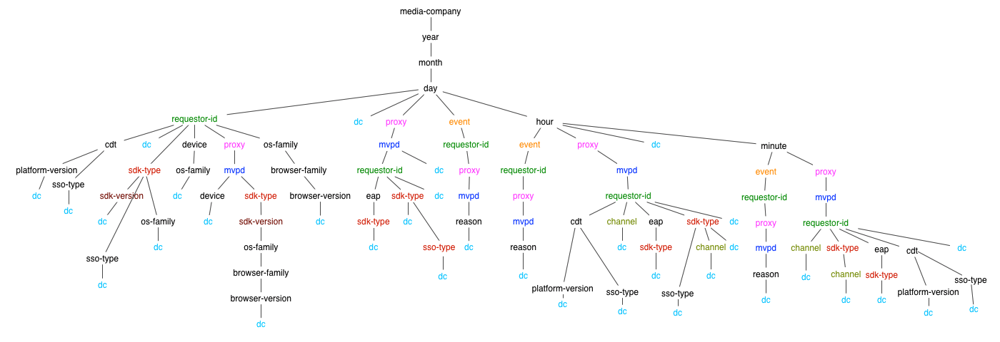

# 권한 부여 서비스 모니터링 API {#entitlement-service-monitoring-api}

>[!NOTE]
>
>이 페이지의 컨텐츠는 정보용으로만 제공됩니다. 이 API를 사용하려면 Adobe의 현재 라이선스가 필요합니다. 허가되지 않은 사용은 허용되지 않습니다.

## API 개요 {#api-overview}

ESM(Entitlement Service Monitoring)은 WOLAP(웹 기반)로 구현됨 [온라인 분석 처리](https://en.wikipedia.org/wiki/Online_analytical_processing){target=_blank}) 프로젝트. ESM은 데이터 웨어하우스에서 지원하는 일반적인 비즈니스 보고 웹 API입니다. 일반 OLAP 작업을 RESTfully로 수행할 수 있도록 하는 HTTP 쿼리 언어 역할을 합니다.

>[!NOTE]
>
>ESM API는 일반적으로 사용할 수 없습니다. 가용성에 대한 질문이 있는 경우 Adobe 담당자에게 문의하십시오.

ESM API는 기본 OLAP 큐브의 계층 구조 보기를 제공합니다. 각 리소스([차원](#esm_dimensions) 차원 계층에서 URL 경로 세그먼트로 매핑됨)은 (집계됨)을 사용하여 보고서를 생성합니다 [지표](#esm_metrics) 현재 선택 항목에 사용됩니다. 각 리소스는 상위 리소스(롤업용)와 하위 리소스(드릴다운용)를 가리킵니다. 슬라이싱 및 다이싱은 특정 값 또는 범위에 차원을 고정하는 쿼리 문자열 매개 변수를 통해 수행됩니다.

REST API는 차원 경로, 제공된 필터 및 선택한 지표에 따라 요청에 지정된 시간 간격(제공되지 않은 경우 기본값으로 폴백) 내에 사용 가능한 데이터를 제공합니다. 시간 차원 (연도, 월, 일, 시간, 분, 초)이 포함되지 않은 보고서에는 시간 범위가 적용되지 않습니다.

끝점 URL 루트 경로는 사용 가능한 드릴다운 옵션에 대한 링크와 함께 단일 레코드 내에서 전체 집계된 지표를 반환합니다. API 버전은 끝점 URI 경로의 후행 세그먼트로 매핑됩니다. 예를 들어, `https://mgmt.auth.adobe.com/*v2*` 는 클라이언트가 WOLAP 버전 2에 액세스함을 의미합니다.

사용 가능한 URL 경로는 응답에 포함된 링크를 통해 검색할 수 있습니다. 유효한 URL 경로는 집계된 지표를 보유하는 기본 드릴다운 트리 내의 경로를 매핑하기 위해 유지됩니다. 양식의 경로 `/dimension1/dimension2/dimension3` 이 세 가지 차원의 사전 집계를 반영합니다(SQL과 동일). `clause GROUP` 작성자: `dimension1`, `dimension2`, `dimension3`). 이러한 사전 집계가 존재하지 않고 시스템이 즉시 계산할 수 없는 경우, API는 404 Not Found 응답을 반환합니다.

## 드릴다운 트리 {#drill-down-tree}

다음 드릴다운 트리는 ESM 2.0에서 사용할 수 있는 차원(리소스)을 보여 줍니다. [프로그래머] (#esm_dimensions) 및 [MVPD](#esm_dimensions_mvpd).


### 프로그래머가 사용할 수 있는 Dimension {#progr-dimensions}



### MVPD에 사용 가능한 Dimension {#mvpd-dimensions}


GET: `https://mgmt.auth.adobe.com/v2` API 끝점은 다음을 포함하는 표현을 반환합니다.

* 사용 가능한 루트 드릴다운 경로 링크:

   * `<link rel="drill-down" href="/v2/dimensionA"/>`

   * `<link rel="drill-down" href="/v2/dimensionB"/>`

* 모든 지표에 대한 요약(집계된 값)입니다(기본 간격에서 쿼리 문자열 매개 변수가 제공되지 않았으므로 아래 참조).


드릴다운 경로(단계별) 수행:
`/dimensionA/year/month/day/dimensionX` 다음 응답을 검색합니다.

* 에 대한 링크`dimensionY`&quot; 및 &quot;`dimensionZ`&quot;드릴다운 옵션

* 각 값에 대한 일별 합계가 포함된 보고서 `dimensionX`


### 필터

날짜/시간 차원을 제외하고, 현재 투영(치수 경로)에 사용할 수 있는 모든 치수는 해당 이름을 쿼리 문자열 매개 변수로 사용하여 필터링할 수 있습니다.

다음 필터링 옵션을 사용할 수 있습니다.

* **다음과 같음** 필터는 차원 이름을 쿼리 문자열의 특정 값으로 설정하여 제공합니다.

* **위치** 필터는 차원=값1\&amp;dimension=값2 와 같은 차원-이름 매개 변수를 여러 번 추가하여 지정할 수 있습니다.

* **같지 않음** 필터는 &#39;\!&#39;를 사용해야 합니다. 차원 이름 뒤에 기호가 있으면 &#39;\!=&#39; &quot;operator&quot;: dimension\!=value

* **다음에 없음** 필터에는 &#39;\!=&#39; 연산자를 집합에 있는 각 값에 대해 한 번씩 여러 번 사용합니다. 차원\!=value1\&amp;dimension\!=value2&amp;...

쿼리 문자열의 차원 이름에 대한 특별한 용도가 있습니다. 차원 이름이 값 없이 쿼리 문자열 매개 변수로 사용되는 경우 API에 보고서에 해당 차원을 포함하는 프로젝션을 반환하도록 지시합니다.

### 예제 ESM 쿼리

| *URL* | *SQL 해당 항목* |
|---|---|
| /dimension1/dimension2/dimension3?dimension1=value1 | 투영에서 * 을 선택합니다. 여기서 dimension1 = &#39;value1&#39; </br> 차원1, 차원2, 차원3으로 그룹화 |
| /dimension1/dimension2/dimension3?dimension1=value1&amp;dimension1=value2 | 다음 위치에서 DIMENSION1이 있는 투영에서 * 선택(&#39;value1&#39;, &#39;value2&#39;) </br> 차원1, 차원2, 차원3으로 그룹화 |
| /dimension1/dimension2/dimension3?dimension1!=value1 | 투영에서 *를 선택합니다. 여기서 dimension1 &lt;> &#39;value1&#39; | </br> 차원1, 차원2, 차원3으로 그룹화 |
| /dimension1/dimension2/dimension3?dimension1!=value1&amp;dimension2!=value2 | DIMENSION1이 없는 투영에서 * 선택(&#39;value1&#39;, &#39;value2&#39;) | </br> 차원1, 차원2, 차원3으로 그룹화 |
| 직접 경로가 없다고 가정합니다. /dimension1/dimension3 </br> 경로가 있습니다. /dimension1/dimension2/dimension3 </br> </br> /dimension1?dimension3 | 치수 1, 치수 3에 의한 투영 그룹에서 * 선택 |

>[!NOTE]
>
>이러한 필터링 기법은 다음 작업에 작동하지 않습니다. `date/time` 차원. 필터링할 수 있는 유일한 방법 `date/time` 차원은 다음을 설정하는 것입니다. `start` 및 `end` 쿼리 문자열 매개 변수(아래에 설명)를 필수 값으로 바꿉니다.

다음 쿼리 문자열 매개 변수에는 API에 대해 예약된 의미가 있습니다(따라서 차원 이름으로 사용할 수 없거나 해당 차원에 대해 필터링할 수 없음).

### ESM API 예약 쿼리 문자열 매개 변수

| 매개 변수 | 선택 사항 | 설명 | 기본값 | 예 |
| --- | ---- | --- | ---- | --- |
| access_token | 예 | IMS OAuth 보호가 활성화된 경우 IMS 토큰을 표준 Authorization Bearer 토큰 또는 쿼리 문자열 매개 변수로 전달할 수 있습니다. | 없음 | access_token=XXXXXX |
| dimension-name | 예 | 모든 차원 이름 - 현재 URL 경로 또는 유효한 하위 경로에 포함되어 있으며 값은 같음 필터로 처리됩니다. 값을 제공하지 않으면 지정된 차원이 현재 경로에 포함되어 있지 않거나 인접한 경우에도 출력에 포함됩니다 | 없음 | someDimension=someValue&amp;someOtherDimension |
| 종료 | 예 | 보고서 종료 시간(밀리초) | 서버의 현재 시간 | end=2012-07-30 |
| 형식 | 예 | 콘텐츠 협상에 사용됩니다(효과는 동일하지만 경로 &quot;확장&quot;보다 우선하지 않음 - 아래 참조). | 없음: 콘텐츠 협상에서는 다른 전략을 시도합니다. | format=json |
| 제한 | 예 | 반환할 최대 행 수 | 요청에 제한이 지정되지 않은 경우 서버가 자체 링크에서 보고한 기본값 | limit=1500 |
| 지표 | 예 | 반환할 지표 이름을 쉼표로 구분한 목록. 페이로드 크기를 줄이기 위해 사용 가능한 지표의 하위 집합을 필터링하고 기본 최적 투영이 아닌 요청된 지표를 포함하는 투영을 반환하도록 API를 적용하는 데 모두 사용해야 합니다. | 이 매개변수가 제공되지 않을 경우 현재 투영에 사용할 수 있는 모든 지표가 반환됩니다. | metrics=m1,m2 |
| 시작 | 예 | ISO8601로 보고서의 시작 시간. 접두사만 제공되는 경우 서버는 나머지 부분을 채웁니다. 예를 들어 start=2012이면 start=2012-01-01이 됩니다.:00:00시 | 서버가 자체 링크에서 보고함. 서버는 선택한 시간 세부기간을 기반으로 적절한 기본값을 제공하려고 합니다. | start=2012-07-15 |

현재 사용 가능한 HTTP 메서드는 GET 뿐입니다. OPTIONS/HEAD 방법에 대한 지원은 이후 버전에서 제공될 수 있습니다.

## ESM API 상태 코드 {#esm-api-status-codes}

| 상태 코드 | 이유 구문 | 설명 |
|---|---|---|
| 200 | 확인 | 응답에는 &quot;롤업&quot; 및 &quot;드릴다운&quot; 링크가 포함됩니다(해당하는 경우). 보고서는 리소스의 속성(중첩된 &quot;report&quot; 요소/속성)으로 렌더링됩니다. |
| 400 | 잘못된 요청 | 응답 본문에는 요청의 문제를 설명하는 텍스트 메시지가 포함됩니다. </br> </br> 400 잘못된 요청 상태에는 클라이언트 오류와 관련된 유용한 정보를 제공하는 응답 본문(일반/텍스트 미디어 유형)의 설명 텍스트가 동반됩니다. 부적합한 날짜 형식 또는 기존 차원에 적용된 필터와 같은 사소한 시나리오 외에도, 시스템은 즉시 반환되거나 집계될 대량의 데이터가 필요한 쿼리에 대한 응답도 거부합니다. |
| 401 | 승인되지 않음 | 사용자를 인증하기 위한 적절한 OAuth 헤더가 포함되지 않은 요청으로 인해 발생합니다 |
| 403 | 금지됨 | 요청이 현재 보안 컨텍스트에서 허용되지 않음을 나타냅니다. 이는 사용자가 인증되었지만 요청된 정보에 액세스할 수 없을 때 발생합니다 |
| 404 | 찾을 수 없음 | 잘못된 URL 경로가 요청과 함께 제공된 경우 발생합니다. 클라이언트가 200개의 응답이 제공된 &quot;드릴다운&quot;/&quot;롤업&quot; 링크를 따르는 경우 이 문제가 발생하지 않습니다 |
| 405 | 메서드가 허용되지 않음 | 지원되지 않는 메서드가 요청에 사용되었음을 나타냅니다. 현재는 GET 메서드만 지원되지만, 이후 버전에서는 HEAD 또는 OPTIONS을 허용할 수 있습니다 |
| 406 | 허용되지 않음 | 클라이언트에서 지원되지 않는 미디어 유형을 요청했음을 나타냅니다. |
| 500 | 내부 서버 오류 | &quot;이런 일은 절대 일어나선 안 됩니다.&quot; |
| 503 | 서비스를 사용할 수 없음 | 응용 프로그램 또는 그 종속성 내에 오류를 표시합니다. |

## 데이터 형식 {#data-formats}

데이터는 다음 형식으로 사용할 수 있습니다.

* JSON(기본값)
* XML
* CSV
* HTML(데모 목적)

클라이언트가 사용할 수 있는 콘텐츠 협상 전략은 다음과 같습니다(우선 순위는 목록의 위치에 의해 지정됩니다.).

1. URL 경로의 마지막 세그먼트에 추가된 &quot;파일 확장명&quot;: 예: `/esm/v2/media-company/year/month/day.xml`. URL에 쿼리 문자열이 포함된 경우 확장은 물음표 앞에 와야 합니다. `/esm/v2/media-company/year/month/day.csv?mvpd= SomeMVPD`
1. 형식 쿼리 문자열 매개 변수: 예: `/esm/report?format=json`
1. 표준 HTTP Accept 헤더(예: ) `Accept: application/xml`

&quot;확장&quot; 및 쿼리 매개 변수는 모두 다음 값을 지원합니다.

* xml
* json
* csv
* html

어느 전략에서도 미디어 유형을 지정하지 않은 경우 API는 기본적으로 JSON 콘텐츠를 생성합니다.

## 하이퍼텍스트 응용 프로그램 언어 {#hypertext-application-language}

JSON 및 XML의 경우 페이로드는 다음에 설명된 대로 HAL로 인코딩됩니다.  <http://stateless.co/hal_specification.html>.

실제 보고서(&quot;report&quot;라는 중첩된 태그/속성)는 선택한/적용할 수 있는 모든 차원과 지표가 포함된 실제 레코드 목록으로 구성되며, 해당 값은 다음과 같이 인코딩됩니다.

### JSON

```JSON
 "report": [
  {
    "dimension1": "d1",
    ...
    "metric1": "m1",
    ...
  }, {
    ...
  }
]
```

### XML

```XML
 <report>
  <record dimension1="d1" ... metric1="m1" ... />
  ...
</report
```

XML 및 JSON 형식의 경우 레코드 내의 필드(차원 및 지표) 순서가 지정되지 않지만 일관됩니다(모든 레코드에서 순서가 동일함). 그러나 클라이언트는 레코드 내의 특정 필드 순서에 의존해서는 안 됩니다.

리소스 링크(JSON의 &quot;self&quot; rel 및 XML의 &quot;href&quot; 리소스 속성)에는 인라인 보고서에 사용되는 현재 경로 및 쿼리 문자열이 포함되어 있습니다. 쿼리 문자열은 암시적 및 명시적 매개 변수를 모두 표시하므로 페이로드는 사용된 시간 간격, 암시적 필터(있는 경우) 등을 명시적으로 지정합니다. 리소스 내의 나머지 링크에는 현재 데이터에서 드릴다운하기 위해 따를 수 있는 사용 가능한 모든 세그먼트가 포함됩니다. 롤업에 대한 링크도 제공되며 상위 경로(있는 경우)를 가리킵니다. 다음 `href` 드릴다운/롤업 링크의 값에는 URL 경로만 포함됩니다(쿼리 문자열은 포함되지 않으므로 필요한 경우 클라이언트가 추가해야 함). 현재 리소스에서 사용(또는 암시적)한 모든 쿼리 문자열 매개 변수를 &quot;롤업&quot; 또는 &quot;드릴다운&quot; 링크에 적용할 수 있는 것은 아닙니다(예: 하위 또는 상위 리소스에는 필터가 적용되지 않을 수 있음).

예(라는 단일 지표가 있다고 가정함) `clients` 및 에는 사전 집계가 있습니다. `year/month/day/...`):

* https://mgmt.auth.adobe.com/esm/v2/year/month.xml

```XML
   <resource href="/esm/v2/year/month?start=2012-07-20T00:00:00&end=2012-08-20T14:35:21">
   <links>
   <link rel="roll-up" href="/esm/v2/year"/>
   <link rel="drill-down" href="/esm/v2/year/month/day"/>
   </links>
   <report>
   <record month="6" year="2012" clients="205"/>
   <record month="7" year="2012" clients="466"/>
   </report>
   </resource>
```

* https://mgmt.auth.adobe.com/esm/v2/year/month.json 

   ```JSON
       {
         "_links" : {
           "self" : {
             "href" : "/esm/v2/year/month?start=2012-07-20T00:00:00&end=2012-08-20T14:35:21"
           },
           "roll-up" : {
             "href" : "/esm/v2/year"
           },
           "drill-down" : {
             "href" : "/esm/v2/year/month/day"
           }
         },
         "report" : [ {
           "month" : "6",
           "year" : "2012",
           "clients" : "205"
         }, {
           "month" : "7",
           "year" : "2012",
           "clients" : "466"
         } ]
       }
   ```

### CSV

CSV 데이터 형식에서는 링크 또는 기타 메타데이터(헤더 행 제외)가 인라인으로 제공되지 않습니다. 대신 선택 메타데이터가 파일 이름으로 제공되며, 이 파일 이름은 다음 패턴을 따릅니다.

```CSV
    esm__<start-date>_<end-date>_<filter-values,...>.csv
```

CSV에는 머리글 행이 포함된 다음 보고서 데이터가 후속 행으로 포함됩니다. 머리글 행에는 모든 차원이 포함되며 그 뒤에는 모든 지표가 포함됩니다. 보고서 데이터의 정렬 순서는 차원 순서로 반영됩니다. 따라서 데이터가 정렬 기준: `D1` 다음 기준 `D2`, CSV 헤더는 다음과 같이 표시됩니다. `D1, D2, ...metrics...`.

머리글 행의 필드 순서는 테이블 데이터의 정렬 순서를 반영합니다.


예: https://mgmt.auth.adobe.com/v2/year/month.csv에서 라는 파일을 생성합니다. `report__2012-07-20_2012-08-20_1000.csv` (다음 컨텐츠 포함)


| 년 | 월 | 클라이언트 |
| ---- | :---: | ------- |
| 2012 | 6 | 580 |
| 2012 | 7 | 231 |

## 데이터 새로 고침 {#data-freshness}

성공적인 HTTP 응답에는 `Last-Modified` 본문의 보고서가 마지막으로 업데이트된 시간을 나타내는 헤더입니다. Last-Modified 헤더가 없다는 것은 보고서 데이터가 실시간으로 계산됨을 나타냅니다.

일반적으로 조악한 데이터는 세분화된 데이터보다 덜 자주 업데이트됩니다(예: 분 단위 값 또는 시간별 값은 일별 값보다 더 최신일 수 있으며, 특히 고유 카운트와 같이 더 작은 세부기간을 기반으로 계산할 수 없는 지표의 경우).

향후 버전의 ESM에서는 표준 &quot;If-Modified-Since&quot; 헤더를 제공하여 클라이언트가 조건부 GET을 수행할 수 있습니다.

## GZIP 압축 {#gzip-compression}

Adobe은 ESM 보고서를 가져오는 클라이언트에서 gzip 지원을 활성화할 것을 강력히 권장합니다. 이렇게 하면 응답 크기가 크게 줄어들어 응답 시간이 줄어듭니다. (ESM 데이터의 압축 비율은 20~30 범위 내에 있습니다.)

클라이언트에서 gzip 압축을 활성화하려면 `Accept-Encoding:` 헤더를 다음과 같이 지정합니다.

* Accept-Encoding: gzip, 수축


<!--
## Related Information {#related-information}

- [ESM Overview](/help/authentication/entitlement-service-monitoring-overview.md)
- [Degradation API Overview](/help/authentication/degradation-api-overview.md)
- [Understanding Server-side Metrics](/help/authentication/understanding-serverside-metrics.md)
-->
