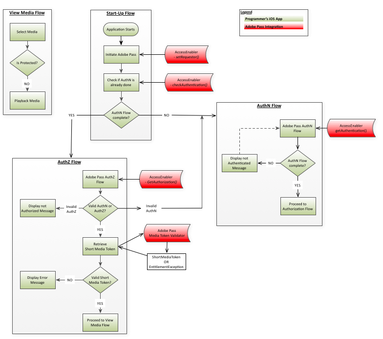

# iOS/tvOS SDK Cookbook {#iostvos-sdk-cookbook}

>[!NOTE]
>
>이 페이지의 컨텐츠는 정보용으로만 제공됩니다. 이 API를 사용하려면 Adobe의 현재 라이선스가 필요합니다. 허가되지 않은 사용은 허용되지 않습니다.

## 소개 {#intro}

이 문서에서는 프로그래머 상위 수준 애플리케이션이 iOS/tvOS AccessEnabler 라이브러리에서 노출된 API를 통해 구현할 수 있는 자격 부여 워크플로에 대해 설명합니다.

iOS/tvOS용 Adobe Primetime 인증 자격 솔루션은 궁극적으로 두 개의 도메인으로 나뉩니다.

* UI 도메인 - UI를 구현하고 AccessEnabler 라이브러리에서 제공하는 서비스를 사용하여 제한된 콘텐츠에 액세스할 수 있는 상위 레벨 애플리케이션 계층입니다.

* AccessEnabler 도메인 - 권한 부여 워크플로우는 다음과 같은 형태로 구현됩니다.

   * Adobe의 백엔드 서버에 대한 네트워크 호출
   * 인증 및 권한 부여 워크플로와 관련된 비즈니스 논리 규칙
   * 다양한 리소스 관리 및 워크플로 상태 처리(예: 토큰 캐시)

AccessEnabler 도메인의 목적은 권한 부여 워크플로의 모든 복잡성을 숨기고 AccessEnabler 라이브러리를 통해 권한 부여 워크플로를 구현하는 간단한 권한 부여 기본 세트를 상위 레이어 애플리케이션에 제공하는 것입니다.

1. 요청자 ID 설정
1. 특정 ID 공급자에 대한 인증 확인 및 가져오기
1. 특정 리소스에 대한 권한 부여 확인 및 받기
1. 로그아웃
1. Apple SSO는 Apple VSA 프레임워크를 프록싱하여 흘러갑니다

AccessEnabler의 네트워크 작업은 자체 스레드에서 수행되므로 UI 스레드가 차단되지 않습니다. 따라서 두 애플리케이션 도메인 간의 양방향 통신 채널은 완전히 비동기적인 패턴을 따라야 합니다.

* UI 애플리케이션 레이어는 AccessEnabler 라이브러리에 의해 노출된 API 호출을 통해 AccessEnabler 도메인에 메시지를 전송합니다.
* AccessEnabler는 UI 레이어가 AccessEnabler 라이브러리에 등록하는 AccessEnabler 프로토콜에 포함된 콜백 메서드를 통해 UI 레이어에 응답합니다.

## 방문자 ID 구성 {#visitorIDSetup}

구성 [Marketing Cloud visitorID](https://experienceleague.adobe.com/docs/id-service/using/home.html) analytics 관점에서 가치는 매우 중요합니다. visitorID 값이 설정되면 SDK는 모든 네트워크 호출과 함께 이 정보를 전송하고 Adobe Primetime 인증 서버는 이 정보를 수집합니다. 앞으로는 Adobe Primetime 인증 서비스의 분석을 다른 애플리케이션이나 웹 사이트에서 얻은 다른 분석 보고서와 상호 연관시킬 수 있습니다. visitorID 설정 방법에 대한 정보를 찾을 수 있습니다 [여기](#setOptions).

## 권한 흐름 {#entitlement}

A.  [전제 조건](#prereqs)  
B.  [시작 흐름](#startup_flow)  
C.  [Apple SSO 없는 인증 흐름](#authn_flow_wo_applesso)   
D.  [iOS에서 Apple SSO를 통한 인증 흐름](#authn_flow_with_applesso)  
E.  [tvOS에서 Apple SSO를 사용한 인증 흐름](#authn_flow_with_applesso_tvOS)  
F  [인증 흐름](#authz_flow)  
G.  [미디어 흐름 보기](#media_flow)  
H.  [Apple SSO를 사용하지 않고 로그아웃 플로우](#logout_flow_wo_AppleSSO)  
난..  [Apple SSO로 로그아웃 흐름](#logout_flow_with_AppleSSO)  

### A. 사전 요구 사항 {#prereqs}

1. 콜백 함수를 만듭니다.
   * `setRequestorComplete()`  
   * 트리거 기준 [setRequestor()](#$setReq)는 성공 또는 실패를 반환합니다.  
   * 성공 은 권한 부여 호출을 계속할 수 있음을 나타냅니다.

   * [`displayProviderDialog(mvpds)`](#$dispProvDialog)  
      * 트리거 기준 [`getAuthentication()`](#$getAuthN) 사용자가 공급자(MVPD)를 선택하지 않고 아직 인증되지 않은 경우에만 해당합니다.  
      * 다음 `mvpds` 매개 변수는 사용자가 사용할 수 있는 공급자의 배열입니다.

   * `setAuthenticationStatus(status, errorcode)`  
      * 트리거 기준 `checkAuthentication()` 항상.  
      * 트리거 기준 [`getAuthentication()`](#$getAuthN) 사용자가 이미 인증되고 공급자를 선택한 경우에만 해당합니다.  
      * 반환된 상태는 성공 또는 실패이며, errorcode는 실패 유형을 설명합니다.

   * [`navigateToUrl(url)`](#$nav2url)  
      * 트리거 기준 [`getAuthentication()`](#$getAuthN) 사용자가 MVPD를 선택하면 다음 `url` 매개 변수는 MVPD의 로그인 페이지 위치를 제공합니다.

   * `sendTrackingData(event, data)`  
      * 트리거 기준 `checkAuthentication()`, [`getAuthentication()`](#$getAuthN), `checkAuthorization()`, [`getAuthorization()`](#$getAuthZ), `setSelectedProvider()`.
      * 다음 `event` 매개 변수는 발생한 권한 부여 이벤트를 나타냅니다. `data` 매개 변수는 이벤트와 관련된 값의 목록입니다.

   * `setToken(token, resource)`

      * 트리거 기준 [checkAuthorization()](#checkAuthZ) 및 [getAuthorization()](#$getAuthZ) 리소스를 볼 수 있는 인증 성공 후.
      * 다음 `token` 매개 변수는 단기 미디어 토큰입니다. `resource` 매개 변수는 사용자에게 보기 권한이 있는 콘텐츠입니다.

   * `tokenRequestFailed(resource, code, description)`  
      * 트리거 기준 [checkAuthorization()](#checkAuthZ) 및 [getAuthorization()](#$getAuthZ) 인증에 실패한 후.
      * 다음 `resource` 매개 변수는 사용자가 보려고 한 콘텐츠입니다. `code` parameter는 발생한 실패 유형을 나타내는 오류 코드입니다. `description` 매개 변수는 오류 코드와 관련된 오류를 설명합니다.

   * `selectedProvider(mvpd)`  
      * 트리거 기준 [`getSelectedProvider()`](#getSelProv).
      * 다음 `mvpd` 매개 변수는 사용자가 선택한 공급자에 대한 정보를 제공합니다.

   * `setMetadataStatus(metadata, key, arguments)`
      * 트리거 기준 `getMetadata().`
      * 다음 `metadata` 매개 변수는 요청한 특정 데이터를 제공합니다. `key` 매개 변수는 [getMetadata()](#getMeta) 요청 및 `arguments` 매개 변수가에 전달된 것과 동일한 사전입니다. [getMetadata()](#getMeta).

   * [&#39;preauthorizedResources(authorizedResources)&#39;](#preauthResources)

      * 트리거 기준 [`checkPreauthorizedResources()`](#checkPreauth).

      * 다음 `authorizedResources` 매개 변수는 사용자에게 보기 권한이 있는 리소스를 제공합니다.

   * [`presentTvProviderDialog(viewController)`](#presentTvDialog)

      * 트리거 기준 [getAuthentication()](#getAuthN) 현재 요청자가 SSO를 지원하는 MVPD를 최소 한 개 이상 지원하는 경우.
      * viewController 매개 변수는 Apple SSO 대화 상자이며 기본 보기 컨트롤러에 표시되어야 합니다.

   * [`dismissTvProviderDialog(viewController)`](#dismissTvDialog)

      * 사용자 작업에 의해 트리거됩니다(Apple SSO 대화 상자에서 &quot;취소&quot; 또는 &quot;기타 TV 공급자&quot;를 선택하여).
      * viewController 매개 변수는 Apple SSO 대화 상자로 기본 보기 컨트롤러에서 해제해야 합니다.

### B. 시작 흐름 {#startup_flow}

1. 상위 수준 응용 프로그램을 시작합니다. 
1. Adobe Primetime 인증 시작  

   a. 호출 [`init`](#$init) Adobe Primetime 인증 AccessEnabler의 단일 인스턴스를 만듭니다.
   * **종속성:** Adobe Primetime 인증 기본 iOS/tvOS 라이브러리(AccessEnabler)

   b. 호출 `setRequestor()` 프로그래머의 정체성을 확립하려면 프로그래머&#39;s를 `requestorID` 및(선택 사항) Adobe Primetime 인증 엔드포인트 배열. tvOS의 경우 공개 키와 암호를 제공해야 합니다. 다음을 참조하십시오 [Clientless 설명서](#create_dev) 을 참조하십시오.

   * **종속성:** 유효한 Adobe Primetime 인증 요청자 ID(Adobe Primetime 인증 계정 관리자와 협력하여 정리하십시오.)

   * **트리거:**
     [setRequestorComplete()](#$setReqComplete) callback.

   >[!NOTE]
   >
   >요청자 ID가 완전히 설정될 때까지 권한 부여 요청을 완료할 수 없습니다. 이는 을 통해 다음을 효과적으로 의미합니다. [`setRequestor()`](#$setReq)  은(는) 모든 후속 권한 부여 요청에서 계속 실행 중입니다. 예를 들어, [`checkAuthentication()`](#checkAuthN) 차단되었습니다.

   두 가지 구현 옵션이 있습니다. 요청자 식별 정보가 백엔드 서버로 전송되면 UI 애플리케이션 레이어가 다음 두 가지 접근 방식 중 하나를 선택할 수 있습니다.  

   1. 의 트리거를 기다립니다. [`setRequestorComplete()`](#setReqComplete) callback(AccessEnabler 대리자의 일부). 이 옵션은 다음과 같은 가장 확실성을 제공합니다. [`setRequestor()`](#$setReq) 완료되었으므로 대부분의 구현에 권장됩니다.

   1. 이 트리거될 때까지 기다리지 않고 계속합니다. [`setRequestorComplete()`](#setReqComplete) 콜백을 실행하고 권한 부여 요청 실행을 시작합니다. 이러한 호출(checkAuthentication, checkAuthorization, getAuthentication, getAuthorization, checkPreauthorizedResource, getMetadata, logout)은 AccessEnabler 라이브러리에 의해 큐에 추가되며 이후에 실제 네트워크 호출을 수행합니다. [`setRequestor()`](#$setReq). 예를 들어 네트워크 연결이 불안정한 경우 이 옵션이 가끔 중단될 수 있습니다.

1. 호출 `checkAuthentication()` 전체 인증 흐름을 시작하지 않고 기존 인증을 확인합니다.  이 호출이 성공하면 인증 플로우로 직접 진행할 수 있습니다. 그렇지 않으면 인증 플로우로 이동합니다.

   * **종속성:** 에 대한 성공적인 호출 [setRequestor()](#$setReq) (이 종속성은 모든 후속 호출에도 적용됩니다.)

   * **트리거:** [setAuthenticationStatus()](#$setAuthNStatus) callback.

### C. Apple SSO가 없는 인증 흐름 {#authn_flow_wo_applesso}

1. 호출 [`getAuthentication()`](#$getAuthN) 인증 흐름을 시작하거나 사용자가 이미 인증되었다는 확인을 받습니다.

   **트리거:**

   * 다음 [setAuthenticationStatus()](#$setAuthNStatus) 콜백(사용자가 이미 인증된 경우). 이 경우 로 직접 이동합니다. [인증 흐름](#authz_flow).

   * 다음 [displayProviderDialog()](#$dispProvDialog) 콜백(사용자가 아직 인증되지 않은 경우).

1. (으)로 전송된 공급자 목록이 있는 사용자 표시
   [`displayProviderDialog()`](#dispProvDialog).

1. 사용자가 공급자를 선택한 후, 사용자로부터 사용자 MVPD의 URL을 가져옵니다. `navigateToUrl:` 또는 `navigateToUrl:useSVC:` 콜백 및 열기 `UIWebView/WKWebView` 또는 `SFSafariViewController` 컨트롤러 및 해당 컨트롤러를 URL로 보냅니다.

1. 다음을 통해 `UIWebView/WKWebView` 또는 `SFSafariViewController` 이전 단계에서 인스턴스화된 사용자는 MVPD의 로그인 페이지에 도달하고 로그인 자격 증명을 입력합니다. 컨트롤러 내에서 여러 리디렉션 작업이 수행됩니다. 

>[!NOTE]
>
>이 시점에서 사용자는 인증 흐름을 취소할 수 있습니다. 이 경우 UI 레이어는 를 호출하여 이 이벤트에 대해 AccessEnabler에 알립니다. [setSelectedProvider()](#setSelProv) 포함 `null` 를 매개 변수로 사용하십시오. 이렇게 하면 AccessEnabler가 내부 상태를 정리하고 인증 흐름을 재설정할 수 있습니다.

1. 사용자가 성공적으로 로그인하면 애플리케이션 레이어가 특정 사용자 지정 URL의 로드를 감지합니다. 이 특정 사용자 지정 URL은 실제로 유효하지 않으며 제어자가 실제로 로드하기 위한 것이 아닙니다. 애플리케이션이 인증 흐름이 완료되었으며 을 닫아도 안전하다는 신호로 해석해야 합니다 `UIWebView/WKWebView` 또는 `SFSafariViewController` 컨트롤러. 케이스 a `SFSafariViewController`특정 사용자 지정 URL이 다음에 의해 정의되는 경우 컨트롤러를 사용해야 합니다. **`application's custom scheme`** (예:`adbe.u-XFXJeTSDuJiIQs0HVRAg://adobe.com`), 그렇지 않은 경우 이 특정 사용자 지정 URL은 **`ADOBEPASS_REDIRECT_URL`** 상수(즉, `adobepass://ios.app`).

1. UIWebView/WKWebView 또는 SFSafariViewController 컨트롤러를 닫고 AccessEnabler를 호출합니다. `handleExternalURL:url` AccessEnabler가 백엔드 서버에서 인증 토큰을 검색하도록 지시하는 API 메서드입니다.

1. (선택 사항) 호출 [`checkPreauthorizedResources(resources)`](#$checkPreauth) 을 눌러 사용자가 볼 수 있는 권한이 있는 리소스를 확인합니다. 다음 `resources` 매개 변수는 사용자의 인증 토큰과 연결된 보호된 리소스의 배열입니다. 사용자의 MVPD에서 얻은 인증 정보에 대한 한 가지 사용은 UI를 장식하는 것입니다(예: 보호된 콘텐츠 옆에 잠긴/잠금 해제된 기호).

   * **트리거:** [`preauthorizedResources()`](#preauthResources) callback
   * **실행 지점:** 완료된 인증 흐름 이후

1. 인증이 성공하면 인증 플로우로 진행합니다.

### D. iOS에서 Apple SSO를 사용하는 인증 흐름 {#authn_flow_with_applesso}

1. 호출 [`getAuthentication()`](#$getAuthN) 인증 흐름을 시작하거나 사용자가 이미 인증되었다는 확인을 받습니다.
   **트리거:**

   * 다음 [presentTvProviderDialog()](#presentTvDialog) 콜백: 사용자가 인증되지 않았으며 현재 요청자가 SSO를 지원하는 MVPD를 적어도 하나 이상 가지고 있는 경우. SSO를 지원하는 MVPD가 없는 경우 클래식 인증 흐름이 사용됩니다.

1. 사용자가 공급업체를 선택하면 AccessEnabler 라이브러리는 Apple의 VSA 프레임워크에서 제공하는 정보가 포함된 인증 토큰을 받게 됩니다.

1. 다음 [setAuthenticationsStatus()](#setAuthNStatus) 콜백이 트리거됩니다. 이 시점에서 사용자는 Apple SSO로 인증되어야 합니다.

1. [선택 사항] 호출 [`checkPreauthorizedResources(resources)`](#$checkPreauth) 을 눌러 사용자가 볼 수 있는 권한이 있는 리소스를 확인합니다. 다음 `resources` 매개 변수는 사용자의 인증 토큰과 연결된 보호된 리소스의 배열입니다. 사용자의 MVPD에서 얻은 인증 정보에 대한 한 가지 사용은 UI를 장식하는 것입니다(예: 보호된 콘텐츠 옆에 잠긴/잠금 해제된 기호).

   * **트리거:** [`preauthorizedResources()`](#preauthResources) callback
   * **실행 지점:** 완료된 인증 흐름 이후

1. 인증이 성공하면 인증 플로우로 진행합니다.

### E. tvOS에서 Apple SSO를 사용하는 인증 흐름 {#authn_flow_with_applesso_tvOS}

1. 호출 [`getAuthentication()`](#$getAuthN) 인증 흐름을 시작하거나 사용자가 이미 인증되었다는 확인을 받습니다.
   **트리거:**
   * 다음 [`presentTvProviderDialog()`](#presentTvDialog) 콜백: 사용자가 인증되지 않았으며 현재 요청자가 SSO를 지원하는 MVPD를 적어도 하나 이상 가지고 있는 경우. SSO를 지원하는 MVPD가 없는 경우 클래식 인증 흐름이 사용됩니다.

1. 사용자가 공급자를 선택한 후 [`status()`](#status_callback_implementation) 콜백이 호출됩니다. 등록 코드가 제공되고 AccessEnabler 라이브러리가 두 번째 화면 인증을 위해 서버 폴링을 시작합니다.

1. 제공된 등록 코드가 두 번째 화면에서 성공적으로 인증에 사용된 경우 [`setAuthenticatiosStatus()`](#setAuthNStatus) 콜백이 트리거됩니다. 이 시점에서 사용자는 Apple SSO로 인증되어야 합니다.
1. [선택 사항] 호출 [`checkPreauthorizedResources(resources)`](#$checkPreauth) 을 눌러 사용자가 볼 수 있는 권한이 있는 리소스를 확인합니다. 다음 `resources` 매개 변수는 사용자의 인증 토큰과 연결된 보호된 리소스의 배열입니다. 사용자의 MVPD에서 얻은 인증 정보에 대한 한 가지 사용은 UI를 장식하는 것입니다(예: 보호된 콘텐츠 옆에 잠긴/잠금 해제된 기호).

   * **트리거:** [`preauthorizedResources()`](#preauthResources) callback

   * **실행 지점:** 완료된 인증 흐름 이후
1. 인증이 성공하면 인증 플로우로 진행합니다.

### F. 인증 흐름 {#authz_flow}

1. 호출 [getAuthorization()](#$getAuthZ) 인증 흐름을 시작합니다.

   * **종속성:** 유효한 ResourceID가 MVPD와(과) 합의되었습니다.
   * 리소스 ID는 다른 디바이스 또는 플랫폼에서 사용되는 ID와 동일해야 하며 MVPD에서 동일합니다. 리소스 ID에 대한 자세한 내용은 [보호된 리소스 식별](/help/authentication/identify-protected-resources.md)

1. 인증 및 권한 부여의 유효성을 검사합니다.

   * 다음과 같은 경우 [getAuthorization()](#$getAuthZ) 호출 성공: 사용자에게 유효한 AuthN 및 AuthZ 토큰이 있습니다(사용자는 요청된 미디어를 시청하도록 인증되고 승인됨).

   * If [getAuthorization()](#$getAuthZ) 실패: throw된 예외를 검사하여 해당 유형(AuthN, AuthZ 또는 그 외 다른 것)을 확인합니다.
      * 인증(AuthN) 오류인 경우 인증 흐름을 다시 시작합니다.
      * 인증(AuthZ) 오류인 경우 사용자에게 요청된 미디어를 볼 수 있는 권한이 없으며 사용자에게 일종의 오류 메시지가 표시되어야 합니다.
      * 다른 유형의 오류(연결 오류, 네트워크 오류 등)가 있는 경우 그런 다음 사용자에게 적절한 오류 메시지를 표시합니다.

1. 짧은 미디어 토큰의 유효성을 검사합니다.\
   Adobe Primetime 인증 미디어 토큰 검증기 라이브러리를 사용하여 다음에서 반환된 단기 미디어 토큰을 확인합니다. [getAuthorization()](#$getAuthZ) 위의 호출:

   * 유효성 검사가 성공하는 경우: 사용자에 대해 요청된 미디어를 재생합니다.
   * 유효성 검사에 실패하는 경우: AuthZ 토큰이 잘못되었으며 미디어 요청이 거부되고 오류 메시지가 사용자에게 표시되어야 합니다.

1. 일반 애플리케이션 플로우로 돌아갑니다.

### G. 미디어 흐름 보기 {#media_flow}

1. 사용자가 보려는 미디어를 선택합니다.
1. 미디어는 보호됩니까? 응용 프로그램에서 선택한 미디어가 보호되어 있는지 확인합니다.

   * 선택한 미디어가 보호되면 애플리케이션이 [인증 흐름](#authz_flow) 위.

   * 선택한 미디어가 보호되지 않으면 사용자를 위해 미디어를 재생합니다.

### H. Apple SSO가 없는 로그아웃 흐름 {#logout_flow_wo_AppleSSO}

1. 호출 [`logout()`](#$logout) 로그아웃할 수 있습니다. AccessEnabler는 캐시된 모든 값과 토큰을 지웁니다. 캐시를 지운 후 AccessEnabler가 서버 호출을 수행하여 서버측 세션을 정리합니다. 서버 호출로 인해 IdP로 SAML 리디렉션이 발생할 수 있으므로(IdP측에서 세션 정리가 허용됨) 이 호출은 모든 리디렉션을 따라야 합니다. 이러한 이유로 이 호출은 UIWebView/WKWebView 또는 SFSafariViewController 컨트롤러 내에서 처리되어야 합니다.

   a. 인증 워크플로와 동일한 패턴에 따라 AccessEnabler 도메인은 다음을 통해 UI 애플리케이션 계층에 요청을 수행합니다. `navigateToUrl:` 또는 `navigateToUrl:useSVC:` callback, UIWebView/WKWebView 또는 SFSafariViewController 컨트롤러를 만들고 콜백에 제공된 URL을 로드하도록 지시합니다. `url` 매개 변수. 백엔드 서버에 있는 로그아웃 끝점의 URL입니다.

   b. 애플리케이션이 의 활동을 모니터링해야 합니다. `UIWebView/WKWebView or SFSafariViewController` 몇 번의 리디렉션을 거치면서 특정 사용자 지정 URL이 로드되는 순간을 제어하고 감지합니다. 이 특정 사용자 지정 URL은 실제로 유효하지 않으며 제어자가 실제로 로드하기 위한 것이 아닙니다. 응용 프로그램에서 로그아웃 흐름이 완료되었으며 를 닫아도 안전하다는 신호로만 해석해야 합니다 `UIWebView/WKWebView` 또는 `SFSafariViewController` 컨트롤러. 제어기가 이 특정 사용자 지정 URL을 로드하면 애플리케이션이 `UIWebView/WKWebView or SFSafariViewController` 컨트롤러 및 AccessEnabler 호출 `handleExternalURL:url`API 메서드. 케이스 a `SFSafariViewController`특정 사용자 지정 URL이 다음에 의해 정의되는 경우 컨트롤러를 사용해야 합니다. **`application's custom scheme`** (예: `adbe.u-XFXJeTSDuJiIQs0HVRAg://adobe.com`), 그렇지 않은 경우 이 특정 사용자 지정 URL은 **`ADOBEPASS_REDIRECT_URL`**  상수(즉, `adobepass://ios.app`).

   >[!NOTE]
   >
   >로그아웃 흐름은 사용자가 어떤 방식으로든 UIWebView/WKWebView 또는 SFSafariViewController와 상호 작용할 필요가 없다는 점에서 인증 흐름과 다릅니다. UI 애플리케이션 레이어는 UIWebView/WKWebView 또는 SFSafariViewController 를 사용하여 모든 리디렉션이 준수되는지 확인합니다. 따라서, 로그아웃 프로세스 중에 컨트롤러를 보이지 않게(즉, 숨겨지게) 하는 것이 가능하다(그리고 권장된다).

### I. Apple SSO를 사용하여 로그아웃 플로우 {#logout_flow_with_AppleSSO}

1. 호출 [`logout()`](#$logout) 로그아웃할 수 있습니다.
1. 다음 [status()](#status_callback_implementation) callback은 id VSA203으로 호출됩니다.
1. 시스템 설정에서도 로그인하도록 사용자에게 지시해야 합니다. 이렇게 하지 않으면 애플리케이션이 다시 시작될 때 인증이 다시 수행됩니다.

<!--
### Related Information {#related}

- [iOS API Reference](#)

- [iOS Technical Overview](#)

- [Generating Digital Certificates](#)

- [Identifying Protected Resources](#)

- [Handling MVPDs with 'Not Trusted Certificates' in Adobe Primetime
  authentication native SDK (Tech Note)](#)

- [iOS Authentication error - adobepass.ios.app cannot be found (Tech
  Note)](#)
-->
