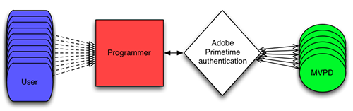

# 프로그래머를 위한 개요 {#programmers-overview}

>[!NOTE]
>
>이 페이지의 컨텐츠는 정보용으로만 제공됩니다. 이 API를 사용하려면 Adobe의 현재 라이선스가 필요합니다. 허가되지 않은 사용은 허용되지 않습니다.

## 소개 {#introduction}

이 개요는 Adobe® Pass를 웹 사이트 또는 애플리케이션에 통합하려는 콘텐츠 공급자(프로그래머)를 위한 것입니다. 킥스타트 및 통합 안내서를 포함한 추가 설명서는 아래의 관련 정보를 참조하십시오.

오늘날 시청자는 언제 어디서나 인터넷에 접속할 수 있으며, 프로그래머인 귀하로부터 직접 보호된 콘텐츠에 대한 액세스를 요청할 수 있습니다. 그들은 한번의 행사를 보고 싶어할 수도 있고, 아니면 당신이 방영하는 전체 텔레비전 시리즈에 대한 시청권을 찾고 있을 수도 있다.

그러나 보호된 콘텐츠에 대한 액세스를 허용하려면 먼저 고객이 해당 콘텐츠를 볼 자격이 있는지 여부를 결정해야 합니다. 다채널 비디오 프로그래밍 디스트리뷰터(MVPD)에 가입되어 있습니까? 그렇다면 그 구독에는 프로그램이 포함되어 있습니까?

프로그래머는 뷰어의 권한을 확인하는 것이 항상 간단한 것은 아닙니다. MVPD는 고객에 대한 식별 데이터 및 액세스 권한을 보유하고 있습니다.  보호된 콘텐츠에 액세스하려는 뷰어는 각각 다른 시스템을 갖는 다양한 MVPD를 구독하므로, 보호된 콘텐츠에 대한 뷰어의 자격 여부를 결정하는 것이 매우 복잡하고 기술적으로 어려운 일이 될 수 있다는 사실을 쉽게 확인할 수 있습니다.

*그림: 프로그래머가 직접 결정한 사용자 권한*

TV용 Adobe Primetime 인증 Everywhere는 프로그래머와 MVPD 간의 이러한 권한 트랜잭션을 안전하게 매개합니다. Adobe Primetime 인증을 통해 프로그래머는 유효한 고객에게 보호된 콘텐츠를 쉽고 빠르고 안전하게 제공할 수 있습니다.

*그림: Adobe Primetime 인증으로 매개되는 사용자 권한*

Adobe Primetime 인증은 참여하는 MVPD와의 교환에서 프록시 역할을 하므로 일관된 크로스 사이트 인터페이스를 시청자에게 제공할 수 있습니다. 또한 Adobe Primetime 인증을 사용하면 뷰어에 SSO(Single Sign-On) 인증 및 권한 부여를 제공할 수 있습니다. 모든 참여 서비스에 대해 인증 및 권한 부여가 추적되므로, 가입자는 자신의 시스템에서 첫 번째 인증 후 다시 로그인할 필요가 없습니다.

* **인증** - 지정된 사용자가 알려진 고객인지 MVPD를 통해 확인하는 프로세스입니다.
* **인증** - 인증된 사용자에게 지정된 리소스에 대한 유효한 구독이 있는지 MVPD로 확인하는 프로세스입니다.

### Adobe Primetime 인증 작동 방식 {#HowItWorks}

프로그래머의 컨텐츠 보기 애플리케이션은 Access Enabler 클라이언트 구성 요소 또는 Clientless API의 RESTful 웹 서비스(스마트 TV, 게임 콘솔, 셋톱 박스 등과 같은 웹이 불가능한 장치의 경우)를 사용하여 Adobe Primetime 인증과 상호 작용합니다. Access Enabler는 사용자의 시스템에서 실행되며, 여기서 모든 권한 부여 워크플로우를 용이하게 합니다.  고객이 사이트에 액세스하고 보호된 콘텐츠를 요청하면 Adobe 시 호스팅 사이트에서 Access Enabler 구성 요소를 다운로드합니다.  Adobe Primetime 인증 서버는 Clientless 솔루션에 사용되는 RESTful 웹 서비스를 호스팅합니다.

Adobe Primetime 인증은 실제 권한 부여 워크플로를 처리하는 동시에 다음과 같은 작업에 사용하는 프리미티브를 제공합니다.

* ID를 설정합니다. (프로그래머는 Adobe Primetime 인증 자격 흐름의 &quot;요청자&quot;입니다.)
* 특정 MVPD로 사용자를 인증합니다.  (MVPD는 Adobe Primetime 인증 권한 흐름의 &quot;ID 공급자&quot; 또는 &quot;IdP&quot;입니다.)
* 특정 리소스에 대한 MVPD를 사용하는 사용자에게 권한을 부여합니다.
* 사용자를 로그아웃합니다.

프로그래머는 다음을 수행하는 상위 수준 웹 페이지 또는 플레이어 애플리케이션을 담당합니다.

* 사용자 인터페이스 구현
* Access Enabler 또는 Clientless API 웹 서비스와 상호 작용합니다

Adobe Primetime 인증의 목표는 프로그래머와 MVPD 모두 자격 확인을 처리할 수 있는 간단하고 모듈적인 방법을 만드는 것입니다.

## 토큰 이해 {#understanding-tokens}

Adobe Primetime 인증 권한 부여 솔루션은 인증 및 권한 부여 워크플로우가 성공적으로 완료되면 생성되는 특정 데이터 생성에 중점을 둡니다. 이러한 데이터 조각을 토큰이라고 합니다. 토큰의 수명은 제한적입니다. 토큰이 만료되면 인증 및 권한 부여 워크플로우의 재시작을 통해 토큰을 재발행해야 합니다.

토큰에 대한 자세한 내용은 다음 섹션을 참조하십시오.

* [토큰 유형](#token-types)
* [토큰 저장소](#token-storage)
* [토큰 보안](#token-security)
* [토큰 공유](#token-sharing)

### 토큰 유형 {#token-types}

인증 및 권한 부여 워크플로우 중에 세 가지 유형의 토큰이 발행됩니다. AuthN 및 AuthZ 토큰은 &quot;장기&quot;이며, 사용자의 보기 경험에 연속성을 제공합니다. 미디어 토큰은 스트림 리핑을 통해 사기를 방지하기 위해 업계 모범 사례를 지원하는 단기 토큰입니다. 프로그래머는 MVPD와 맺은 계약을 기반으로 각 토큰 유형에 대한 TTL(Time-to-Live) 값을 지정합니다. 프로그래머는 비즈니스 및 고객에게 가장 적합한 TTL 값을 결정합니다.

* **인증 토큰** (&quot;Long-lived&quot;): 인증에 성공하면 Adobe Primetime 인증은 요청 장치 및 GUID(Globally Unique Identifier) 모두와 연결된 AuthN 토큰을 만듭니다.
   * Adobe Primetime 인증은 AuthN 토큰을 Access Enabler로 전송하여 클라이언트의 시스템에 안전하게 캐시합니다.  AuthN 토큰이 있고 만료되지 않았지만 Adobe Primetime 인증을 사용하는 모든 애플리케이션에서 사용할 수 있습니다. Access Enabler는 인증 흐름에 AuthN 토큰을 사용합니다.
   * 특정 시점에 하나의 AuthN 토큰만 캐시됩니다. 새 AuthN 토큰이 발급되고 이전 토큰이 이미 있을 때마다 Adobe Primetime 인증이 캐시된 토큰을 덮어씁니다.
* **AuthZ 토큰** (&quot;Long-lived&quot;): 인증에 성공하면 Adobe Primetime 인증은 요청 장치 및 특정 보호된 리소스와 연결된 AuthZ 토큰을 만듭니다.  보호된 리소스는 고유 리소스 ID로 식별됩니다.
   * Adobe Primetime 인증은 AuthZ 토큰을 Access Enabler로 전송하여 로컬 시스템에서 안전하게 캐싱합니다. 그런 다음 Access Enabler는 AuthZ 토큰을 사용하여 실제 보기 액세스에 사용되는 단기 미디어 토큰을 생성합니다.
   * 지정된 시간에 리소스당 하나의 AuthZ 토큰만 캐시됩니다. Adobe Primetime 인증은 여러 AuthZ 토큰을 서로 다른 리소스와 연결되어 있는 한 캐시할 수 있습니다. 새 AuthZ 토큰이 발행되고 동일한 리소스에 대한 이전 토큰이 이미 있을 때마다 Adobe Primetime 인증이 캐시된 토큰을 덮어씁니다.
* **미디어 토큰** (&quot;단기&quot;): Access Enabler는 AuthZ 토큰을 사용하여 단기(기본값: 7분) 미디어 토큰을 생성합니다. 이때가 성공적인 재생 요청이 발생한 것으로 간주되는 지점이다.
   * 보호된 리소스에 대한 액세스를 제공하기 전에 미디어 서버는 Adobe Primetime 인증 구성 요소인 미디어 토큰 검증기를 사용하여 미디어 토큰의 유효성을 검사해야 합니다.
   * 미디어 토큰은 장치에 바인딩되어 있지 않으므로, 해당 수명은 오래 지속되는 AuthN 및 AuthZ 토큰보다 훨씬 짧습니다(기본값: 7분).
   * 단기 미디어 토큰은 일회성 사용으로 제한되며 캐시되지 않습니다. 인증 API가 호출될 때마다 Adobe Primetime 인증 서버에서 검색됩니다.

### 토큰 저장소 {#token-storage}

Access Enabler는 해당 환경과 관련된 위치에 오래 유지되는 토큰(AuthN 및 AuthZ)을 저장합니다.

* **Flash 10.1** (또는 이상): 오래 지속된 토큰은 로컬 공유 객체로 저장됩니다.
* **HTML5**: 오래 지속되는 토큰은 HTML5 브라우저의 로컬 스토어에 안전하게 보관됩니다.
* **iOS**: 오래 사는 토큰은 다른 Adobe Primetime 인증 클라이언트 애플리케이션에서 액세스할 수 있는 영구 페이스트보드에 저장됩니다.
* **Android**: 장기 사용 토큰은 공유 데이터베이스 파일에 저장되며, 다른 Adobe Primetime 인증 클라이언트 애플리케이션에서 액세스할 수 있습니다.
* **클라이언트 없는 API 장치**: 토큰은 Primetime 인증 서버에 저장됩니다.

### 토큰 보안 {#token-security}

Adobe Primetime 인증 서버는 장치 ID(장치의 하드웨어 특성에서 파생됨)를 사용하여 모든 장기 사용 토큰을 디지털 서명합니다. 디지털 서명은 환경에 따라 생성, 보호 및 유효성 검사 방법이 다릅니다.

* **Flash 10.1** (또는 이상) - 장치 ID는 Adobe 개별화 서버에서 발급된 고유 인증서인 장치 자격 증명에 의존합니다. 이 보안은 FAXS DRM 기술과 동일합니다. 이 서버측 유효성 검사는 토큰의 고유 디바이스 ID를 디바이스 자격 증명(Flash Player에서 Adobe Primetime 인증으로 안전하게 통신됨)과 비교합니다. 또한 장치 자격 증명은 FAXS 클라이언트 버전과 장치 자격 증명이 발급된 Flash Player(또는 AIR) 버전을 식별합니다. HTML 바인딩은 Device5보다 더 강력하므로 토큰의 TTL(Time-to-Live)은 일반적으로 Flash에서 더 깁니다.
* **HTML5** - 장치가 클라이언트 측에서 개별화됩니다. JavaScript를 통해 사용할 수 있는 특성을 사용하여 브라우저 및 OS 버전, IP 주소 및 브라우저 쿠키 GUID(Globally Unique Identifier)를 포함하는 의사 디바이스 ID를 생성합니다. 이 토큰 장치 ID는 장치의 현재 의사 장치 ID와 비교됩니다. IP 주소는 동일한 세션에서도 일반적인 사용 중에 변경될 수 있으므로 Adobe Primetime 인증은 localStorage와 sessionStorage의 두 위치에 HTML5 토큰을 저장합니다. IP가 변경되고 sessionStorage 토큰이 여전히 유효한 경우 세션이 유지됩니다. HTML 5에서는 Flash 바인딩이 강력하지 않으므로 일반적으로 토큰의 TTL은 디바이스보다 짧습니다.
* **기본 클라이언트** (iOS 및 Android) - 오래 사는 토큰은 기본 장치 ID 개별화 정보를 보유하므로 요청하는 장치에 바인딩됩니다. 인증 및 권한 부여 요청은 HTTPS를 통해 전송되며, 디바이스 ID 정보는 백엔드 서버로 전송하기 전에 Access Enabler 라이브러리에 의해 디지털 서명됩니다. 서버 측에서 장치 ID 정보는 연결된 디지털 서명에 대해 검증됩니다.
* **클라이언트 없는 API 클라이언트** - Clientless API 솔루션에는 모든 API 호출에 디지털 서명을 하는 보안 프로토콜 세트가 있습니다. 자격 흐름 동안 생성된 토큰은 Adobe Primetime 인증 서버에 안전하게 저장됩니다.

Adobe Primetime 인증은 콘텐츠에 액세스하는 장치가 토큰을 발급한 장치와 동일한지 확인하기 위해 각 장기 토큰을 확인합니다. 모든 토큰에 대해 클라이언트측 유효성 검사가 수행되어 디지털 서명이 그대로 유지되며 토큰의 무결성이 보존됩니다. 장치 ID 유효성 검사에 실패하면 인증 세션이 무효화되고 사용자에게 다시 로그인하라는 메시지가 표시되므로 토큰이 재설정됩니다.

### 토큰 공유 {#token-sharing}

다른 플랫폼의 애플리케이션은 토큰을 공유하지 않습니다. 여기에는 다음과 같은 여러 가지 이유가 있습니다.

* 에 설명된대로 [토큰 저장소](#token-storage), 토큰을 저장하는 방법은 플랫폼마다 다릅니다(예: Flash을 위한 로컬 공유 개체, JavaScript를 위한 웹 스토리지).
* 토큰 보안의 정도는 플랫폼마다 다릅니다. 예를 들어 Flash 토큰은 FAXS를 사용하여 디바이스에 강력하게 바인딩됩니다. 순수 JavaScript 환경의 토큰은 Flash과 동일한 수준의 DRM 지원을 가지고 있지 않습니다.  JS 토큰을 Flash 애플리케이션과 공유하면 보안이 낮은 토큰이 보다 안전한 환경을 악용할 가능성이 높아집니다.

## 프로그래머 통합 라이프사이클 {#prog-integ-lifecycle}

*그림: 인증과 프로그래머의 웹 사이트 및 애플리케이션 통합*

## 논리 흐름 {#logical-flows}

### 권한 부여 순서도 {#chart}

다음 순서도는 자격 확인(Adobe Primetime 인증 Access Enabler 클라이언트 구성 요소 사용)의 전체 프로세스를 보여 줍니다.

*그림: 자격 확인 프로세스*

### 인증 단계 {#authn-steps}

다음 단계에서는 Adobe Primetime 인증 흐름의 예를 보여 줍니다.  이것은 프로그래머가 사용자가 MVPD의 유효한 고객인지 여부를 결정하는 자격 프로세스의 일부입니다.  이 시나리오에서, 사용자는 MVPD에 대한 유효한 가입자이다.  사용자가 프로그래머 Flash 응용 프로그램을 사용하여 보호된 콘텐츠를 보려고 합니다.

1. 사용자가 프로그래머 Flash 응용 프로그램과 Adobe Primetime 인증 Access Enabler 구성 요소를 사용자 컴퓨터에 로드하는 프로그래머 웹 페이지로 이동합니다. Flash 애플리케이션은 Access Enabler를 사용하여 프로그래머의 ID를 Adobe Primetime 인증으로 설정하고 Adobe Primetime 인증은 Access Enabler를 해당 프로그래머(&quot;요청자&quot;)에 대한 구성 및 상태 데이터로 채웁니다. Access Enabler는 다른 API 호출을 수행하기 전에 서버에서 이 데이터를 받아야 합니다. 기술 참고 사항: 프로그래머는 Access Enabler를 사용하여 ID를 설정합니다. `setRequestor()` 메서드, 자세한 내용은 [프로그래머 통합 안내서](/help/authentication/programmer-integration-guide-overview.md).
1. 사용자가 프로그래머로 보호된 콘텐츠를 보려고 하면 프로그래머 애플리케이션은 MVPD의 목록을 사용자에게 제공하고, 사용자는 이 목록에서 공급자를 선택합니다.
1. 사용자가 Adobe Primetime 인증 서버로 리디렉션되고 여기서 가 암호화됩니다. [SAML](https://en.wikipedia.org/wiki/Security_Assertion_Markup_Language) 사용자가 선택한 MVPD에 대한 요청이 만들어졌습니다. 이 요청은 프로그래머를 대신하여 MVPD에 인증 요청으로 보내진다. MVPD 시스템에 따라 사용자의 브라우저는 로그인을 위해 MVPD 사이트로 리디렉션되거나 프로그래머 앱에서 로그인 iFrame이 만들어집니다.
1. 두 경우(리디렉션 또는 iFrame) 모두 MVPD가 요청을 수락하고 해당 로그인 페이지를 표시합니다.
1. 사용자가 MVPD에 로그인하면 MVPD가 사용자의 결제 고객 상태를 확인한 다음 MVPD가 자체 HTTP 세션을 만듭니다.
1. 사용자가 인증되면 MVPD는 응답(SAML 및 암호화)을 만들어 MVPD가 다시 Adobe Primetime 인증으로 보냅니다.
1. Adobe Primetime 인증은 MVPD 응답을 받고, Adobe Primetime 인증 HTTP 세션이 열려 있는지 확인하고, MVPD에서 SAML 응답을 확인하고, 프로그래머 사이트로 다시 리디렉션합니다.
1. 프로그래머 사이트가 다시 로드되고 Access Enabler가 다시 로드되며 프로그래머는 setRequestor()를 다시 호출합니다.  현재 구성이 변경되었기 때문에 setRequestor()에 대한 두 번째 호출이 필요합니다. 이제 Access Enabler에 AuthN 토큰이 서버에서 생성되기를 기다리고 있음을 알리는 플래그가 있습니다.
1. Access Enabler는 보류 중인 인증이 있음을 확인하고 Adobe Primetime 인증 서버에서 토큰을 요청합니다. Flash Player의 DRM 기능을 호출하여 서버에서 토큰을 검색합니다.
1. AuthN 토큰은 프로그래머의 Flash Player LSO 캐시에 저장됩니다. 이제 인증이 완료되고 Adobe Primetime 인증 서버에서 세션이 제거됩니다.

### 인증 단계 {#authz-steps}

다음 단계는에서 계속됩니다. [인증 단계](#authn-steps):

1. 사용자가 프로그래머로 보호된 콘텐츠에 액세스하려고 하면 프로그래머 애플리케이션은 먼저 사용자의 로컬 컴퓨터 또는 장치에서 AuthN 토큰을 확인합니다.  해당 토큰이 없으면 [인증 단계](#authn-steps) 다음은 위의 예입니다.  AuthN 토큰이 있는 경우 인증 흐름은 프로그래머 애플리케이션에서 보호된 콘텐츠의 특정 항목에 대한 사용자의 보기 권한을 가져오도록 요청하여 Access Enabler에 대한 호출을 시작하는 것으로 진행됩니다.
1. 보호된 콘텐츠의 특정 항목은 &quot;리소스 식별자&quot;로 표시됩니다.  이는 단순한 문자열이거나 더 복잡한 구조일 수 있지만, 어떤 경우든 리소스 식별자의 특성은 프로그래머와 MVPD 간에 미리 합의됩니다.  프로그래머 애플리케이션은 리소스 식별자를 Access Enabler에 전달합니다.  Access Enabler는 사용자의 로컬 시스템 또는 디바이스에서 AuthZ 토큰을 확인합니다.  AuthZ 토큰이 없으면 Access Enabler가 요청을 백엔드 Adobe Primetime 인증 서버에 전달합니다.
1. Adobe Primetime 인증 서버는 표준화된 프로토콜을 사용하여 MVPD 인증 엔드포인트와 통신합니다.  MVPD의 응답이 사용자에게 보호된 콘텐츠를 볼 권한이 있음을 나타내는 경우 Adobe Primetime 인증 서버는 AuthZ 토큰을 만들어 다시 Access Enabler에 전달합니다. Access Enabler는 사용자 컴퓨터에 AuthZ 토큰을 저장합니다.
1. 사용자의 시스템 또는 장치에 저장된 AuthZ 토큰을 사용하여 프로그래머 애플리케이션은 Adobe Primetime 인증 서버에서 미디어 토큰을 얻기 위해 액세스 Enabler를 호출하고 해당 토큰을 프로그래머 애플리케이션에 제공합니다.
1. 마지막으로, 프로그래머 애플리케이션은 미디어 토큰 검증기 구성 요소를 사용하여 올바른 사용자가 올바른 콘텐츠를 보고 있는지 확인하고 미디어 토큰을 배치한 상태에서 사용자가 보호된 콘텐츠를 볼 수 있도록 합니다.

## 등록 및 초기화 {#reg-and-init}

Adobe Primetime 인증 작업의 첫 번째 단계는 Adobe 또는 Adobe Primetime 인증 인증 인증 파트너에 등록하는 것입니다.

등록하면 Adobe Primetime 인증과 통신할 도메인 목록을 제공합니다. 예를 들어, Turner Broadcasting System 도메인에는 tbs.com 및 tnt.tv as Adobe Primetime 인증 등록 도메인이 포함됩니다. 이러한 각 콘텐츠 사이트에는 Adobe Primetime 인증에 대한 액세스 권한이 부여되고 자체 요청자 ID(예: &quot;TBS&quot; 및 &quot;TNT&quot;)가 할당됩니다. 추가 사이트를 추가하려는 경우 Adobe에게 추가 도메인 이름을 알려 허용 도메인 목록에 추가하고 추가 요청자 ID를 부여해야 합니다.

>[!WARNING]
>
>통합을 테스트하는 동안 테스트 서버가 프로덕션에서 사용할 등록된 도메인에 있는지 확인합니다. 화이트리스트에 추가되지 않은 도메인에서 온 요청, 심지어 테스트 요청도 무시됩니다. 예를 들어 프로덕션에서 domain.com을 사용하도록 요청한 경우 domain.com, test.domain.com 및 staging.domain.com에서 테스트 통합을 배포하고 있는지 확인합니다.
>
>도메인이 화이트리스트에 추가되더라도 URL에 사용자 이름 및/또는 암호가 포함된 요청은 무시됩니다. 예: `//username@registered-domain/`

요청자 ID는 Adobe Primetime 인증의 Access Enabler 클라이언트 구성 요소와 모든 통신에서 프로그래머 클라이언트를 고유하게 식별합니다. 프로그래머와 연결된 모든 Adobe Primetime 인증 정적 데이터는 이 ID에 입력됩니다.

>[!TIP]
>
>요청자 ID 외에 등록할 때 Access Enabler 클라이언트 구성 요소 및 미디어 토큰 검증기에 대한 기능 URL도 받습니다.

## 통합 단계 {#integration-steps}

>[!TIP]
>
>미디어 플레이어 개발에 Adobe Open Source Media Framework(&quot;OSMF&quot;)를 사용하는 경우 Adobe Primetime 인증을 사용하는 가장 빠른 방법은 OSMF 플러그인을 통합하는 것입니다 *(사용하지 않음)* 플레이어의 코드에 삽입합니다.
>
><!--For details, see [Adobe Primetime authentication Plugin For OSMF](https://tve.helpdocsonline.com/9-2-2) in the Programmer Integration Guide.-->

1. [요청자 설정](#requestor)
1. [인증 및 권한 부여 처리](#authn-authz)
1. [단일 로그아웃 지원](#ssl)

### 1. 요청자 설정 {#requestor}

#### 1a. Adobe에 등록

첫 번째 단계는 Adobe 또는 Adobe Primetime 인증 승인 파트너에 등록하는 것입니다.  등록하면 하나 이상의 GUID(Globally Unique Identifier)가 발급됩니다. 발급된 각 GUID는 Adobe Primetime 인증에 대한 액세스가 허용되는 도메인에 연결되어 있습니다. 요청 도메인에 대한 GUID(요청자 ID라고 함)를 전달하여 Access Enabler와 상호 작용하는 각 세션에 대해 ID를 등록합니다. 자세한 내용은 [등록 및 초기화](#reg-and-init) ( 프로그래머 통합 안내서 참조).

#### 1b. 초기 액세스 Enabler 통합

다음 단계는 기존 미디어 플레이어 앱 또는 웹 페이지에 Access Enabler를 통합하는 것입니다.

* Flash 버전을 포함할 수 있습니다. `AccessEnabler.swf`를 Flash 기반 비디오 플레이어에 포함하거나, 웹 페이지의 HTML에 직접 포함할 수 있습니다. ActionScript 또는 JavaScript에서 Access Enabler SWF과 통신할 수 있습니다. 기본 API는 ActionScript이지만, JavaScript로 작업하려는 경우 페이지에 포함할 수 있는 완전한 래퍼 라이브러리를 사용할 수 있습니다.
* Flash이 아닌 환경의 경우 다음을 수행할 수 있습니다.
   * HTML5/JavaScript 버전인 AccessEnabler.js를 사용하고 JavaScript API를 통해 통신합니다
   * Adobe Primetime 인증용 AIR Native Extension을 사용하여 기본 코드와 기본 제공 ActionScript 클래스 결합
   * Access Enabler 라이브러리(iOS 또는 Android)의 기본 클라이언트 버전 중 하나를 사용합니다.

### 2. 인증 및 권한 부여 처리 {#authn-authz}

#### 2a. Access Enabler와 통신

Access Enabler와 웹 페이지 또는 플레이어 앱 간의 통신은 비동기적입니다. 애플리케이션이 Access Enabler 메서드를 호출하면 Access Enabler가 Access Enabler 라이브러리에 등록하는 콜백을 통해 응답합니다.

* 유효한 AuthN 토큰이 아직 로컬 시스템에 없는 경우 응용 프로그램에서 인증 요청을 수행하면 Access Enabler가 자동으로 인증 요청을 시작합니다. 인증이 성공하면 사용자의 AuthN 토큰이 로컬에 저장되므로 다시 로그인할 필요가 없습니다. 다른 컨텍스트에서(예: MVPD 웹 사이트를 통해 또는 다른 프로그래머와 함께) Adobe Primetime 인증을 통해 성공적으로 인증한 경우 Access Enabler는 로컬 AuthN 토큰에 액세스할 수 있으며 추가 인증이 필요하지 않습니다.
* 사용자가 보호된 콘텐츠에 액세스하려고 하면 Access Enabler에 인증 요청을 보냅니다. 인증을 확인(또는 시작)한 후 Access Enabler는 Adobe Primetime 인증 서버를 통해 MVPD에 연락하여 고객이 보호된 콘텐츠를 볼 자격이 있는지 여부를 확인합니다. 애플리케이션은 Access Enabler에 요청을 보낸 다음 응답(인증 성공 또는 실패)을 처리하기만 하면 됩니다. 인증이 성공하면 AuthZ 토큰이 클라이언트 시스템에 저장됩니다.  마지막으로, 애플리케이션은 자체 인증 절차에서 사용할 단기 미디어 토큰을 받습니다.

>[!NOTE]
>
>* SP(서비스 공급자)인 Adobe Primetime 인증과 IdP(ID 공급자)인 MVPD 간의 인증은 SAML 교환으로 발생합니다.
>
>* 인증은 Adobe Primetime 인증(SP)과 MVPD(IdP) 간에 백 채널(서버 간) 웹 서비스 교환을 사용합니다.

#### 2b. 권한 부여 사용자 인터페이스 제공 {#entitlement-ui}

콘텐츠에 대한 사용자 액세스를 위해 고유한 UI를 제공합니다. 실제 로그인 프로세스와 같은 일부 요소는 MVPD에 의해 제공되고, 일부 요소는 선택적으로 Adobe Primetime 인증의 일부로 사용할 수 있습니다. 최소한 다음과 같은 작업을 수행합니다.

* **새 사용자가 MVPD를 식별하고 처음 로그인할 수 있도록 하는 MVPD 선택 인터페이스를 구현합니다.**. 개발을 위해 Access Enabler는 고객이 MVPD를 선택하고 로그인 프로세스를 시작할 수 있도록 기본 사용자 인터페이스를 제공합니다. 프로덕션의 경우 자체 MVPD 선택기 대화 상자를 구현해야 합니다. 일부 MVPD는 로그인을 위해 자체 사이트로 리디렉션되고 일부는 로그인 페이지를 iFrame 내에 표시해야 합니다. 사용자의 MVPD가 iFrame에 로그인 페이지를 표시하는 경우를 처리하려면 이 iFrame을 만드는 콜백을 구현해야 합니다.
* **보호된 콘텐츠 식별**. 보호된 콘텐츠에 액세스하려면 권한 부여가 필요합니다. 인터페이스는 보호된 콘텐츠와 승인된 콘텐츠를 표시해야 합니다.  인증 상태는 &quot;잠금 해제됨&quot; 및 &quot;잠김&quot; 아이콘으로 표시되는 경우가 많습니다.
* **사용자가 인증되었음을 표시합니다.**. 보호된 콘텐츠를 식별하는 데 사용하는 수단의 일부로 사용자의 인증 상태를 표시해야 합니다. Access Enabler를 쿼리하여 고객이 이미 인증되었는지 확인할 수 있습니다.

#### 2c. 미디어 토큰 검증기 통합 {#int-media-token-ver}

Adobe Primetime 인증 미디어 토큰 검증기 구성 요소를 미디어 서버에 통합해야 합니다.  따라서 기존 토큰 검증기가 성공적인 인증을 통해 Adobe Primetime 인증에서 제공된 단기 미디어 토큰을 인식할 수 있습니다. 미디어 토큰 검증기는 보호된 콘텐츠에 대한 사용자 액세스를 제공하기 전에 미디어 토큰을 마지막 보안 단계로 확인합니다. Adobe에 등록할 때 미디어 토큰 검증기를 다운로드할 위치를 받습니다.

### 3. 단일 로그아웃 지원 {#ssl}

대부분의 경우 미디어 플레이어는 간단한 Access Enabler API를 통해 사용자 로그아웃을 처리합니다. logout()을 호출하면 Access Enabler가 다음을 수행합니다.

* 현재 사용자를 로그아웃합니다
* 로그아웃한 사용자에 대한 모든 인증 및 권한 부여 정보를 지웁니다.
* 사용자의 로컬 시스템에서 모든 AuthN 및 AuthZ 토큰을 삭제합니다.

토큰이 만료될 때까지 충분히 오랫동안 사용자가 시스템을 유휴 상태로 두면 사용자는 여전히 세션으로 돌아가서 로그아웃을 성공적으로 시작할 수 있습니다. Adobe Primetime 인증은 모든 토큰이 삭제되도록 하며 MVPD에 해당 세션을 삭제하도록 알립니다.

Adobe Primetime 인증과 통합되지 않은 사이트에서 로그아웃이 시작되면 MVPD는 브라우저 리디렉션을 통해 Adobe Primetime 인증 단일 로그아웃 서비스를 호출할 수 있습니다.

## 사용자 ID 이해 {#user-ids}

개념적으로 자격 흐름을 시작하는 각 사용자는 고유한 단일 사용자 ID와 연결됩니다.  그러나 자격 흐름의 과정을 통해 ID를 가져온 API에 따라 해당 사용자 ID가 다른 방식으로 표시될 수 있습니다.

Short Media 토큰의 sessionGUID는 sendTrackingData() 호출을 통해 사용할 수 있는 UserID의 보안 형식입니다.   현재 모든 통합에서 이 GUID는 시간 및 장치에 걸쳐 사용자에 대한 영구 GUID이지만 GUID의 원본은 MVPD의 SAML 응답에서 UserID로 시작합니다.   그러나 일부 MVPD는 나중에 생각이 바뀌어 임시 GUID를 보내기 시작할 수 있습니다.  프로그래머가 AuthN 응답의 MVPD 소스 UserID가 지속되는지 확인하려는 경우 MVPD와의 계약에서 이를 준비해야 합니다.

Adobe Primetime 인증 API에 사용자 ID를 표시하는 다양한 방법은 다음과 같습니다.

* `sendTrackingData()` GUID 속성 - MVPD UserID의 Adobe 해시 버전입니다.  해시되어 이 사용자 ID는 MVPD에서 소스로 다시 추적할 수 없습니다.   이 ID는 고유하며 일반적으로 영구적이지만 특정 사용 동작을 MVPD가 제공하는 기능과 비교하기 위해 MVPD와 공유할 수 없습니다.   디지털 서명이 되어 있지 않아 사기 예방에 있어 스푸핑이 불가능하지는 않지만 분석에 충분합니다.  이 형식의 사용자 ID는 AuthN/AuthZ 흐름에서 Adobe Primetime 인증이 생성하는 모든 이벤트에 클라이언트측에서 제공됩니다.
* 짧은 미디어 토큰 `sessionGUID` 속성 - 를 통해 UserID와 동일합니다. `sendTrackingData()`그러나 이 디지털 서명은 무결성을 보호하기 위해 디지털 서명됩니다.  그러면 이 값이 동시 사용 사기 추적에 충분합니다. 유효성 검사기 라이브러리를 사용한 후 서버측에서 처리되도록 고안되었으며 비디오 스트림을 클라이언트에게 릴리스하기 전에 사기 패턴에 대해 분석할 수 있습니다.  이러한 작업 중 하나를 수행하는 것은 프로그래머의 책임입니다.
* `getMetadata() userID `속성 - 이 속성을 사용하면 Adobe이 실제 소스 MVPD UserID를 프로그래머에게 노출할 수 있습니다. 프로그래머가 가지고 있는 인증서의 공개 키로 암호화되어 클라이언트에게 명확하게 노출되지 않을 것이다. 이렇게 하면 프로그래머에게 MVPD의 실제 사용자 ID가 제공되므로 MVPD와 직접 계정 연결이나 사기 조사에 사용할 수 있습니다.

**결론적으로**

* MVPD 사용자 ID는 일반적으로 보장되지는 않지만 다음과 같은 지속적인 고유 ID입니다. **MVPD에서 생성되어 인증 성공 시 Adobe으로 전달됨**. 일부 예외를 제외하고 모든 네트워크에서 일반적으로 일관됩니다.
* MVPD 사용자 ID는 PII를 포함하지 않으며 계정 번호가 아닙니다. PII가 전송되지 않음을 모든 MVPD로 확인했으므로 암호화된 형식으로 노출될 필요가 없습니다.

사용자 ID를 사용하는 방법은 사용 사례에 따라 다릅니다.

* 추적/분석에 필요한 경우 가장 실용적인 위치는 `sendTrackingData()`.
* 스트림 릴리스, 사기 또는 운영 데이터를 위해 서버측에서 필요로 하는 경우 미디어 토큰 유효성 검사기에서 가져올 수 있습니다.
* 계정 연결 및 더 자세한 사기 행위를 위해 필요한 경우 Adobe 담당자에게 문의하여 가용성을 확인하십시오.

<!--
>[!RELATEDINFORMATION]
>
>* **Kickstart Guides** These guides explain the initial steps to take once you have decided to begin integrating with Adobe Primetime authentication.
>* **Programmer Integration Guide** This is a lower level technical guide for Programmers, directed primarily to the software engineers who code and test the applications and systems involved in the integration.
>* [Overview For MVPDs](/help/authentication/mvpd-overview.md) This provides a similar level of conceptual information as in this Programmer overview, but is directed toward MVPDs.
-->
