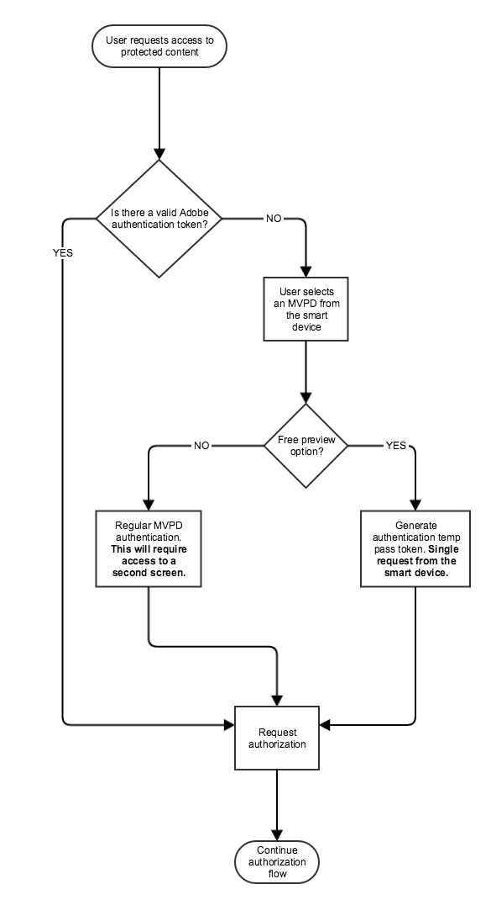

# REST API Cookbook(Client-to-Server) {#rest-api-cookbook-client-to-server}

>[!NOTE]
>
>이 페이지의 컨텐츠는 정보용으로만 제공됩니다. 이 API를 사용하려면 Adobe의 현재 라이선스가 필요합니다. 무단 사용이 허용되지 않습니다.

## 개요 {#overview}

이 문서에서는 프로그래머 엔지니어링 팀이 &quot;스마트 장치&quot;(게임 콘솔, 스마트 TV 앱, 셋톱 박스 등)를 통합하기 위한 단계별 지침을 제공합니다. REST API 서비스를 사용하여 Adobe Primetime 인증 사용. 클라이언트 SDK보다는 REST API를 사용하는 이 클라이언트-서버 접근 방식을 사용하면 상당한 수의 고유 SDK를 개발할 수 없을 정도로 다양한 플랫폼을 보다 광범위하게 지원할 수 있습니다. Clientless 솔루션 작동 방식에 대한 광범위한 기술 개요는 다음을 참조하십시오. [Clientless 기술 개요](/help/authentication/rest-api-overview.md).

이 접근 방법에서는 스트리밍 앱과 AuthN 앱의 두 가지 구성 요소(스트리밍 앱 및 AuthN 앱)를 사용하여 필요한 흐름을 완료해야 합니다. 스트리밍 앱의 시작, 등록, 인증 및 미디어 흐름, AuthN 앱의 인증 흐름.

## 구성 요소 {#components}

작동 중인 Client-to-Server 솔루션에서는 다음 구성 요소가 관련되어 있습니다.

 

| 유형 | 구성 요소 | 설명 |
| --- | --- | --- |
| 스트리밍 장치 | 스트리밍 앱 | 사용자의 스트리밍 장치에 있고 인증된 비디오를 재생하는 Programmer 응용 프로그램입니다. |
|  | \[선택 사항\] AuthN 모듈 | 스트리밍 장치에 사용자 에이전트(즉, 웹 브라우저)가 있는 경우 AuthN 모듈은 MVPD IdP에서 사용자를 인증합니다. |
| \[선택 사항\] AuthN 장치 | AuthN 앱 | 스트리밍 장치에 사용자 에이전트(즉, 웹 브라우저)가 없는 경우, AuthN 응용 프로그램은 웹 브라우저를 사용하여 별도의 사용자 장치에서 액세스하는 프로그래머 웹 응용 프로그램입니다.  |
| Adobe 인프라 | Adobe Pass 서비스 | MVPD IdP 및 AuthZ 서비스와 통합되고 인증 및 인증 결정을 제공하는 서비스입니다. |
| MVPD 인프라 | MVPD IdP | 사용자의 ID를 확인하기 위해 자격 증명 기반 인증 서비스를 제공하는 MVPD 끝점입니다. |
|  | MVPD AuthZ 서비스 | 사용자의 구독, 자녀 보호 등을 기반으로 인증 결정을 제공하는 MVPD 엔드포인트입니다. |

 

플로우에서 사용되는 추가 용어는 [용어 설명](/help/authentication/glossary.md).

## 흐름{#flows}

### DCR(Dynamic Client Registration)

Adobe Pass은 DCR을 사용하여 프로그래머 애플리케이션 또는 서버와 Adobe Pass 서비스 간의 클라이언트 통신을 보호합니다. DCR 흐름은 별개의 종속 및 전제 조건 흐름이며 [동적 클라이언트 등록](/help/authentication/dynamic-client-registration.md)

### 스트리밍(스마트 장치) 앱 흐름

#### 시작 흐름

1. 앱이 시작되고 초기 UI가 로드됩니다.

2. 장치 ID 가져오기/생성.

3. 장치가 이미 인증되었는지 확인하는 확인 인증 호출을 실행합니다.  예: [`<SP_FQDN>/api/v1/checkauthn [device ID]`](/help/authentication/check-authentication-token.md)

4. 만약 `checkauthn` 호출이 성공하려면 2단계부터 인증 흐름을 진행합니다.  실패하면 등록 흐름을 시작합니다.

 

#### 등록 흐름

1. 사용자가 두 번째 화면 로그인 앱에 액세스하는 데 사용할 등록 코드와 URL을 가져와서 사용자에게 제공할 수 있습니다.

   a. 해시된 장치 ID와 &quot;등록 URL&quot;을 전달하여 Adobe 등록 코드 서비스에 POST 요청을 보냅니다.  예: [`<REGGIE_FQDN>/reggie/v1/[requestorId]/regcode [device ID]`](/help/authentication/registration-code-request.md)

   나. 반환된 등록 코드와 URL을 사용자에게 제공합니다.

   c. 사용자에게 웹 가능 장치로 전환하고 URL로 이동한 다음 등록 코드를 입력하도록 지시합니다.

 

#### 인증 흐름

1. 사용자가 두 번째 화면 앱에서 돌아와서 장치에서 &quot;계속&quot; 단추를 누릅니다. 또는 폴링 메커니즘을 구현하여 인증 상태를 확인할 수 있지만 Adobe Primetime 인증에서는 폴링에서 계속 단추 방법을 권장합니다. <!--(For information on employing a "Continue" button versus polling the Adobe Primetime authentication backend server, see the Clientless Technical Overview: Managing 2nd-Screen Workflow Transition.)--> 예: [\&lt;sp _fqdn=&quot;&quot;>/api/v1/tokens/authn](/help/authentication/retrieve-authentication-token.md)

2. 인증을 시작하려면 Adobe Primetime 인증 인증 인증 인증 서비스 로 GET 요청을 보내십시오. 예: `<SP_FQDN>/api/v1/authorize [device ID, Requestor ID, Resource ID]`

<!-- end list -->

* 응답이 성공을 나타내는 경우: 사용자에게 유효한 AuthN 토큰 AND가 있으며 사용자는 요청된 미디어를 볼 수 있는 권한이 있습니다(이 사용자에 대해 유효한 AuthZ 토큰이 있음).

* 응답이 실패를 나타내는 경우: throw된 예외를 검사하여 해당 유형(AuthN, AuthZ 등)을 확인합니다.

   * AuthN 오류인 경우 등록 흐름을 다시 시작합니다.

   * AuthZ 오류인 경우 사용자는 요청된 미디어를 볼 수 있는 권한이 없으며 일부 유형의 오류 메시지가 사용자에게 표시되어야 합니다.

   * 다른 오류(연결 오류, 네트워크 오류 등)가 발생한 경우 그런 다음 사용자에게 적절한 오류 메시지를 표시합니다.

 

#### 미디어 흐름 보기

1. 다양한 미디어 선택 사항을 제공합니다. 사용자가 볼 미디어를 선택합니다.

2. 미디어가 보호됩니까?

   a. 앱이 미디어가 보호되어 있는지 확인합니다.

   나. 미디어가 보호된 경우 앱은 위의 인증(AuthZ) 플로우를 시작합니다.

   c. 미디어가 보호되지 않으면 사용자의 미디어를 재생합니다.

3. 미디어를 재생합니다.

### AuthN(2번째 화면) 앱 흐름

1. 이 사용자의 MVPD 목록을 가져옵니다. 예: [`<SP_FQDN>/api/v1/config/[requestorID]`](/help/authentication/provide-mvpd-list.md)

1. 인증 흐름을 시작합니다.  예: [`<SP_FQDN>/api/v1/authenticate [requestorID, MVPD ID, Redirect URL, Domain name, Registration Code, "noflash=true"]`](/help/authentication/initiate-authentication.md)

1. 인증이 성공했는지 확인합니다. 예:[`<SP_FQDN>/api/v1/checkauthn/[registration code][requestor ID]`](/help/authentication/check-authentication-token.md)

1. 사용자를 다시 스마트 장치 앱으로 보내 인증 흐름을 완료합니다.

## 플랫폼 SSO {#platform-sso}

일부 플랫폼은 SSO(Single Sign-On)를 위한 전용 지원을 제공합니다. 각 플랫폼에 대한 구현 세부 사항이 제공됩니다.

* [Apple SSO](/help/authentication/apple-sso-cookbook-rest-api.md)
* Amazon SSO

## REST API용 TempPass 및 Injective TempPass {#temppass}

사용자가 크레디트를 입력할 필요가 없는 TempPass 및 Progression TempPass 구현의 경우 스트리밍 앱에서 바로 인증을 구현할 수 있습니다.

**이 API를 사용하려면 스트리밍 앱이 선택적 추가 데이터와 함께 토큰을 식별하는 데 사용되고 있으므로 장치 ID의 고유성을 확인해야 합니다.**

