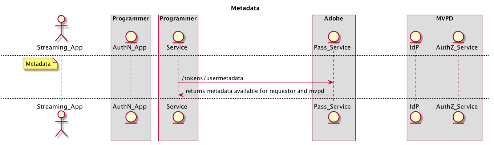

# REST API Cookbook(서버 간) {#rest-api-cookbook-server-to-server}

>[!NOTE]
>
>이 페이지의 컨텐츠는 정보용으로만 제공됩니다. 이 API를 사용하려면 Adobe의 현재 라이선스가 필요합니다. 무단 사용이 허용되지 않습니다.

## 개요 {#overview}

이 Cookbook 문서의 목적은 서버 간 아키텍처를 사용하여 Adobe Primetime 인증을 구현하는 우수 사례를 자세히 설명하는 것입니다.  프로덕션 환경 및 작업에 대한 기본 요구 사항, 단계별 흐름 구현 및 일반적인 고려 사항을 제공합니다.

 

## 구성 요소 {#components}

서버 간 작동 솔루션에서는 다음 구성 요소가 관련되어 있습니다.

 
| 유형 | 구성 요소 | 설명 | | — | — | — | | 스트리밍 장치 | 스트리밍 앱 | 사용자의 스트리밍 장치에 있고 인증된 비디오를 재생하는 Programmer 응용 프로그램입니다. | | | \[선택 사항\] AuthN 모듈 | 스트리밍 장치에 사용자 에이전트(즉, 웹 브라우저)가 있는 경우, AuthN 모듈은 MVPD IdP에서 사용자를 인증하는 책임이 있습니다. | | \[선택 사항\] AuthN 장치 | AuthN 앱 | 스트리밍 장치에 사용자 에이전트(즉, 웹 브라우저)가 없는 경우, AuthN 응용 프로그램은 웹 브라우저를 사용하여 별도의 사용자 장치에서 액세스하는 프로그래머 웹 응용 프로그램입니다. | | 프로그래머 인프라 | 프로그래머 서비스 | 인증 및 인증 결정을 받기 위해 스트리밍 장치를 Adobe Pass 서비스와 연결하는 서비스입니다. | | Adobe 인프라 | Adobe Pass 서비스 | MVPD IdP 및 AuthZ 서비스와 통합되고 인증 및 인증 결정을 제공하는 서비스입니다. | | MVPD 인프라 | MVPD IdP | 사용자의 ID를 확인하기 위해 자격 증명 기반 인증 서비스를 제공하는 MVPD 끝점입니다. | | | MVPD AuthZ 서비스 | 사용자의 구독, 자녀 보호 등에 따라 인증 결정을 제공하는 MVPD 엔드포인트입니다. |

플로우에서 사용되는 추가 용어는
[용어 설명](/help/authentication/glossary.md).

## 흐름 {#flows}

### DCR(Dynamic Client Registration)

Adobe Pass은 DCR을 사용하여 프로그래머 애플리케이션 또는 서버와 Adobe Pass 서비스 간의 클라이언트 통신을 보호합니다. DCR 흐름은 별개의 종속 및 전제 조건 흐름이며 [동적 클라이언트 등록](/help/authentication/dynamic-client-registration.md).

### 인증(authN)

인증 흐름은 사용자가 MVPD를 식별하여 사용자에게 유효한 계정이 있는지 확인하는 데 사용됩니다. 

1. 사용자는 스트리밍 장치 앱을 시작하고 보호된 콘텐츠에 로그인하거나 보기를 시도합니다.
2. 스트리밍 장치 앱에서는 장치가 이미 인증되었는지 여부를 프로그래머 서비스에 요청합니다.
3. 프로그래머 서비스는 DCR을 사용하여 앱을 등록합니다.
4. 프로그래머 서비스는 Adobe Pass 서비스를 호출하여 스트리밍 장치 authN 상태를 확인합니다 **checkauthor** API.
5. 이 경우 **checkauthor** 호출은 사용자 장치가 인증되는 상태를 반환한 다음 앱을 인증 흐름으로 진행할 수 있습니다.
6. 이 경우 **checkauthor** 호출은 사용자 장치가 인증되지 않음 상태를 반환합니다. 그러면 앱은 사용자 요청이 로그인될 때까지 대기해야 합니다.
7. 사용자가 직접 로그인(예: 로그인 단추를 선택) 또는 간접적으로 로그인(예: 아직 인증되지 않은 경우 보호된 콘텐츠를 선택)하도록 요청하면 스트리밍 장치 앱은 프로그래머 서비스에 사용자 인증을 시작하도록 요청합니다. 프로그래머 서비스는 Adobe Pass 서비스를 호출하여 고유한 등록 코드(regcode)를 요청하고 수신합니다 **regcode** API.
8. 또한 프로그래머 서비스는 Adobe Pass 서비스를 호출하여 현재 MVPD 및 특성 목록을 검색합니다 **config** API. 참고: 이 API는 플로우에서 일찍 호출되고 캐시될 수도 있습니다.
9. 프로그래머 서비스는 스트리밍 장치 앱으로 레지코드를 반환하고 \#7 단계에서 요청한 처리된 MVPD 목록을 반환합니다. 참고: 처리된 MVPD 목록 형식은 Programmer에서 지정되며 특정 MVPD(예: 허용 또는 블록 목록)를 명시적으로 허용하거나 차단하도록 필터링될 수 있습니다.
10. 가 AuthN 장치와 다른 경우(예: &quot;두 번째 화면&quot;)을 선택하거나 필요에 따라(즉, 스트리밍 장치가 사용자 에이전트를 지원하지 않음), 스트리밍 장치는 사용자가 AuthN 애플리케이션에 액세스할 수 있는 regcode와 URI를 표시해야 합니다. 사용자는 AuthN 장치의 사용자 에이전트에 URI를 입력하여 AuthN 애플리케이션을 실행한 다음 해당 애플리케이션에 regcode를 입력합니다. 스트리밍 장치가 AuthN 장치와 동일한 경우 regcode를 프로그래밍 방식으로 AuthN 모듈에 전달할 수 있습니다.
11. AuthN 모듈은 MVPD 선택기를 표시하여 MVPD로 사용자 인증을 시작합니다. 사용자가 MVPD를 선택하면 AuthN 모듈이 호출됩니다 **인증** 를 사용하여 사용자 에이전트를 MVPD IdP로 리디렉션합니다. 사용자가 MVPD를 사용하여 인증되면 사용자 에이전트는 Regcode를 사용하여 성공적으로 인증되는 Adobe Pass 서비스를 통해 다시 리디렉션되고 AuthN 모듈로 다시 리디렉션됩니다.
12. 스트리밍 장치가 AuthN 장치와 다른 경우 AuthN 장치는 사용자에게 성공적인 인증 메시지를 표시하고 계속하기 위한 단계를 표시해야 합니다(예: &quot;성공\! 이제 게임 콘솔로 돌아가 \[...\]&quot;) 스트리밍 장치가 AuthN 장치와 동일한 경우 스트리밍 장치가 프로그래밍 방식으로 인증 완료를 감지할 수 있습니다.

 

다음 다이어그램은 인증 흐름을 보여줍니다.

### 인증(authZ)

권한 부여 흐름은 사용자가 요청된 컨텐츠에 액세스할 권한이 있는지 여부를 확인하는 데 사용됩니다.

1. 사용자가 스트리밍 장치 앱에서 보호된 콘텐츠를 보려고 할 때마다 스트리밍 장치 앱은 콘텐츠를 식별하고 스트림을 시작하는 데 필요한 권한 및 정보를 요청하는 프로그래머 서비스를 호출합니다.
1. 프로그래머 서비스는 Adobe Pass을 호출합니다 **권한 부여** 다른 필수 매개 변수와 함께 리소스 ID를 전달하는 API입니다. Adobe 서비스는 리소스 ID를 사용하여 MVPD AuthZ 서비스를 호출하고 다시 프로그래머 서비스로 전달되는 인증 결정을 받고 수신합니다. 이 인증 결정은 구성 가능한 기간 동안 Adobe Pass Service에 의해 캐시됩니다. 다음에 **권한 부여** 프로그래머 서비스에서 Adobe Pass 서비스로 호출하는 경우 캐시된 값이 유효한 한 반환됩니다.
1. 승인이 나면 프로그래머 서비스는 Adobe Pass을 호출해야 합니다 **/tokens/media** 서명된 미디어 토큰을 반환하는 API입니다. 프로그래머 서비스는 JAR(미디어 토큰 확인자 라이브러리)를 사용하여 미디어 토큰의 유효성을 검사해야 합니다. 유효한 경우 Programmer Service는 권한을 반환해야 하며 \#1 단계에서 요청된 스트림(예: 스트림 URL)을 시작하는 데 필요합니다.
1. 승인이 거부되면 **권한 부여** 호출에서 오류 코드와 설명을 프로그래머 서비스에 반환합니다. 프로그래머 서비스는 오류 코드 및 설명(또는 프로그래머가 수정한 메시지)을 \#1 단계의 요청에 반환해야 합니다.

다음 다이어그램은 권한 부여 흐름을 보여줍니다.

### 로그아웃

로그아웃 흐름을 사용하면 사용자가 현재 응용 프로그램과 연결된 ID를 제거할 수 있습니다.

1. 사용자가 로그아웃을 요청하면(즉, 응용 프로그램과 연결된 현재 MVPD 계정의 장치에서 제거) 스트리밍 장치 앱에서는 이 응용 프로그램이 장치를 로그아웃하도록 지시하는 Programmer Service를 호출합니다.
1. 프로그래머 서비스는 Adobe Pass을 호출해야 합니다 **로그아웃** API.

다음 다이어그램은 로그아웃 흐름을 보여줍니다.

### \[선택 사항\] 사전 권한 부여(사전 비행)

사전 권한 부여를 사용하여 사용자가 액세스할 수 있는 리소스 집합을 빠르게 결정할 수 있습니다.  이 호출의 결과는 일반적으로 개별 사용자에 대한 UI를 사용자 지정하는 데 사용됩니다.

1. 사용자가 인증되면 Streaming Device는 Programer Service를 호출하여 사용자가 스트리밍할 수 있는 컨텐츠를 요청할 수 있습니다.

1. 프로그래머 서비스는 Adobe Pass을 호출해야 합니다 **사전 승인** 리소스 ID 목록이 있는 API. 이 문자열은 일반적으로 사용자에게 스트림에 대한 자격이 있는 채널을 나타내는 간단한 문자열입니다. *참고: 현재,* ***사전 승인*** *목록을 5개의 리소스 ID로 제한하도록 호출이 구성됩니다. 5개 이상의 리소스가 필요한 경우 여러 리소스* ***사전 승인*** *호출을 수행하거나 MVPD의 계약에 따라 5개 이상의 리소스를 수락하도록 호출을 구성할 수 있습니다. 구현자는* ***사전 승인*** *은 MVPD 리소스와 프로그래머에 대한 응답 시간을 모두 호출하고 이 호출의 사용을 신중하게 구조화합니다.*

1. 다음 **사전 승인** 호출은 사용자에게 연관된 채널에 대한 자격이 있는지 여부를 나타내는 요청에서 각 리소스 ID에 대한 TRUE 또는 FALSE 값을 포함하는 JSON 개체를 사용하여 프로그래머 서비스에 응답합니다. *참고: MVPD가 주어진 리소스 ID에 대한 답변을 제공하지 않는 경우(예: 네트워크 오류나 시간 초과로 인해) 값은 기본적으로 FALSE로 설정됩니다.*

1. 프로그래머 서비스는 **사전 승인** 를 호출하여 스트리밍 장치에 대한 프로그래머 정의 사용자 지정 응답을 만듭니다. 일반적으로 사용자의 이용 권한에 따라 사용자에게 프레젠테이션을 개인화합니다.

다음 다이어그램은 사전 인증 흐름을 보여줍니다.

### \[선택 사항\] 메타데이터

메타데이터는 MVPD에서 공유한 사용자 정보를 검색하는 데 사용할 수 있습니다.
 예를 들면 사용자 ID, 우편 번호 등이 있을 수 있습니다.

1. 사용자가 인증되면 프로그래머 서비스는 Adobe Pass을 호출할 수 있습니다 **사용자 메타데이터** 인증된 사용자에 대한 정보를 요청하는 API입니다.

1. 응답에는 지정된 사용자가 사용할 수 있는 모든 메타데이터가 포함됩니다. 특정 필드는 각 Programmer/MVPD 통합에 대해 별도로 구성됩니다.

다음 다이어그램은 사전 인증 흐름을 보여줍니다.

 

 

## 환경 및 기능 요구 사항{#environments}

 

프로그래머는 프로덕션에 대해 하나, 스테이징에 대해 하나 이상의 환경을 만들어야 합니다.

### 프로덕션

프로덕션 환경은 큰 규모나 예상치 못한 스파이크(예: 라이브 스포츠, 최신 뉴스)에 맞게 고가용하고 확장되어야 합니다.

 

Adobe Pass 서비스는 미국 전역에 지리적으로 분산된 여러 데이터 센터에서 실행됩니다.  Adobe Pass 서비스에서 최상의 응답 시간(즉, 가장 짧은 지연 시간)을 얻으려면 프로그래머도 지리적으로 분산된 서비스 인프라를 만들어야 합니다. 

Adobe이 트래픽을 다시 라우팅해야 하는 경우 프로그래머 서비스는 DNS 캐시를 최대 30초로 제한해야 합니다. 이는 데이터 센터를 사용할 수 없게 되면 발생할 수 있습니다.\
 

프로그래머는 프로덕션 환경의 공용 IP 범위를 제공해야 합니다. 이러한 IP는 Adobe의 공정한 API 사용 정책에 의해 액세스 및 관리되는 Adobe Pass 인프라의 허용 목록에 포함됩니다.

### 스테이징

스테이징 환경은 최소한으로 구성될 수 있지만 모든 시스템 구성 요소와 비즈니스 논리를 포함해야 합니다. 프로덕션 환경과 유사하게 작동하며 프로덕션 외부의 테스트 릴리스를 허용해야 합니다. 가장 좋은 방법은 스테이징 환경을 Programmer가 사용할 수 있도록 Adobe Pass 테스트 환경에 연결하고, 필요한 경우 Adobe을 통해 테스트 및 문제 해결을 지원할 수 있는 것입니다.

### 기능 요구 사항

프로그래머 서비스는 플로우를 실행하는 장치에 대한 정확한 장치 식별 정보를 전달해야 합니다. 또한 프로그래머 서비스는 플로우를 실행하는 장치의 IP(x-forwarded-for-header)를 연결 소스 포트(장치 정보 필드)와 함께 전달해야 합니다.

    **X-Forwarded-For : \&lt;client _ip=&quot;&quot;>** 
    
    where \&lt;client _ip=&quot;&quot;> 클라이언트 공용 IP 주소입니다
    
     
    
    헤더를 **regcode** 및 **authorization** 호출에 추가해야 합니다.
    
    예 :
    
    POST /register/v1/{req\_id}/regcode HTTP/1.1
    
    X-Forwarded-For:203.45.101.20
    
     
    
    GET /api/v1/authorization HTTP/1.1
    
    X-Forwarded-For:203.45.101.20

 

프로그래머 서비스는 개별 MVPD 또는 통합 앱(예: 장치 IP, 소스 포트, 장치 정보, MRSS, ECID 등의 선택적 데이터)에 필요한 데이터와 양식을 전송해야 합니다. <!--Please see the documentation for [Passing Device and Connection Information Cookbook](http://tve.helpdocsonline.com/passing-device-information-cookbook)-->.

Programmer 서비스는 알림을 받으면 authN 또는 authZ 세션을 캐싱하고 무효화할 때 authN 및 authZ TTL을 준수해야 합니다.

프로그래머는 Adobe과 공유된 인증서를 유지해야 합니다.

<!--
## Related Information {#related}

* [REST API Reference](/help/authentication/rest-api-reference.md)
* [Glossary of Terms](/help/authentication/adobe-pass-glossary.md)
-->