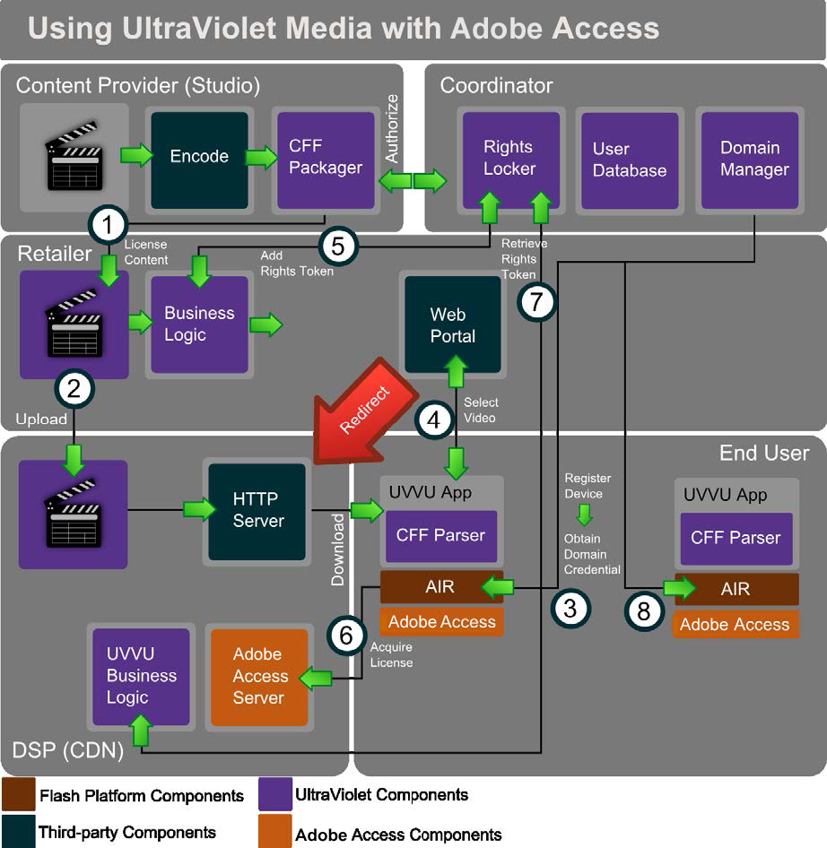

# Ultra보라 미디어 및 Adobe 액세스 {#ultraviolet-media-and-adobe-access}

Adobe 액세스는 제3자 컨텐츠 스트리밍 솔루션과 함께 사용하여 완벽하고 안전한 DRM 기반의 미디어 배포 에코시스템을 설정할 수 있습니다.

UltraBoratle( )은 디지털 홈 엔터테인먼트 컨텐츠의 소비자가 여러 플랫폼 및 디바이스를 통해 구매한 컨텐츠를 스트리밍하고 다운로드할 수 있는 디지털 권한 인증 및 클라우드 기반의 배포 시스템입니다. CENC(Common Encryption)를 사용하여 Ultra보라 컨텐츠를 CFF(Common File Format)로 다운로드(또는 스트리밍)합니다.

Adobe 액세스과 함께 Ultra보라 시스템을 손쉽게 설정할 수 있습니다. 다음 사용 사례에서는 컨텐츠 흐름 동작을 보여 줍니다.

<!---->

1. 컨텐츠 소유자는 CFF에서 컨텐츠를 인코딩하고 패키징합니다. 패키지 컨텐츠는 소매업체에 배포하기 위해 라이선스가 부여됩니다.
1. 소매업체는 컨텐츠를 CDN과 같은 디지털 서비스 제공업체에 업로드합니다. 이제 컨텐츠를 다운로드할 수 있습니다. 이러한 역할 중 일부는 하나 이상의 회사에서 수행할 수 있습니다.

   최종 사용자에게 Adobe AIR을 지원하는 장치가 있습니다. 이 외에도 사용자는 Ultra보라 호환 애플리케이션을 설치해야 합니다. 이 응용 프로그램에는 CFF를 구문 분석하여 런타임에 사용할 수 있도록 표시하는 데 필요한 코드가 포함되어 있습니다. 모든 중요한 암호화 작업은 보안 런타임에서 처리됩니다.
1. 응용 프로그램에서 장치에 대한 도메인 조인을 트리거할 수 있으며, 이는 공동 서독자와 상호 작용합니다. 공동 지배자는 권한 보관함, 사용자 데이터베이스 및 도메인을 유지합니다. 공동 ordinator의 도메인 관리자는 Adobe 액세스 SDK를 사용하여 Adobe 액세스 특정 도메인 참여/퇴장 작업을 구현합니다.
1. 그런 다음 사용자는 애플리케이션을 사용하여 소매업체에서 획득하려는 비디오를 선택할 수 있습니다. 소매업체는 일반적으로 웹 포털을 제공하고 모든 비즈니스 로직을 처리합니다.
1. 소매업체는 공동 조정자와 상호 작용하여 권한 토큰을 추가합니다. 그런 다음 소매업체는 실제 컨텐츠 다운로드를 위해 요청을 서비스 공급업체에 리디렉션합니다.
1. 장치에 아직 컨텐츠에 대한 라이센스가 없는 경우 CFF를 사용하여 라이센스 요청을 트리거합니다. 요청에는 일반적으로 도메인 인증서, 사용자 자격 증명 및 응용 프로그램에 대한 정보가 포함됩니다. 서비스 제공업체는 Ultra보라 사양을 따르는 Adobe 액세스 라이센스 서버(Adobe 액세스 SDK를 사용하여 개발)를 운용합니다.
1. 서비스 공급자의 Ultra보라 비즈니스 로직은 적절한 권한 토큰을 검색하여 컨텐트 라이센스를 발급할지 여부를 결정하는 데 필요한 만큼 공동 조정자와 상호 작용합니다.

   콘텐츠 라이선스는 도메인에 바인딩되어 있습니다. 클라이언트 응용 프로그램은 CFF 파일에 라이센스를 삽입할 수 있습니다. 이제 런타임의 Adobe 액세스 구성 요소에서 모든 보호 및 사용 규칙 적용을 처리하여 컨텐츠를 애플리케이션에서 재생할 수 있습니다.
1. 동일한 최종 사용자가 소유한 다른 장치 및 응용 프로그램은 co-ordinator에 등록할 수 있습니다. 이제 외부 트랜잭션 없이 다른 Adobe 액세스 장치에서 내용을 로드할 수 있습니다.

