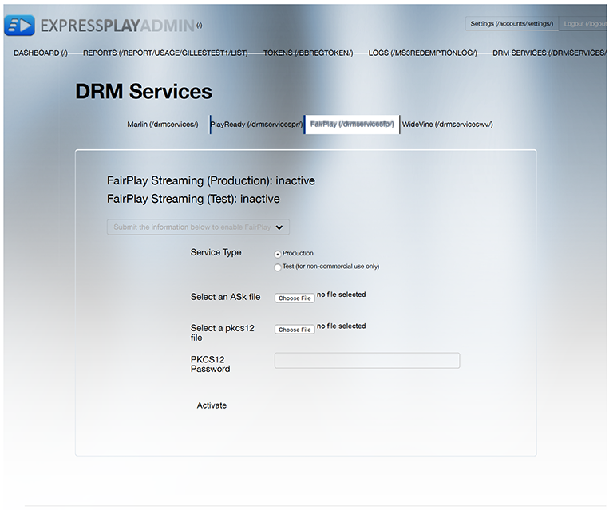

# FairPlay용 Multi-DRM 워크플로 {#multi-drm-workflow-for-fairplay}

DRM 워크플로에는 콘텐츠를 패키징하고, 콘텐츠에 대한 라이선스를 제공하고, 자체 비디오 애플리케이션에서 보호된 콘텐츠를 재생하는 작업이 포함됩니다. 워크플로우는 일반적으로 각 DRM 솔루션에 대해 유사하지만 세부 사항에 차이가 있습니다.

이 Multi-DRM 워크플로우는 Apple FairPlay로 보호된 HLS 콘텐츠의 설정, 패키징, 라이선스 및 재생을 안내합니다. 이 워크플로에는 오프라인 재생 및 라이선스 순환을 구현하기 위한 선택적 지침도 포함되어 있습니다.

## FairPlay에 ExpressPlay 서비스 사용 {#enable-expressplay-service-for-fairplay}

Apple의 FairPlay DRM 솔루션을 ExpressPlay DRM 서비스와 함께 사용하려면 몇 가지 설정이 필요합니다. 여기에는 Apple에서 자격 증명을 획득하고 ExpressPlay에 업로드하는 작업이 포함됩니다.

FairPlay 콘텐츠 보호를 위해 ExpressPlay 서비스를 활성화하려면 다음 단계를 따르십시오.

1. Apple에서 자격 증명을 획득합니다.

   이러한 자격 증명은 각 서비스 공급자에게 고유하게 제공됩니다. 다음 양식을 작성하여 요청해야 합니다. [https://developer.apple.com/contact/fps/](https://developer.apple.com/contact/fps/).

   >[!NOTE]
   >
   >선택 **[!UICONTROL Content Provider]** 기본 역할.

   요청이 승인되면 Apple에서 메시지를 보냅니다. *FairPlay 스트리밍 배포 패키지*.
1. 인증서 서명 요청을 생성합니다.

   다음을 사용할 수 있습니다. [!DNL openssl] 공개/비공개 키 쌍 및 인증서 서명 요청(CSR)을 생성합니다.

   1. 키 쌍을 생성합니다.

      ```
      openssl genrsa -aes256 -out privatekey.pem 1024 
      ```

   1. CSR을 생성합니다.

      ```
      openssl req -new -sha1 -key privatekey.pem -out certreq.csr  
        -subj "/CN=SubjectName /OU=OrganizationalUnit /O=Organization /C=US"
      ```

      >[!NOTE]
      >
      >이 단계에 대한 지침은 *FairPlay 스트리밍 배포 패키지*, 하지만 편의를 위해 여기에 포함되어 있습니다. 프로세스의 이 부분에 문제가 있는 경우 *FairPlayCertificateCreation.pdf* (배포 패키지에서).

1. Apple 개발자 포털을 통해 CSR을 업로드합니다.
   1. 개발 팀의 Team Agent는에 로그인해야 합니다. [!DNL developer.apple.com/account].
   1. 클릭 **[!UICONTROL Certificates, Identifiers & Profiles]**&#x200B;을(를) 선택한 다음 **[!UICONTROL iOS, tvOS, watchOS]** 드롭다운을 클릭하여 페이지 왼쪽 상단 **[!UICONTROL Certificates->Production]** 페이지의 왼쪽에 있습니다.
   1. 다음을 클릭합니다. **[!UICONTROL +]** 페이지 오른쪽 상단의 단추를 클릭하여 새 인증서를 요청합니다. 다음 항목 선택 **[!UICONTROL FairPlay Streaming Certificate]** 옵션 **[!UICONTROL Production]**.

      다음 *iOS 인증서 추가* 대화 상자가 열립니다.
   1. 다음에서 *iOS 인증서 추가*&#x200B;를 클릭하고 2.b 단계에서 생성한 CSR 파일을 업로드한 다음 을 클릭합니다. **[!UICONTROL Generate]**.

      ASK(응용 프로그램 비밀 키)가 같은 대화 상자에 표시됩니다.
   1. ASK를 적고 안전한 장소에 보관합니다.
   1. 인증서 생성을 완료하려면 ASK의 키를 클릭하고 **[!UICONTROL Continue]**.
   1. ASK를 저장했는지 확인한 후 을 클릭합니다. **[!UICONTROL Generate]** 계속합니다.

      >[!NOTE]
      >
      >ASK의 복사본을 저장하고 안전하게 저장하는 것이 중요합니다. *ASK가 손상되면 더 이상 FairPlay 스트리밍으로 콘텐츠를 보호할 수 없습니다.* 한 개의 ASK만 팀에 할당됩니다. 이 값은 다시 제공되지 않으며 나중에 검색할 수 없습니다.

   1. FPS 인증서를 다운로드합니다.

      개인 키(2.a단계)와 공개 키(이 단계에서 다운로드한 FPS 인증서)의 백업 사본을 안전한 위치에 저장해야 합니다.
1. FairPlay 자격 증명으로 ExpressPlay 계정을 설정합니다.
   1. 3단계에서 다운로드한 인증서 이름은 입니다. [!DNL fairplay.cer].
   1. 를 엽니다. [!DNL fairplay.cer] Apple 키체인 액세스 유틸리티를 사용하는 파일입니다.
   1. 를 입력하여 많은 인증서를 필터링합니다. `fairplay`오른쪽 상단에 있는 검색 필드에서 &quot;&quot;를 클릭합니다.
   1. 회사의 FairPlay 인증서를 식별합니다.

      회사 이름은 Apple에서 발급한 인증서와 연결되어 있어야 합니다.
   1. 확장 화살표를 선택하여 인증서를 확장하고 개인 키를 마우스 오른쪽 단추로 클릭합니다.
   1. 선택 **[!UICONTROL Export "Your Company Name"]** 및 저장 [!DNL .p12] 파일.

      이 파일의 보안을 위해 암호를 할당하라는 메시지가 표시됩니다. 자격 증명 패키지와 함께 이 암호를 전송해야 하므로 이 암호를 적어 두십시오.
   1. 다음에 대한 계정에 로그인: [www.expressplay.com](https://www.expressplay.com).
   1. 클릭 **[!UICONTROL DRM SERVICES]** 왼쪽 상단에서 **[!UICONTROL FairPlay]** 탭.
   1. ExpressPlay 계정에 FairPlay 자격 증명을 업로드하십시오.

      1. ASK의 값을 포함하는 텍스트 파일을 만듭니다(예: 32자여야 함). `1234567890abcdef1234567890abcdef`)을 클릭하고 업로드할 이 파일을 선택합니다.
      1. 4.f.단계에서 업로드할 PKCS12 파일을 선택합니다.
      1. 4.f단계에서 PKCS12 파일 암호를 입력합니다.
      1. 업로드 단추를 클릭합니다.

이제 FairPlay 콘텐츠 보호 기능을 사용하여 iOS 애플리케이션이나 HTML5 페이지를 만들 수 있습니다. [!DNL fairplay.cer] FairPlay용 ExpressPlay 서비스를 사용하는 인증서입니다.

<!--<a id="fig_sjr_2pn_sv"></a>-->



### FairPlay용 콘텐츠 패키지 {#package-your-content-for-fairplay}

콘텐츠를 패키지하려면 오프라인 패키지 Adobe 또는 ExpressPlay의 Bento4 패키지 프로그램과 같은 기타 도구를 사용할 수 있습니다.

패키저는 재생을 위해 비디오를 준비하고(예: 원본 파일을 조각화하여 매니페스트에 넣기) 선택한 DRM 솔루션으로 비디오를 보호합니다(이 경우 FairPlay).

* [Adobe Offline Packager for FairPlay DRM](https://helpx.adobe.com/content/dam/help/en/primetime/guides/offline_packager_getting_started.pdf#page=21)
* [ExpressPlay Packagers - HLS용 Bento4](https://www.bento4.com/developers/hls/)

<!--<a id="fig_jbn_fw5_xw"></a>-->


1. 콘텐츠를 패키징합니다.

   다음은 Adobe Offline Packager를 사용하는 패키징 예입니다. Packager는 구성 파일(예: [!DNL fairplay.xml])를 조정할 때 유용합니다.

   ```
   <config>
   <in_path>mp4_file_path</in_path>
   <out_type>hls</out_type>
   <out_path>out_file_path</out_path>
   <drm/>
   <drm_sys>FAIRPLAY</drm_sys>
   <frag_dur>4</frag_dur>
   <target_dur>6</target_dur>
   <key_file_path>creds/fairplay.bin</key_file_path>
   <iv_file_path>creds/iv.bin</iv_file_path>
   <key_url>user_provided_value</key_url>
   <content_id>_default_</content_id>
   </config>
   ```

   * `in_path` - 이 항목은 로컬 패키징 컴퓨터의 소스 비디오 위치를 가리킵니다.
   * `out_type` - 이 항목은 패키지된 출력의 유형을 설명합니다(이 경우 FairPlay용 HLS).
   * `out_path` - 로컬 시스템에서 출력을 보낼 위치입니다.
   * `drm_sys` - 패키지하는 DRM 솔루션. 이 은(는) `FAIRPLAY` 이 경우.
   * `frag_dur` - 조각 기간(초)입니다.
   * `target_dur` - HLS 출력의 대상 기간입니다.
   * `key_file_path` - CEK(콘텐츠 암호화 키) 역할을 하는 패키징 컴퓨터의 라이선스 파일 위치입니다. Base-64로 인코딩된 16바이트 16진수 문자열입니다.
   * `iv_file_path` - 패키징 머신에서 IV 파일의 위치입니다.
   * `key_url` - 의 URI 매개 변수 `EXT-X-KEY` 의 태그 [!DNL .m3u8] 파일.
   * `content_id` - 기본값.

   에 명시된 대로 [Packager 설명서](https://helpx.adobe.com/content/dam/help/en/primetime/guides/offline_packager_getting_started.pdf#page=7)를 설정하는 것이 좋습니다. 출력 생성에 사용할 일반 옵션이 포함된 구성 파일을 만듭니다. 그런 다음 특정 옵션을 명령줄 인수로 제공하여 출력을 만듭니다.&quot;

   ```
   java -jar OfflinePackager.jar -in_path sample.mp4 -out_type hls 
   -out_path out_file_path -drm -drm_sys FAIRPLAY -key_file_path "creds/fairplay.bin" 
   -key_url "user_provided_value"
   ```

   생성된 M3U8 파일에 `EXT-X-KEY` 속성은 다음과 같이 표시됩니다.

   ```
   #EXT-X-KEY:METHOD=SAMPLE-AES,URI="user_provided_value",​
   KEYFORMAT="com.apple.streamingkeydelivery",KEYFORMATVERSIONS="1" 
   ```

### FairPlay 정책 설정 {#setting-policies-for-fairplay}

권한 부여 서버를 사용하여 FairPlay로 보호된 콘텐츠에 대한 정책을 설정할 수 있습니다. 직접 설정하거나 Adobe이 제공하는 샘플 권한 부여 서버를 사용할 수 있습니다.

Adobe은 방법을 보여 주는 샘플 ExpressPlay 권한 서버(SEES)를 제공합니다 *시간 기반* 및 *device-binding* 권한 부여. 이 샘플 권한 서버는 ExpressPlay 서비스 위에 구축되어 있습니다.

[참조 서버: 샘플 ExpressPlay 권한 서버(SEES)](../../multi-drm-workflows/feature-topics/sees-reference-server.md)

* [참조 서비스: 시간 기반 권한](../../multi-drm-workflows/feature-topics/sees-reference-server-time-entitlement.md)
* [참조 서비스: 장치 바인딩 권한](../../multi-drm-workflows/feature-topics/sees-reference-server-binding-entitlement.md)

## FairPlay 라이선스 및 재생 {#licensing-and-playback-for-fairplay}

FairPlay로 보호된 콘텐츠의 라이선스를 부여하고 재생하려면 비디오 매니페스트 파일(skd:)에 사용된 스키마와 ExpressPlay 토큰 요청(https:)에 사용된 스키마 간에 URL 스키마를 교환해야 합니다.

iOS TVSDK 클라이언트에서 라이센싱 및 재생을 구현하기 위한 지침은 다음과 같습니다. [TVSDK 애플리케이션에서 Apple FairPlay 활성화](../../../programming/tvsdk-3x-ios-prog/ios-3x-drm-content-security/ios-3x-apple-fairplay-tvsdk.md). 선택적으로 FairPlay에 대한 오프라인 재생 및 라이선스 순환을 구현할 수도 있습니다.

## HLS Offline with FairPlay {#section_047A05D1E3B64883858BC601CFC8F759}

플레이어가 웹(예: 비행기)에서 격리되어 있기 때문에 라이선스를 검색할 수 없는 경우 사용자가 FairPlay로 보호된 콘텐츠를 재생할 수 있도록 하려는 경우

이 작업을 시작하기 전에 Apple 문서를 다운로드하여 읽으십시오 **&quot;FairPlay 스트리밍 및 HTTP 라이브 스트리밍으로 오프라인 재생&quot;**. TS(전송 스트림) 세그먼트를 다운로드하고 로컬 컴퓨터에 저장하는 방법은 안내서를 참조하십시오.

다음 워크플로우를 사용하여 FairPlay에 대한 오프라인 플레이를 구현합니다.

1. HLS TS 세그먼트를 다운로드합니다.
1. FairPlay 서버에서 영구 임대 라이선스 요청(참조) **&quot;FairPlay 영구 임대 정책&quot;**).
1. 저장 `persistentContentKey`.
1. 오프라인으로 FairPlay 콘텐츠를 재생합니다.

>[!NOTE]
>
>지속 콘텐츠 키가 만료된 경우 클라이언트에서 FairPlay 스트리밍이 암호 해독을 시작하지 않습니다. 그러나 재생 중에 콘텐츠 키가 만료되는 경우 사용자 환경이 계속 유지됩니다.
>
>다음을 참조하십시오 [HTTP 라이브 스트리밍 작업](https://developer.apple.com/library/content/documentation/AudioVideo/Conceptual/MediaPlaybackGuide/Contents/Resources/en.lproj/HTTPLiveStreaming/HTTPLiveStreaming.html#//apple_ref/doc/uid/TP40016757-CH11-SW3) 자세한 내용은 문서 를 참조하십시오.

### FairPlay 라이선스 순환 {#section_D32AA08C61474B4F876AC2A5F18CB879}

라이선스 회전은 오래 재생되는 콘텐츠의 라이선스 해킹을 방지하기 위한 제도이다.

M3U8 매니페스트에서 각 키 태그는 다음 키 태그까지 또는 파일이 끝날 때까지 다음 TS 세그먼트에 적용됩니다.

라이선스 순환을 추가하려면 다음을 수행합니다.

* 라이선스 순환 시간 동안 새 FairPlay 키 태그를 삽입합니다.

  여러 개의 키 태그를 추가할 수 있습니다.

  선형 콘텐츠의 경우 M3U8 창에서 최신 키 태그를 유지해야 합니다. 재생될 TS 세그먼트가 약 2개 남아 있을 때(약 20초) iOS은 다음 M3U8을 요청합니다. 새 M3U8에 새 키 태그가 포함된 경우 모든 키 요청이 즉시 발생합니다. 이전의 기존 키는 다시 요청되지 않습니다. iOS은 재생이 시작되기 전에 모든 주요 요청이 완료될 때까지 기다립니다.

  라이선스 회전이 있는 VOD 콘텐츠의 경우, 모든 키 요청이 재생 시작 시 발생합니다.

  다음은 키 회전이 있는 샘플 M3U8 입니다.

  ```
  #EXTM3U
  #EXT-X-TARGETDURATION:10
  #EXT-X-VERSION:5
  #EXT-X-MEDIA-SEQUENCE:0
  #EXT-X-PLAYLIST-TYPE:VOD
  #EXT-X-KEY:METHOD=SAMPLE-AES,URI="skd://one?cek=1dc2cc71d913f4f74eca0c4632
  212b25&iv=e21f0f72b6363ff6143737cb1e9ca8d7",KEYFORMAT="com.apple.streaming
  keydelivery",KEYFORMATVERSIONS="1"
  #EXTINF:10,
  fileSequence0.ts
  #EXTINF:10,
  fileSequence1.ts
  #EXTINF:10,
  fileSequence2.ts
  #EXTINF:10,
  fileSequence3.ts
  #EXTINF:10,
  fileSequence4.ts
  #EXTINF:10,
  fileSequence5.ts
  #EXTINF:10,
  fileSequence6.ts
  #EXTINF:10,
  fileSequence7.ts
  #EXTINF:10,
  #EXT-X-KEY:METHOD=SAMPLE-AES,URI="skd://two?cek=f6efc698b96cf8f4fa46d5237d
  337c77&iv=18401077091784bcda8079acf978dc95",KEYFORMAT="com.apple.streaming
  keydelivery",KEYFORMATVERSIONS="1"
  #EXTINF:10,
  fileSequence8.ts
  #EXTINF:10,
  ```
