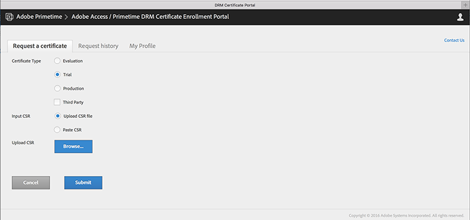

# 프로비저닝 받기(계정 등) {#get-provisioned-accounts-etc}

ExpressPlay에서 제공하는 Primetime DRM Cloud를 시작하려면 Adobe 담당자의 도움을 받아 Adobe 인증서 및 ExpressPlay 계정을 설정해야 합니다.

1. Adobe 담당자에게 문의하고 TVSDK를 사용하여 다중 DRM을 구현하는 데 필요한 Adobe 인증서 및 ExpressPlay 계정을 요청하십시오.

   연락처 정보로 사용할 이메일 주소를 Adobe 담당자에게 제공하십시오. 그런 다음 Adobe이 두 개의 계정을 만듭니다.

   * ***인증서 포털 계정*** - ( https://certportal.primetime.adobe.com) : *Adobe 액세스/Primetime DRM 인증서 등록 관리 팀* 은(는) 입력한 주소로 이메일을 보냅니다. 이메일에는 Adobe 인증서 등록 문서에 대한 링크와 함께 Adobe 인증서 포털의 URL이 포함되어 있습니다(최신 문서는 다음과 같습니다. [인증서 등록 안내서](../../../digital-rights-management/certificate-enrollment-guide/about-certs.md)).

   * ***ExpressPlay 계정*** - Adobe이 ExpressPlay 관리자 계정에 등록하는 데 사용하는 링크가 포함된 이메일을 보냅니다.

1. Adobe ID을 사용하여 Adobe 인증서 포털에 로그인합니다(Adobe 담당자에게 제공한 것과 동일한 이메일 주소 사용). 아직 Adobe ID이 없는 경우 다음을 수행하여 빠르게 만들 수 있습니다. *Adobe ID 받기* 인증서 포털의 링크:

   <!---->

   

1. Adobe 인증서 포털에서 다음을 요청합니다. *체험판* 인증서

   Multi-DRM 시험의 경우 단일 평가판이 패키징, 라이센싱 및 전송과 같은 콘텐츠 보호의 모든 측면을 다룹니다. 직접 제공해야 합니다. [CSR](../../../digital-rights-management/certificate-enrollment-guide/request-certs/gen-cert-signing-req.md) 인증서를 요청하려면:
   <!---->

   

   Adobe이 인증서 요청에 대한 수락 또는 거부를 나타내는 이메일을 보냅니다. 에서 인증서 요청의 상태를 볼 수 있습니다. *요청 내역* cert portal의 탭:
   <!---->

   

1. ExpressPlay 관리자 계정을 만듭니다.

   Adobe이 제공한 ExpressPlay에 연결된 링크를 따르십시오. 이렇게 하면 *계정 만들기* ExpressPlay에서 페이지를 작성합니다. 필요한 정보를 입력하고 양식을 제출하십시오. 다음 이후부터 이메일을 받게 됩니다. `operations@expressplay.com` 1주일 동안 사용할 수 있는 활성화 링크가 포함되어 있습니다. 를 활성화한 후 ExpressPlay 서비스를 설정합니다.
   <!---->

   

   서비스를 만들면 자체 관리 페이지가 표시됩니다. 일부 활동 추적 필드와 함께 프로덕션 및 테스트가 표시됩니다 *고객 인증자* (API 키), 프로덕션 및 테스트 서비스 URL:

   <!---->

    

1. FairPlay를 사용하는 경우 Apple 개발자 사이트에서 ExpressPlay를 설정하는 추가 단계를 수행해야 합니다. 다음을 참조하십시오 [FairPlay에 ExpressPlay 서비스 사용](../../multi-drm-workflows/p-l-and-p/fairplay-workflow.md#enable-expressplay-service-for-fairplay) 설명서를 참조하십시오.
