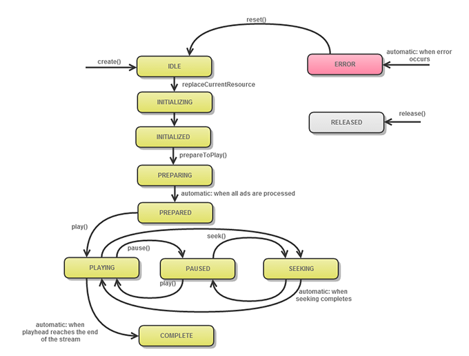

# MediaPlayer 개체 라이프사이클{#mediaplayer-object-lifecycle}

Media Player 인스턴스를 만드는 순간부터 종료(재사용 또는 제거)되는 순간까지 이 인스턴스는 상태 간의 일련의 전환을 완료합니다.

일부 작업은 플레이어가 특정 상태에 있는 경우에만 허용됩니다. 예를 들어 IDLE에서 `play`을(를) 호출할 수 없습니다. 플레이어가 준비 상태에 도달한 후에만 이 상태를 호출할 수 있습니다.

상태 작업을 하려면

* `MediaPlayer.status` 속성을 사용하여 `MediaPlayer` 개체의 현재 상태를 검색할 수 있습니다.

   ```
   function get status():String;
   ```

* 상태 목록이 `MediaPlayer.PlayerStatus`에 정의되어 있습니다.

`MediaPlayer` 인스턴스의 라이프사이클에 대한 상태 전환 다이어그램:
<!--<a id="fig_1C55DE3F186F4B36AFFDCDE90379534C"></a>-->



다음 표에서는 추가 세부 사항을 제공합니다.

<table id="table_426F0093E4214EA88CD72A7796B58DFD"> 
 <thead> 
  <tr> 
   <th colname="col1" class="entry"> <span class="codeph"> MediaPlayerStatus  </span> </th> 
   <th colname="col2" class="entry"> 발생 시간: </th> 
  </tr> 
 </thead>
 <tbody> 
  <tr> 
   <td colname="col1"> <span class="codeph"> 유휴  </span> </td> 
   <td colname="col2"> <p> 응용 프로그램에서 <span class="codeph"> MediaPlayer </span>를 인스턴스화하여 새 미디어 플레이어를 요청했습니다. 새로 만든 플레이어가 미디어 플레이어 항목을 지정하기를 기다리고 있습니다. </p> </td> 
  </tr> 
  <tr> 
   <td colname="col1"> <span class="codeph"> 초기화 중  </span> </td> 
   <td colname="col2"> <p>응용 프로그램 이름이 <span class="codeph"> MediaPlayer.replaceCurrentResource </span>이고 미디어 플레이어가 로드되고 있습니다. </p> </td> 
  </tr> 
  <tr> 
   <td colname="col1"> <span class="codeph"> 초기화됨  </span> </td> 
   <td colname="col2"> <p>TVSDK가 미디어 플레이어 항목을 설정했습니다. </p> </td> 
  </tr> 
  <tr> 
   <td colname="col1"> <span class="codeph"> 준비  </span> </td> 
   <td colname="col2"> <p>응용 프로그램은 <span class="codeph"> MediaPlayer.prepareToPlay </span>입니다. 미디어 플레이어에서 미디어 플레이어 항목 및 관련 리소스를 로드하고 있습니다. </p> <p>팁: 주 미디어의 일부 버퍼링이 발생할 수 있습니다. </p> <p>TVSDK가 미디어 스트림을 준비하고 광고 삽입(활성화된 경우)을 수행하고 있습니다. </p> <p>팁: 시작 시간을 0이 아닌 값으로 설정하려면 <span class="codeph"> prepareToPlay(startTime) </span>을(를) 밀리초 단위로 호출합니다. </p> </td> 
  </tr> 
  <tr> 
   <td colname="col1"> <span class="codeph"> 준비  </span> </td> 
   <td colname="col2"> <p>컨텐츠가 준비되고 광고가 타임라인에 삽입되었거나 광고 절차가 실패했습니다. 버퍼링 또는 재생을 시작할 수 있습니다. </p> </td> 
  </tr> 
  <tr> 
   <td colname="col1"> <span class="codeph"> 재생  </span> </td> 
   <td colname="col2"> <p>응용 프로그램에서 <span class="codeph"> play </span>을(를) 호출했으므로 TVSDK가 비디오를 재생하려고 합니다. 일부 버퍼링은 비디오가 실제로 재생되기 전에 발생할 수 있습니다. </p> </td> 
  </tr> 
  <tr> 
   <td colname="col1"> <span class="codeph"> 일시 중지됨  </span> </td> 
   <td colname="col2"> <p>애플리케이션이 미디어를 재생하거나 일시 중지하면 미디어 플레이어는 이 상태와 PLAYING 사이에서 이동합니다. </p> </td> 
  </tr> 
  <tr> 
   <td colname="col1"> <span class="codeph"> 검색  </span> </td> 
   <td colname="col2"> <p>미디어 플레이어가 일시 중지되거나 재생되는 동안 올바른 위치를 찾고 있습니다. 검색 시작 또는 종료 시기를 결정하려면 <span class="codeph"> SeekEvent.SEEK_BEGIN </span> 및 <span class="codeph"> SeekEvent.SEEK_END </span> 이벤트를 수신하십시오. </p> </td> 
  </tr> 
  <tr> 
   <td colname="col1"> <span class="codeph"> 완료  </span> </td> 
   <td colname="col2"> <p>플레이어가 스트림 끝에 도달했고 재생이 중지되었습니다. </p> </td> 
  </tr> 
  <tr> 
   <td colname="col1"> <span class="codeph"> 릴리스  </span> </td> 
   <td colname="col2"> <p>응용 프로그램에서 미디어 플레이어를 릴리스했습니다. 미디어 플레이어는 관련된 리소스도 출시합니다. 이 인스턴스를 더 이상 사용할 수 없습니다. </p> </td> 
  </tr> 
  <tr> 
   <td colname="col1"> <span class="codeph"> 오류  </span> </td> 
   <td colname="col2"> <p>프로세스 중에 오류가 발생했습니다. 오류가 발생하면 애플리케이션의 다음 작업에 영향을 줄 수 있습니다. </p> </td> 
  </tr> 
 </tbody> 
</table>

>[!TIP]
>
>상태를 사용하여 프로세스에 대한 피드백(예: 다음 상태 변경을 기다리는 동안 스피너)을 제공하거나 다음 방법을 호출하기 전에 적절한 상태를 기다리는 등의 미디어 재생 다음 단계를 수행할 수 있습니다.

